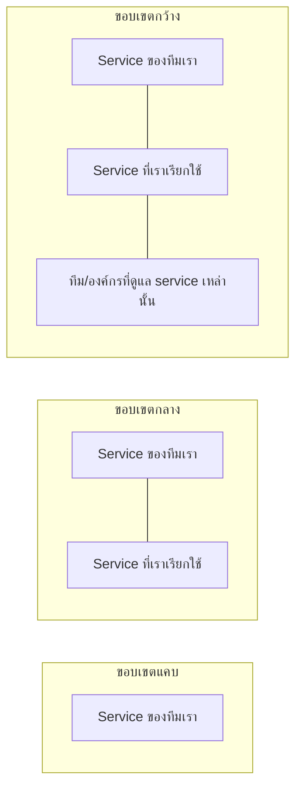

ย้อนกลับไปที่อ่างอาบน้ำในโมดูล Stocks and Flows — ตอนนั้นเราวาดก้อนเมฆแทนแหล่งน้ำและท่อระบาย บอกว่า "ไม่สนใจว่ามันมาจากไหน ไปไหนต่อ" นั่นคือการตัดสินใจ**ขอบเขตระบบ (system boundary)** โดยไม่รู้ตัว — หัวข้อนี้จะเจาะลึกว่าทำไมการตัดสินใจนี้สำคัญมากกว่าที่คิด และทำไมมันไม่มีคำตอบที่ "ถูกต้องแบบสัมบูรณ์" เลยสักครั้ง

## Boundary ไม่ใช่สิ่งที่มีอยู่จริงในธรรมชาติ — มันคือสิ่งที่คนเลือกวาด

ในโลกจริง ทุกอย่างเชื่อมโยงกันหมด ไม่มีเส้นแบ่งที่ธรรมชาติขีดไว้ให้ว่า "ระบบนี้จบตรงนี้" — เวลาวิเคราะห์ปัญหา ทีมจึง**ต้องเลือก**ว่าจะรวมอะไรไว้ในขอบเขตการวิเคราะห์ และตัดอะไรออกไปเป็น "ปัจจัยภายนอกที่ไม่สนใจ" (คือก้อนเมฆนั่นเอง) — การเลือกนี้ไม่มีคำตอบถูกผิดตายตัว แต่มีผลอย่างมากต่อทางแก้ที่จะได้

## ตัวอย่าง: ปัญหาเดียวกัน วาดขอบเขตต่างกัน ได้ทางแก้ต่างกันโดยสิ้นเชิง

**ปัญหา**: Service ของทีมเราตอบช้าเป็นบางช่วง

- **ขอบเขตแคบ** (แค่ service ตัวเอง): ทางแก้ที่เห็นคือ optimize โค้ด, เพิ่ม cache, scale instance — ทั้งหมดอยู่ในอำนาจทีมทำเองได้ทันที แต่ถ้าสาเหตุจริงคือ downstream service ตอบช้า ทางแก้เหล่านี้จะไม่ช่วยอะไรเลย
- **ขอบเขตกลาง** (รวม downstream ที่เรียกใช้): เห็นว่า downstream service ตอบช้าจริง ทางแก้คือเปลี่ยนวิธีเรียก (async, circuit breaker) หรือคุยกับทีมนั้นโดยตรง
- **ขอบเขตกว้าง** (รวมทั้งองค์กรที่ดูแล downstream): อาจพบว่าทีม downstream เองก็ overloaded เพราะ policy การจัดสรร headcount ทั้งบริษัท (Success to the Successful จากโมดูลก่อน) — ทางแก้ที่แท้จริงอยู่ที่ระดับองค์กร ไม่ใช่ระดับโค้ดเลย

สังเกตว่ายิ่งขยายขอบเขตกว้างขึ้น ยิ่งเห็นทางแก้ที่ "แรงกว่า" (leverage point สูงกว่า) แต่ก็ยิ่งอยู่นอกเหนืออำนาจที่ทีมเดียวจะแก้เองได้ — นี่คือ trade-off ที่ต้องชั่งน้ำหนักเสมอ ไม่ใช่แค่ "ขยายขอบเขตให้กว้างที่สุดเสมอ" เพราะขอบเขตที่กว้างเกินจนวิเคราะห์ไม่ไหว หรือกว้างเกินจนไม่มีอำนาจแก้อะไรได้เลย ก็ไม่มีประโยชน์เท่ากัน

## Boundary ที่แคบเกินไปคือรากของหลาย System Trap ที่เจอมาแล้ว

ย้อนดู archetype และ trap ที่เจอมาตลอด track นี้ จะเห็นว่าหลายอันมีรากมาจากขอบเขตที่แคบเกินไป: Tragedy of the Commons เกิดเพราะแต่ละฝ่ายมองแค่ขอบเขตของตัวเอง ไม่เห็นผลกระทบที่ตัวเองส่งออกไปนอกขอบเขต, Shifting the Burden เกิดเพราะมองขอบเขตแค่ "อาการตรงหน้า" ไม่รวม "ความสามารถระยะยาว" เข้ามาในขอบเขตการตัดสินใจ

## คำถามที่ควรถามทุกครั้งก่อนเริ่มวิเคราะห์ระบบ

**"ขอบเขตที่กำลังใช้อยู่ตอนนี้ กว้างพอจะเห็น feedback loop ที่สำคัญที่สุดของปัญหานี้หรือยัง"** — ถ้าวิเคราะห์แล้วยังหาสาเหตุไม่เจอ หรือทางแก้ที่ลองแล้วไม่ได้ผลซ้ำๆ (เหมือนที่เจอในหัวข้อ Leverage Points) มักเป็นสัญญาณว่าขอบเขตที่ใช้อยู่แคบเกินไป ต้องขยับออกไปดูภาพที่กว้างขึ้น ไม่ใช่พยายามแก้หนักขึ้นภายในขอบเขตเดิม

หัวข้อสุดท้ายของโมดูลนี้จะรวมทุกอย่างที่เรียนมาทั้ง track เข้าเป็นกรอบเดียว — **Mental Model** และโมเดลภูเขาน้ำแข็ง (Iceberg Model) ที่อธิบายว่าทำไมคนส่วนใหญ่ติดอยู่แค่การมองผิวน้ำ ไม่เคยได้เห็นโครงสร้างที่ซ่อนอยู่ใต้น้ำเลย
