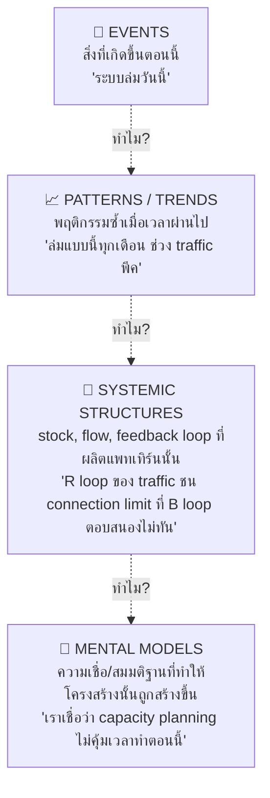

มาถึงหัวข้อสุดท้ายของโมดูลนี้ ก่อนจะไปโมดูล Case Studies — ถึงเวลารวมทุกอย่างที่เรียนมาตลอด track นี้เข้าเป็นกรอบเดียว เครื่องมือที่ทำหน้าที่นี้ได้ดีที่สุดคือ **Iceberg Model** โมเดลภูเขาน้ำแข็งที่ใช้สอน Systems Thinking กันมาหลายสิบปี

## Iceberg Model: สี่ระดับความลึกของการมองปัญหา

**ระดับที่ 1 — Events** คือสิ่งที่เห็นตรงหน้า ทีละครั้ง ตอบสนองแบบ reactive (ระบบล่ม → แก้ตอนนั้น) นี่คือระดับที่คนส่วนใหญ่ใช้เวลาส่วนใหญ่ในชีวิตการทำงานอยู่ตรงนี้

**ระดับที่ 2 — Patterns/Trends** คือสิ่งที่เห็นเมื่อเอาหลาย event มาเรียงตามเวลา (นี่คือสิ่งที่โมดูล Behavior Patterns สอน — exponential growth, oscillation, overshoot) การขยับมาระดับนี้เริ่มทำให้ทำนายอนาคตได้ ไม่ใช่แค่ตอบสนองปัจจุบัน

**ระดับที่ 3 — Systemic Structures** คือ stock, flow, feedback loop ที่**ผลิต**แพทเทิร์นเหล่านั้นออกมา (นี่คือสิ่งที่โมดูล Stocks & Flows, Feedback Loops, และ Systems Archetypes สอนตลอด track นี้) การขยับมาระดับนี้ทำให้แก้ปัญหาได้ถาวรแทนที่จะแก้ทีละ event

**ระดับที่ 4 — Mental Models** คือความเชื่อและสมมติฐานที่ฝังลึกที่สุด ซึ่งเป็นเหตุผลว่าทำไมโครงสร้างนั้นถูกสร้างขึ้นมาแบบนั้นตั้งแต่แรก (เชื่อมกับ "paradigm" ที่เป็น leverage point อันดับ 2 จากโมดูลก่อน) — นี่คือระดับที่ลึกที่สุด แก้ยากที่สุด แต่เมื่อแก้ได้ ผลจะกว้างและถาวรที่สุด

## ทำไมยิ่งลึก ยิ่งมี Leverage มากขึ้น

สังเกตว่าลำดับสี่ระดับนี้**ตรงกับลำดับ leverage point จากโมดูลก่อนหน้าเป๊ะ** — <mark class="hl-insight">Events ≈ parameter (เห็นง่าย แก้ง่าย ผลน้อย), Structure ≈ rules/loop strength (ต้องขุดหาแต่ผลแรงกว่า), Mental Models ≈ paradigm (ลึกที่สุด แต่ทรงพลังที่สุด)</mark> นี่ไม่ใช่ความบังเอิญ — Iceberg Model กับ Leverage Points คือมุมมองสองมุมของกรอบคิดเดียวกัน ยิ่งขุดลึกลงไปใต้ผิวน้ำ ยิ่งเจอจุดที่แก้แล้วได้ผลกว้างและยั่งยืนกว่า

## ตัวอย่างการไล่ทั้งสี่ระดับ

| ระดับ | คำถาม | คำตอบตัวอย่าง |
|---|---|---|
| Event | เกิดอะไรขึ้น | Production ล่มเมื่อเช้านี้ตอน 9 โมง |
| Pattern | เคยเกิดแบบนี้มาก่อนไหม บ่อยแค่ไหน | ล่มแบบนี้ทุกวันจันทร์ตอนคนเข้าระบบพร้อมกันหลัง weekend |
| Structure | อะไรในโครงสร้างที่ผลิตแพทเทิร์นนี้ | ไม่มี rate limiting ที่หน้า login endpoint เจอ traffic burst ทุกครั้งที่คนกลับมาพร้อมกัน |
| Mental Model | ทำไมโครงสร้างถึงเป็นแบบนี้ | ทีมเชื่อว่า "traffic burst ไม่น่าจะเกิดบ่อยพอจะคุ้มลงทุนทำ rate limiting ตั้งแต่แรก" |

<mark class="hl-warning">การแก้ที่ event ("restart server") ได้ผลแค่วันนั้น</mark> การแก้ที่ mental model ("เปลี่ยนมุมมองทีมให้ถือว่า traffic spike คือเรื่องปกติที่ต้องออกแบบรองรับไว้ตั้งแต่ต้น ไม่ใช่ edge case") จะเปลี่ยนวิธีที่ทีมออกแบบระบบทุกตัวถัดไป ไม่ใช่แค่ตัวนี้ตัวเดียว

## สรุปทั้ง Track: จากมองผิวน้ำ สู่มองใต้น้ำ

นี่คือหัวใจของ Systems Thinking ทั้งหมดที่เรียนมาตลอด track นี้ — เปลี่ยนสายตาจากการไล่ดับไฟทีละ event (สิ่งที่คนส่วนใหญ่ทำทั้งวัน) ไปสู่การมองเห็น pattern, structure, และท้ายที่สุดคือ mental model ที่ซ่อนอยู่ลึกที่สุด ยิ่งฝึกมองลึกลงไปใต้ผิวน้ำได้เร็วเท่าไหร่ ยิ่งแก้ปัญหาได้ตรงจุดและยั่งยืนมากขึ้นเท่านั้น

โมดูลสุดท้ายของ track — **Case Studies** — จะพาไปไล่ทั้งสี่ระดับนี้กับปัญหาจริงสามเคส ตั้งแต่ event บนผิวน้ำ ลงไปจนถึง mental model ที่ซ่อนอยู่ลึกที่สุด ให้เห็นภาพรวมทั้งหมดที่เรียนมาตลอด track ทำงานร่วมกันจริงๆ
