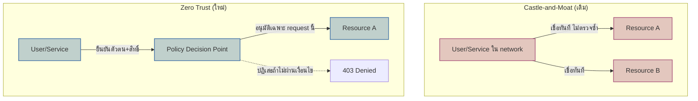

ลองนึกภาพปราสาทยุคกลางที่มีกำแพงหนาและคูน้ำล้อมรอบ — ทหารยามตรวจเข้มที่ประตูเดียว ใครผ่านเข้ามาได้ถือว่าน่าเชื่อถือทันที เดินไปห้องไหนในปราสาทก็ได้โดยไม่มีใครตรวจซ้ำอีก นี่คือโมเดลความปลอดภัยแบบดั้งเดิมที่ระบบ IT ใช้กันมานาน — มี firewall กั้นเป็น "กำแพง" รอบ network องค์กร ใครอยู่ใน network (VPN, office LAN) ถือว่าเชื่อถือได้ เรียก API ภายในได้อย่างอิสระโดยไม่ต้องตรวจซ้ำ

ปัญหาคือถ้าทหารยามหน้าประตูพลาดแค่ครั้งเดียว (credential รั่ว, phishing, laptop พนักงานติด malware) ผู้บุกรุกจะเดินเข้าไปห้องไหนก็ได้เหมือนเป็นคนในบ้าน — เหตุการณ์ data breach ใหญ่ๆ หลายครั้งเกิดจากรูปแบบนี้เป๊ะ: <mark class="hl-warning">แฮกเกอร์เจาะจุดเดียวแล้วเคลื่อนที่ (lateral movement) ไปทั่วทั้ง network ได้อย่างอิสระเพราะระบบข้างในเชื่อใจกันเองหมด</mark>

<mark class="hl-term">**Zero Trust Architecture**</mark> พลิกสมมติฐานนี้ทั้งหมด — หลักการคือ "never trust, always verify" ไม่มีใครถูกเชื่อถือโดยอัตโนมัติแค่เพราะอยู่ใน network เดียวกัน ทุก request ต้องพิสูจน์ตัวตนและสิทธิ์ใหม่ทุกครั้ง ไม่ว่าจะมาจากไหน

## จาก Perimeter สู่ Verify-Every-Request

หัวใจของ Zero Trust ไม่ใช่แค่ "ตรวจสิทธิ์บ่อยขึ้น" แต่คือเปลี่ยนหน่วยของความเชื่อถือจาก **"อยู่ใน network ไหน"** เป็น **"identity + context ของ request นี้"** — <mark class="hl-insight">แม้ service สองตัวจะอยู่ใน data center เดียวกัน ก็ยังต้องพิสูจน์ตัวตนกันทุกครั้งผ่าน mutual TLS (mTLS) หรือ short-lived token ไม่ใช่แค่เช็ค IP range เหมือนเดิม</mark> (แนวคิดเดียวกับ sidecar/service mesh ที่เรียนไปแล้วในโมดูล Deployment & Infra Architecture — service mesh มักเป็นตัวที่ enforce mTLS ระหว่าง service ให้อัตโนมัติ)

## ไม่ได้แปลว่าไม่ต้องมี Network Security เลย

Zero Trust ไม่ได้บอกให้ถอด firewall ทิ้งหรือเปิด network โล่งๆ — มันแค่บอกว่า**อย่าพึ่งพา network boundary เป็นเกราะป้องกันชั้นเดียว** ในทางปฏิบัติ องค์กรส่วนใหญ่ใช้ Zero Trust ควบคู่กับ network segmentation อยู่ดี (นี่คือแนวคิด <mark class="hl-term">**Defense in Depth**</mark> ที่จะเรียนในหัวข้อถัดไป) เพียงแต่ไม่ได้ให้ network segmentation เป็นตัวตัดสินใจเดียวอีกต่อไป

| มิติ | Castle-and-Moat | Zero Trust |
|---|---|---|
| หน่วยความเชื่อถือ | network location (IP, VPN) | identity + context ของแต่ละ request |
| ความเสี่ยงถ้าจุดเดียวถูกเจาะ | สูงมาก lateral movement ได้อิสระ | ต่ำกว่า ทุก request ยังถูกตรวจ |
| Overhead | ต่ำ ตรวจครั้งเดียวตอนเข้า | สูงกว่า ต้อง verify ทุกครั้ง |
| เหมาะกับ | ระบบเล็ก ทีมเดียว network ปิด | องค์กรใหญ่, cloud-native, remote work |

## มุมมองตอนสัมภาษณ์งาน

คำถามสัมภาษณ์: "ทำไม VPN ถึงไม่พอสำหรับความปลอดภัยยุคนี้" คำตอบที่ดีคือชี้ว่า VPN แก้ปัญหาแค่ "ใครเข้า network ได้" แต่ไม่แก้ปัญหา "เข้ามาแล้วเดินไปไหนได้บ้าง" — องค์กรที่ใช้ VPN อย่างเดียวยังเสี่ยง lateral movement เหมือนเดิมถ้า credential รั่ว Zero Trust แก้ตรงจุดนี้โดยตรงด้วยการตรวจทุก request ไม่ใช่แค่ตอน login เข้า network

## ADR ตัวอย่าง

> **Title:** ใช้ mTLS ระหว่าง Internal Service แทนการเชื่อ Network Boundary
> **Status:** Accepted
> **Context:** เคยเกิดเหตุการณ์ laptop พนักงานติด malware แล้วสามารถเรียก internal API ได้อย่างอิสระเพราะอยู่ใน VPN เดียวกับ production network
> **Decision:** บังคับให้ทุก service-to-service call ต้องผ่าน mTLS พิสูจน์ตัวตนด้วย certificate เฉพาะ service ไม่ใช่เชื่อแค่ว่ามาจาก IP range ภายใน
> **Consequences:** ลดความเสี่ยง lateral movement ได้มาก แม้ endpoint หนึ่งถูกเจาะก็ไม่สามารถเรียก service อื่นได้ทันที แต่ทีมต้องดูแล certificate rotation เพิ่มเติมและมี latency เพิ่มขึ้นเล็กน้อยจากการทำ TLS handshake ทุกครั้ง
