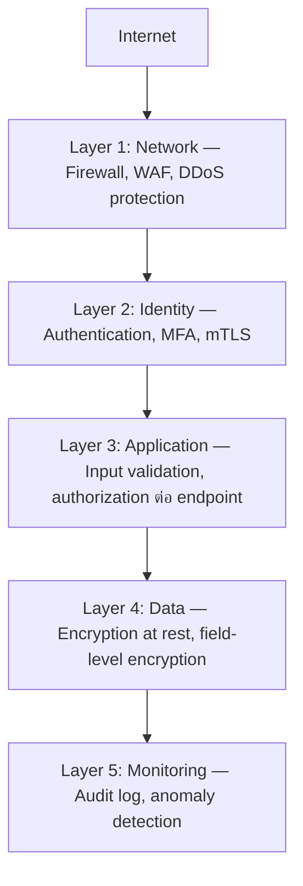

ลองนึกภาพเรือดำน้ำที่แบ่งเป็นห้องกันน้ำ (watertight compartment) หลายห้องแยกจากกัน ถ้าห้องหนึ่งเกิดรอยรั่วจากอุบัติเหตุ ประตูกันน้ำจะปิดอัตโนมัติกักน้ำไว้แค่ห้องนั้น ห้องอื่นยังแห้งและเรือยังลอยน้ำได้ — เรือดำน้ำไม่ได้พึ่งพา "ผนังเรือชั้นเดียว" เป็นเกราะป้องกันเดียว แต่ออกแบบให้ทุกชั้นป้องกันเป็นอิสระจากกัน ถ้าชั้นหนึ่งพัง ชั้นอื่นยังทำงานต่อได้

นี่คือแก่นของ <mark class="hl-term">**Defense in Depth**</mark> ในสถาปัตยกรรมความปลอดภัย — แทนที่จะพึ่งการป้องกันจุดเดียว (เช่น firewall ตัวเดียวที่ขอบ network) ให้วางชั้นการป้องกันหลายชั้นซ้อนกัน แต่ละชั้นออกแบบให้ทำงานได้อย่างอิสระ ถ้าชั้นหนึ่งถูกเจาะ ชั้นถัดไปยังคอยดักอยู่ ไม่ใช่ทุกอย่างพังพร้อมกันเพราะจุดอ่อนจุดเดียว

## ชั้นการป้องกันทั่วไปของระบบสมัยใหม่

สังเกตว่าแต่ละชั้นป้องกันคนละแบบ ไม่ใช่การป้องกันซ้ำแบบเดียวกันห้าครั้ง — Network layer กันไม่ให้ traffic แปลกปลอมเข้ามาถึง, Identity layer ยืนยันว่าใครกำลังเรียก, Application layer เช็คว่า input ปลอดภัยและมีสิทธิ์จริง, Data layer ทำให้ต่อให้ขโมยข้อมูลไปได้ก็อ่านไม่ออกถ้าไม่มี key, Monitoring layer จับความผิดปกติที่หลุดผ่านทุกชั้นมาได้ — แต่ละชั้นคือ**เครื่องมือคนละชนิด** <mark class="hl-insight">เจาะชั้นหนึ่งไม่ได้แปลว่าเจาะชั้นอื่นได้ตามไปด้วย</mark>

## ต่างจากการเพิ่ม Firewall อีกตัว

<mark class="hl-warning">จุดที่เข้าใจผิดบ่อยคือคิดว่า Defense in Depth คือ "เพิ่ม firewall เยอะๆ" — แต่ firewall สองตัวที่กันคนละจุดในทาง network เดียวกัน ถ้าโดน bypass วิธีเดียวกันก็ล้มทั้งคู่พร้อมกัน (ไม่ใช่ independent layer จริง)</mark> Defense in Depth ที่ดีต้องมีความหลากหลายของกลไกป้องกัน (defense diversity) ไม่ใช่แค่ปริมาณ — เช่นชั้น Data encryption ไม่ช่วยอะไรถ้า attacker ผ่าน Application layer ที่มีช่องโหว่ authorization ได้อยู่ดี ต้องคิดว่าแต่ละชั้นปิดช่องโหว่คนละประเภทจริงๆ

| แนวทาง | ผลถ้าชั้นเดียวถูกเจาะ | ต้นทุน |
|---|---|---|
| Single Layer (firewall เดียว) | ระบบเปิดโล่งทันที | ต่ำ ดูแลง่าย |
| Defense in Depth (หลายชั้นอิสระ) | ชั้นอื่นยังกันได้ ความเสียหายจำกัดวง | สูงกว่า ต้องดูแลหลายระบบ |

## มุมมองตอนสัมภาษณ์งาน

คำถามสัมภาษณ์: "ถ้า WAF บล็อก SQL injection ได้แล้ว ทำไมยังต้องทำ parameterized query ในโค้ดอีก" คำตอบที่ดีคือชี้หลัก Defense in Depth ตรงๆ — WAF อาจ bypass ได้ด้วย payload รูปแบบใหม่ที่ signature ยังไม่รู้จัก การมี parameterized query เป็นชั้นป้องกันอิสระที่ยังกันได้แม้ WAF พลาด ไม่ควรพึ่งชั้นเดียวเด็ดขาดสำหรับความเสี่ยงระดับ critical

## ADR ตัวอย่าง

> **Title:** เพิ่ม Field-level Encryption สำหรับข้อมูลบัตรเครดิตแม้มี Network Security อยู่แล้ว
> **Status:** Accepted
> **Context:** ระบบมี firewall, WAF, และ authentication ครบแล้ว แต่ auditor ชี้ว่าถ้า database ถูกเจาะโดยตรง (เช่นผ่าน insider threat หรือ misconfigured backup) ข้อมูลบัตรเครดิตจะรั่วเป็น plaintext ทันที
> **Decision:** เข้ารหัสข้อมูลบัตรเครดิตระดับ field ในฐานข้อมูล แยก key management ออกจาก database instance เดียวกัน
> **Consequences:** แม้ database ถูกเจาะตรงๆ ข้อมูลบัตรก็ยังอ่านไม่ออกถ้าไม่มี key แยกต่างหาก แต่ query ที่ต้องใช้ข้อมูลนี้ซับซ้อนขึ้นและมี performance overhead จากการ encrypt/decrypt เพิ่ม
