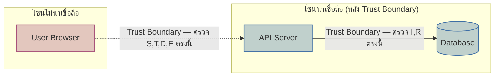

ลองนึกภาพบริษัทประกันภัยที่ก่อนจะอนุมัติกรมธรรม์ให้ตึกหนึ่ง จะส่งผู้เชี่ยวชาญไปเดินสำรวจตึกทั้งหลัง ไม่ใช่แค่ดูว่าตึกสวยหรือแข็งแรงแค่ไหน แต่ถามคำถามแบบ "ถ้าไฟไหม้จะลามจากไหน", "ถ้าขโมยจะเข้าทางไหนง่ายสุด", "ถ้าพนักงานคนในทรยศจะทำอะไรได้บ้าง" — ตรวจสอบล่วงหน้าก่อนเกิดเหตุจริง ไม่ใช่รอให้ไฟไหม้แล้วค่อยมาดูว่าทำไมสปริงเกลอร์ไม่ทำงาน

**Threat Modeling** คือกระบวนการแบบเดียวกันในโลกซอฟต์แวร์ — นั่งคิดล่วงหน้าตั้งแต่ตอนออกแบบสถาปัตยกรรมว่า "ถ้ามีคนร้ายจะโจมตีระบบนี้ เขาจะเข้าทางไหน" <mark class="hl-warning">แทนที่จะรอให้เกิด incident จริงแล้วค่อยแก้ทีหลัง ซึ่งทั้งแพงกว่าและช้ากว่ามาก</mark>

## STRIDE: 6 หมวดของภัยคุกคามที่ต้องคิดถึง

Microsoft พัฒนา framework ชื่อ <mark class="hl-term">**STRIDE**</mark> เป็นเช็คลิสต์ 6 หมวดให้ทีมไล่คิดทีละหมวดตอนออกแบบระบบ แทนที่จะคิดแบบ "อยากได้ security แบบทั่วๆ ไป" ซึ่งมักตกหล่นบางมุม

```demo
component: StepThroughDiagram
props: {"steps":[{"label":"S — Spoofing (ปลอมตัว)","detail":"ผู้โจมตีแอบอ้างเป็นคนอื่นหรือ service อื่น เช่น ปลอม JWT token, ปลอม IP ของ internal service — ป้องกันด้วย strong authentication, mTLS ระหว่าง service"},{"label":"T — Tampering (แก้ไขข้อมูล)","detail":"ผู้โจมตีแก้ไขข้อมูลระหว่างทางหรือในที่เก็บ เช่น แก้ราคาสินค้าใน request ก่อนถึง server — ป้องกันด้วย integrity check, digital signature, HTTPS"},{"label":"R — Repudiation (ปฏิเสธว่าไม่ได้ทำ)","detail":"ผู้ใช้ทำธุรกรรมแล้วปฏิเสธภายหลังว่าไม่ได้ทำ เพราะระบบไม่มีหลักฐาน — ป้องกันด้วย audit log ที่แก้ไขไม่ได้ (เชื่อมกับ Event Sourcing ที่เรียนไปแล้ว — event log แบบ append-only คือ audit trail ในตัว)"},{"label":"I — Information Disclosure (ข้อมูลรั่ว)","detail":"ข้อมูลที่ไม่ควรเห็นถูกเปิดเผย เช่น error message โชว์ stack trace เต็ม, API คืนข้อมูล user คนอื่นมาด้วย — ป้องกันด้วย least privilege, ไม่ log ข้อมูลอ่อนไหว, generic error message"},{"label":"D — Denial of Service (ทำให้ใช้งานไม่ได้)","detail":"ผู้โจมตีถล่ม traffic จนระบบล่ม หรือใช้ request ที่กิน resource สูงผิดปกติ — ป้องกันด้วย rate limiting, circuit breaker (เรียนไปแล้วในโมดูล Reliability)"},{"label":"E — Elevation of Privilege (ยกระดับสิทธิ์)","detail":"ผู้โจมตีได้สิทธิ์สูงกว่าที่ควรมี เช่น user ธรรมดาเรียก admin API ได้เพราะ authorization check พลาดจุดหนึ่ง — ป้องกันด้วยตรวจสิทธิ์ทุก endpoint ไม่ใช่แค่ที่ UI ซ่อนปุ่มไว้"}]}
```

## ทำเมื่อไหร่ ในขั้นตอนไหนของการออกแบบ

<mark class="hl-term">Threat modeling</mark> ควรทำ**ตอนออกแบบ** ไม่ใช่ตอน code review หรือหลัง deploy — เวลาที่เหมาะคือพร้อมกับตอนวาด C4 diagram หรือ architecture diagram ระดับ Container (โมดูล Architecture Documentation) <mark class="hl-insight">เพราะต้องเห็น trust boundary ชัดว่าข้อมูลไหลข้ามจากโซนไม่น่าเชื่อถือไปโซนน่าเชื่อถือตรงไหนบ้าง</mark> — ทีมมักวาด diagram เดิมแล้วเพิ่มเส้นประ (dashed line) แสดง trust boundary ทับลงไป แล้วไล่ถาม STRIDE ทีละจุดที่เส้นประตัดผ่าน



| แนวทาง | ต้นทุนแก้ปัญหา | เวลาที่เหมาะ |
|---|---|---|
| คิด threat ตอนออกแบบ (threat modeling) | ต่ำ แค่ปรับ design | ก่อนเขียนโค้ด |
| เจอช่องโหว่ตอน code review / pentest | ปานกลาง ต้องแก้โค้ด | ก่อน deploy |
| เจอช่องโหว่ตอนถูกโจมตีจริง (incident) | สูงมาก เสียชื่อเสียง+ข้อมูล | หลัง production |

## มุมมองตอนสัมภาษณ์งาน

คำถามสัมภาษณ์: "ออกแบบระบบชำระเงินยังไงให้ปลอดภัย" คำตอบที่แสดงวุฒิภาวะคือไม่กระโดดไปตอบ "ใช้ HTTPS กับ encrypt database" ทันที แต่เริ่มจากไล่ STRIDE ทีละหมวดกับ flow การชำระเงินก่อน แล้วค่อยเสนอมาตรการที่ตรงจุดกับ threat แต่ละแบบที่เจอ แสดงว่าคิดเป็นกระบวนการไม่ใช่ท่องคำตอบสำเร็จรูป

## ADR ตัวอย่าง

> **Title:** ทำ Threat Modeling ก่อนเริ่มพัฒนา Payment Service ใหม่
> **Status:** Accepted
> **Context:** ทีมกำลังจะสร้าง Payment Service ใหม่ ผ่านมาระบบเดิมเคยมีช่องโหว่ elevation of privilege ที่ทำให้ user เรียก refund API ของคนอื่นได้ ทีมไม่อยากพลาดซ้ำ
> **Decision:** ทำ STRIDE threat modeling บน architecture diagram ก่อนเริ่มเขียนโค้ด โดยเชิญทั้งทีม dev และ security review ร่วมกัน บันทึกผลเป็นเอกสารคู่กับ ADR อื่นๆ
> **Consequences:** เจอช่องโหว่ 3 จุดตั้งแต่ตอนออกแบบ (repudiation ไม่มี audit log, information disclosure ใน error response) แก้ได้ถูกกว่าเจอตอน production มาก แต่ใช้เวลา design phase เพิ่มขึ้นประมาณ 2 วันต่อ feature ใหญ่
