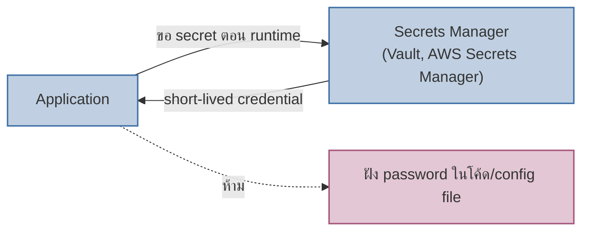

ลองนึกภาพสองบริษัทที่สร้างห้องเก็บของมีค่า บริษัทแรกสร้างห้องเก็บของธรรมดาก่อน แล้วค่อยคิดทีหลังว่า "เดี๋ยวเอากุญแจมาใส่" — ผลคือประตูมีหลายบาน แต่ละบานอาจใส่กุญแจคนละแบบ บางบานลืมใส่เลย บริษัทที่สองออกแบบตั้งแต่พิมพ์เขียวว่าห้องเก็บของมีค่าต้องเข้าได้ทางเดียว ผ่านจุดตรวจเดียว มีกล้องบันทึกทุกการเข้าออกในตัวตั้งแต่แรก

นี่คือความต่างระหว่าง "เพิ่มความปลอดภัยทีหลัง" กับ **Secure by Design** — ปรัชญาที่ให้ความปลอดภัยเป็นส่วนหนึ่งของสถาปัตยกรรมตั้งแต่ต้น ไม่ใช่ feature ที่แปะเพิ่มทีหลัง บทนี้จะพา 3 pattern หลักที่ทำให้ "ออกแบบให้ปลอดภัยโดยธรรมชาติ" เป็นรูปธรรม

## Least Privilege: ให้สิทธิ์เท่าที่จำเป็นเท่านั้น

หลักการง่ายที่สุดแต่ถูกละเลยบ่อยที่สุด — ทุก service, ทุก user, ทุก API key ควรมีสิทธิ์**แค่พอทำงานที่ต้องทำ** ไม่ใช่ "ให้ admin ไปก่อนเดี๋ยวค่อยจำกัดทีหลัง" เช่น service ที่แค่อ่านข้อมูล order ไม่ควรมีสิทธิ์เขียนลง database เดียวกันได้เลย แม้ในทางเทคนิคจะทำได้ก็ตาม — ถ้า service นั้นถูกเจาะ ความเสียหายจะจำกัดอยู่แค่ขอบเขตสิทธิ์ที่มันมี ไม่ลามไปทั้งระบบ

## Secrets Management: อย่าฝัง Credential ไว้ในโค้ด

<mark class="hl-warning">Credential (database password, API key, encryption key) ที่ถูก hardcode ในโค้ดหรือ config file เป็นสาเหตุ data breach ที่พบบ่อยที่สุดอย่างหนึ่ง</mark> — เพราะโค้ดมักถูก commit เข้า git, แชร์กับคนนอกทีมตอน debug, หรือหลุดผ่าน log Secure by Design แก้ด้วยการให้ application ขอ secret จาก <mark class="hl-term">**Secrets Manager**</mark> ตอน runtime แทน ได้ credential แบบ short-lived ที่หมดอายุเอง ไม่ต้องมีใครจำหรือแชร์ password ตรงๆ อีกต่อไป

## Trust Boundary: รู้ชัดว่าข้อมูลข้ามโซนไว้ใจตรงไหน

ทุก architecture diagram ควรมีเส้นแบ่ง **trust boundary** ชัดเจน — จุดที่ข้อมูลเดินทางจากโซนที่ไม่น่าเชื่อถือ (เช่น internet, input จาก user) เข้าสู่โซนที่เชื่อถือได้มากขึ้น (internal network, database) ทุกจุดที่เส้นนี้ถูกข้าม ต้องมีการตรวจสอบ (validate, authenticate, sanitize) เสมอ — นี่คือจุดที่ threat modeling (หัวข้อก่อนหน้า) กับ secure by design มาบรรจบกัน: threat modeling หาว่า <mark class="hl-term">trust boundary</mark> อยู่ตรงไหน <mark class="hl-insight">ส่วน secure by design คือการออกแบบให้ทุกจุดข้าม boundary นั้นปลอดภัยตั้งแต่แรก</mark>

| Pattern | แก้ปัญหาอะไร | ต้นทุนถ้าไม่ทำ |
|---|---|---|
| Least Privilege | จำกัดความเสียหายถ้า service ถูกเจาะ | breach จุดเดียวลามทั้งระบบ |
| Secrets Management | credential รั่วผ่านโค้ด/log | password หลุดแล้วหมุนเวียนยาก ต้อง revoke ทุกที่ที่ใช้ |
| Trust Boundary ชัดเจน | รู้ว่าต้องตรวจสอบข้อมูลตรงไหนบ้าง | ตกหล่นจุดตรวจสอบ เพราะไม่รู้ว่ามีกี่จุดที่ต้องตรวจ |

## มุมมองตอนสัมภาษณ์งาน

คำถามสัมภาษณ์: "เจอ API key หลุดใน public GitHub repo จะป้องกันยังไงในระยะยาว" คำตอบระดับ senior ไม่ใช่แค่ "revoke key แล้วลบออกจาก git" (แก้ปัญหาเฉพาะหน้า) แต่ควรพูดถึงการย้ายไปใช้ Secrets Manager ตั้งแต่ต้น (แก้ที่ต้นเหตุเชิงสถาปัตยกรรม) พร้อม pre-commit hook สแกนหา secret ก่อน commit เป็นชั้นป้องกันเสริม (Defense in Depth)

## ADR ตัวอย่าง

> **Title:** ย้าย Database Credential จาก Environment Variable ไป Secrets Manager
> **Status:** Accepted
> **Context:** ทีมเก็บ database password ไว้ใน `.env` file ที่ถูก commit เข้า git โดยไม่ตั้งใจครั้งหนึ่ง ต้อง rotate password ฉุกเฉินและตรวจสอบว่ามีการเข้าถึงผิดปกติหรือไม่
> **Decision:** ย้าย credential ทั้งหมดไปเก็บใน Secrets Manager ให้ application ดึงมาตอน runtime แทน พร้อมตั้ง rotation อัตโนมัติทุก 90 วัน
> **Consequences:** credential ไม่มีทางหลุดผ่าน git อีก และ rotate ได้โดยไม่ต้อง deploy ใหม่ แต่ต้องเพิ่ม dependency กับ Secrets Manager (ถ้ามันล่ม application อาจ start ไม่ได้) และเพิ่ม latency เล็กน้อยตอน startup
