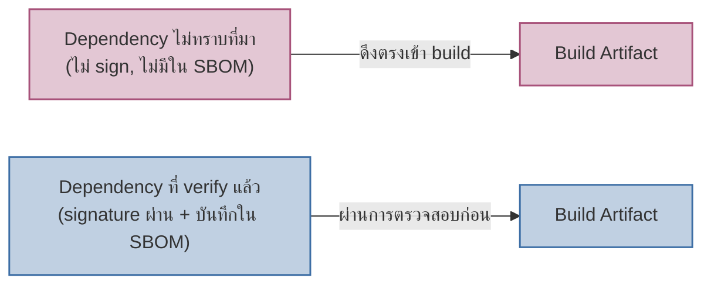

ลองนึกภาพร้านอาหารที่ตรวจสอบทุกจานที่ครัวปรุงเองอย่างเข้มงวด แต่ไม่เคยถามเลยว่าวัตถุดิบที่ซัพพลายเออร์ส่งมาทุกเช้านั้นมาจากไหน ผ่านการตรวจสอบอะไรมาบ้าง หรือแม้แต่รถขนส่งที่แวะจอดระหว่างทางมีใครเปิดฝากล่องไปแล้วหรือเปล่า ต่อให้ครัวสะอาดที่สุดในเมือง ถ้าวัตถุดิบต้นทางปนเปื้อน อาหารที่เสิร์ฟก็ปนเปื้อนตามไปด้วย

นี่คือขอบเขตที่ **Supply Chain Security** พูดถึง — ความเสี่ยงไม่ได้จำกัดอยู่แค่โค้ดที่ทีมเขียนเองอีกต่อไป แต่ครอบคลุมทุก dependency จากภายนอก ทุก base container image ที่ใช้เป็นจุดเริ่มต้น และทุกเครื่องมือใน build pipeline ที่แปลงโค้ดให้กลายเป็น artifact สุดท้าย <mark class="hl-warning">library open-source ยอดนิยมตัวเดียวที่ถูกแฮ็ก (หรือ build step หนึ่งจุดที่ถูกแทรกแซง) สามารถทำให้ทุก application ที่พึ่งพามันติดไปด้วย โดยที่โค้ดของทีมเองไม่มีบั๊กแม้แต่บรรทัดเดียว</mark> — ต่างจาก threat model ใน `03-threat-modeling.md` ที่มองหาจุดอ่อนในระบบที่ทีมควบคุม supply chain security ต้องมองออกไปนอกขอบเขตที่ทีมควบคุมได้ทั้งหมด

## SBOM: รู้ว่า "ในกล่อง" มีอะไรบ้าง

เวลา CVE (Common Vulnerabilities and Exposures — หมายเลขอ้างอิงมาตรฐานสำหรับช่องโหว่ที่รู้จักแล้ว) ตัวใหม่ถูกประกาศสำหรับ library ดังสักตัว คำถามแรกที่ทีมต้องตอบคือ "ระบบไหนของเราโดนบ้าง" ถ้าไม่มีข้อมูลอะไรเลย คำตอบต้องมาจากการไล่เปิด `package.json`, `requirements.txt`, Dockerfile ของทุก service ด้วยมือ — เป็นงาน audit ฉุกเฉินที่กินเวลาเป็นวันในจังหวะที่ควรรีบปิดช่องโหว่ที่สุด

<mark class="hl-term">**SBOM (Software Bill of Materials)**</mark> คือ manifest ที่ระบุทุก dependency และเวอร์ชันที่แน่นอนซึ่งประกอบกันเป็น build หรือ artifact หนึ่งตัว เหมือนฉลากส่วนผสมบนกล่องอาหาร มันเปลี่ยนคำถาม "เราโดนไหม" จากงาน audit ฉุกเฉิน ให้กลายเป็นแค่การ query ฐานข้อมูล — ค้นหาชื่อ library กับเวอร์ชันที่มีช่องโหว่ ได้รายชื่อ service ที่ต้อง patch ทันที ทีมมักสร้าง SBOM อัตโนมัติทุกครั้งที่ build (เช่นด้วย Syft, CycloneDX) แล้วเก็บคู่กับ artifact ไว้เป็นหลักฐานว่า build ตัวนี้ประกอบด้วยอะไรบ้าง ณ เวลานั้น

## Dependency Signing และ Provenance: เชื่อเพราะพิสูจน์ได้ ไม่ใช่เพราะชื่อตรงกัน

ปัญหาของการดาวน์โหลด package จากชื่อคือ ชื่อปลอมแปลงได้ — ทั้งจาก package ที่ตั้งชื่อคล้ายของจริง (typosquatting) หรือจาก registry ที่ถูกเจาะแล้วสลับไฟล์ที่คนดาวน์โหลดไปจริง โดยที่ชื่อและเลขเวอร์ชันยังคงแสดงถูกต้องทุกอย่าง

<mark class="hl-term">**Dependency Signing / Provenance**</mark> แก้ปัญหานี้ด้วยการพิสูจน์ทางคณิตศาสตร์ ไม่ใช่ความเชื่อ — ผู้เผยแพร่ package เซ็นชื่อ (sign) ด้วย private key ของตัวเอง แล้วทุกคนที่ดาวน์โหลดตรวจสอบลายเซ็นนั้นด้วย public key ก่อนใช้งาน ถ้าไฟล์ถูกแก้ไปแม้แต่ byte เดียวระหว่างทาง หรือมาจากคนละแหล่งกับที่อ้าง ลายเซ็นจะตรวจสอบไม่ผ่านทันที <mark class="hl-insight">ความต่างสำคัญคือ การเชื่อ package เพราะ "ชื่อกับเวอร์ชันตรง" กับการเชื่อเพราะ "ลายเซ็น verify ผ่าน" — อย่างแรกเชื่อสิ่งที่มองเห็น อย่างหลังเชื่อสิ่งที่พิสูจน์ได้</mark> provenance ไปไกลกว่านั้นอีกขั้น คือบันทึกด้วยว่า artifact นี้ build มาจาก source code ไหน ด้วย build system ไหน ขั้นตอนไหนบ้าง — ปิดช่องที่ตัว build pipeline เองถูกแทรกแซงโดยที่ source code ต้นทางไม่มีอะไรผิดปกติเลย



## SLSA: บันไดวัดความเป็นผู้ใหญ่ของ Supply Chain

ทีมไม่จำเป็นต้องคิดมาตรฐานเองตั้งแต่ศูนย์ — <mark class="hl-term">**SLSA (Supply-chain Levels for Software Artifacts)**</mark> คือ framework มาตรฐานอุตสาหกรรมที่แบ่งความเข้มงวดของการป้องกัน supply chain ออกเป็นระดับ (level) ไล่จากพื้นฐาน (มี build process ที่ทำซ้ำได้ บันทึกไว้) ไปจนถึงระดับสูงที่ build ทุกขั้นตอนถูก isolate และ provenance ถูกตรวจสอบอัตโนมัติทั้งสาย ทีมส่วนใหญ่ใช้ SLSA เป็น checklist อ้างอิงว่าตอนนี้อยู่ระดับไหน และควรลงทุนเพิ่มตรงไหนต่อ มากกว่าจะไล่ไปถึง level สูงสุดตั้งแต่วันแรก

| แนวทาง | แก้ปัญหาอะไร | ต้นทุนถ้าไม่ทำ |
|---|---|---|
| SBOM | รู้ทันทีว่า service ไหนใช้ library ที่มี CVE | ต้อง audit ทุกระบบด้วยมือตอนช่องโหว่ถูกประกาศ |
| Dependency Signing / Provenance | พิสูจน์ที่มาจริงของ package ก่อนใช้ | เชื่อ package ปลอมที่ชื่อ/เวอร์ชันตรงกันได้ง่าย |
| SLSA เป็นแนวทางอ้างอิง | รู้ว่าองค์กรอยู่ระดับไหน ควรลงทุนตรงไหนต่อ | ป้องกันแบบไม่มีทิศทาง ไม่รู้ว่าจุดอ่อนที่เหลือคือจุดไหน |

```demo
component: ComparisonDiagram
props: {"left":{"title":"Dependency ไม่ทราบที่มา","points":["ไม่มี signature ให้ตรวจสอบ","ไม่ถูกบันทึกใน SBOM","เมื่อ CVE ประกาศ ไม่รู้ว่าใช้อยู่หรือเปล่า"]},"right":{"title":"Dependency ที่ verify แล้ว","points":["signature ตรวจสอบผ่านก่อนดึงเข้า build","อยู่ใน SBOM พร้อมเวอร์ชันที่แน่นอน","เมื่อ CVE ประกาศ query หาระบบที่ได้รับผลได้ทันที"]},"note":"SLSA ใช้เป็นบันไดวัดว่าทีมทำได้ครบขั้นไหนแล้ว"}
```

## มุมมองตอนสัมภาษณ์งาน

คำถามสัมภาษณ์: "จะมั่นใจได้ยังไงว่า dependency ที่ดึงมาใช้ใน production ไม่ถูกสอดไส้โค้ดอันตราย" คำตอบระดับ surface มักหยุดแค่ "ใช้ dependency scanner สแกนหา known vulnerability" ซึ่งตรวจจับได้แค่ช่องโหว่ที่ถูกรายงานแล้วเท่านั้น คำตอบระดับ senior ต้องพูดถึงสองชั้นที่ทำงานร่วมกัน — SBOM ที่ทำให้รู้ตัวทันทีเมื่อมี CVE ใหม่ประกาศ และ dependency signing/provenance ที่ป้องกัน package ปลอมหรือถูกแทรกแซงตั้งแต่ก่อนจะเข้ามาอยู่ใน build เลย เพราะ scanner ตรวจจับปัญหาที่รู้จักแล้วเท่านั้น แต่ signing ป้องกันปัญหาที่ยังไม่ถูกค้นพบด้วยซ้ำ

## ADR ตัวอย่าง

> **Title:** เพิ่ม SBOM Generation และ Dependency Signature Verification เข้า CI Pipeline
> **Status:** Accepted
> **Context:** เมื่อ CVE ระดับ critical ถูกประกาศสำหรับ library ที่ใช้กันแพร่หลาย ทีมใช้เวลากว่า 2 วันไล่ตรวจสอบด้วยมือว่า service ไหนใช้เวอร์ชันที่มีช่องโหว่บ้าง เพราะไม่มีบันทึกรวมศูนย์ของ dependency ทั้งหมด
> **Decision:** ให้ CI สร้าง SBOM อัตโนมัติทุกครั้งที่ build พร้อมเก็บคู่กับ artifact และเพิ่มขั้นตอนตรวจสอบ signature ของ dependency ทุกตัวก่อนอนุญาตให้ build ผ่าน
> **Consequences:** เมื่อ CVE ใหม่ประกาศ ทีม query ได้ทันทีว่า service ไหนได้รับผลกระทบ ลดเวลา audit จากวันเหลือเป็นนาที แต่ build time เพิ่มขึ้นเล็กน้อยจากขั้นตอนตรวจสอบ และ dependency บางตัวที่ยังไม่รองรับ signing ต้องหาทางเลือกอื่นทดแทน
