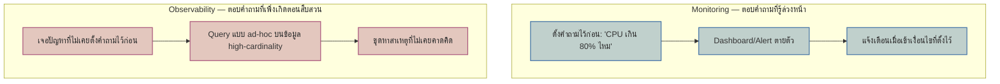

ลองนึกภาพสองสถานการณ์ที่หมอเจอ — สถานการณ์แรกคือ**ตรวจสุขภาพประจำปี** หมอมีชุดค่าที่รู้อยู่แล้วว่าต้องดู (ความดัน, น้ำหนัก, น้ำตาลในเลือด) ถ้าตัวไหนเกินเกณฑ์ก็ flag ทันที — หมอ**รู้ล่วงหน้า**ว่าจะถามอะไร สถานการณ์ที่สองคือ**คนไข้มาด้วยอาการประหลาดที่ไม่เคยเจอมาก่อน** หมอต้องไล่ซักประวัติ ขอตรวจเพิ่มไปเรื่อยๆ ตามเบาะแสที่เจอ — คำถามที่ต้องถามงอกขึ้นมา**ระหว่างสืบสวน** ไม่ได้เตรียมไว้ล่วงหน้า

สองสถานการณ์นี้คือความต่างระหว่าง <mark class="hl-term">Monitoring</mark> กับ <mark class="hl-term">Observability</mark> — เคยเรียนพื้นฐาน Log/Metric/Trace ไปแล้วในโมดูล Reliability (3 เสาหลักของการสังเกตระบบ) แต่การมีเครื่องมือ 3 อย่างนั้นครบ **ไม่ได้แปลว่าระบบ "observable" โดยอัตโนมัติ** — มันเป็นแค่วัตถุดิบ ส่วน monitoring กับ observability คือ**วิธีใช้วัตถุดิบนั้นตอบคำถาม** คนละแบบ

## Known-Unknowns vs Unknown-Unknowns

<mark class="hl-insight">Monitoring ตอบ "known-unknowns" — สิ่งที่รู้ว่าอาจเกิดขึ้น แค่ไม่รู้ว่าเกิดเมื่อไหร่ (เช่น CPU พุ่ง, disk เต็ม) เตรียม dashboard/alert ไว้ล่วงหน้าได้เลย</mark> ส่วน <mark class="hl-insight">Observability ตอบ "unknown-unknowns" — ปัญหาที่ไม่เคยคาดคิดว่าจะเกิด จึงเตรียม alert ไว้ล่วงหน้าไม่ได้ ต้องมีข้อมูลละเอียดพอให้ไปสืบสวนแบบ ad-hoc ตอนเกิดเหตุจริง</mark>

## ทำไม Log/Metric/Trace ครบ 3 อย่างยังไม่พอ

ปัญหาคลาสสิก: มี metric `error_rate` พุ่งขึ้น (monitoring บอกว่า "มีปัญหา") แต่ error นั้นเกิดกับ**เฉพาะ user ที่อยู่ประเทศไทย ใช้ app version 2.3.1 บน iOS เท่านั้น** — ถ้า metric เก็บแค่ตัวเลขรวม (aggregate) จะไม่มีทางเห็น pattern แบบนี้เลย ต้องมีข้อมูลระดับ**เหตุการณ์เดี่ยวๆ ที่ tag ด้วย dimension เยอะๆ** (country, app_version, os, user_id) ถึงจะ slice/dice หา pattern ได้ทีหลัง — คุณสมบัตินี้เรียกว่า <mark class="hl-term">**high-cardinality data**</mark> (field ที่มีค่าไม่ซ้ำจำนวนมาก เช่น `user_id`, `request_id` ต่างจาก field cardinality ต่ำอย่าง `http_status` ที่มีแค่ไม่กี่ค่า)

<mark class="hl-warning">Metric แบบ pre-aggregated ทั่วไป (เช่น ตัวเลขเฉลี่ยราย 1 นาที) มักถูกบีบอัดจนไม่เหลือ dimension ให้ slice หาสาเหตุที่ไม่เคยคาดคิดได้อีก — นี่คือข้อจำกัดที่ทำให้ระบบ monitoring แบบเดิมไม่พอสำหรับ debug unknown-unknowns</mark> ระบบที่ observable จริงต้องเก็บ event ดิบพอให้ query แบบ "หา request ทั้งหมดที่ country=TH AND app_version=2.3.1" ได้แบบ on-demand ไม่ใช่แค่ดูกราฟสรุปที่ตั้งไว้ล่วงหน้า

## เปรียบเทียบ

| มิติ | Monitoring | Observability |
|---|---|---|
| ตอบคำถามแบบไหน | ที่รู้ล่วงหน้า (known-unknowns) | ที่ไม่เคยคาดคิด (unknown-unknowns) |
| รูปแบบข้อมูล | metric สรุป/aggregate | event ดิบ, high-cardinality |
| วิธีใช้งาน | ดู dashboard, ตั้ง threshold/alert | query แบบ ad-hoc ตอนสืบสวน |
| เตรียมล่วงหน้าได้ไหม | ได้ (รู้ว่าจะดูอะไร) | ไม่ได้เต็มที่ (ไม่รู้จะถามอะไรจนกว่าจะเจอปัญหา) |
| ใช้ตอนไหน | เฝ้าระบบวันต่อวัน, alert เบื้องต้น | debug incident ที่ซับซ้อน/ไม่เคยเจอ |

ระบบที่ดีต้องมี**ทั้งสองอย่าง** — monitoring ไว้จับปัญหาที่รู้จักและ alert ให้เร็วที่สุด ส่วน observability ไว้ตามหาสาเหตุของปัญหาที่ monitoring ไม่เคยตั้งคำถามไว้ล่วงหน้า ไม่ใช่เลือกอย่างใดอย่างหนึ่ง

> คำถามสัมภาษณ์: "ทำไมมี dashboard ครบ มี alert ครบ แต่ยังต้องพูดถึง observability เพิ่ม" — คำตอบที่ดีคือชี้ว่า dashboard/alert ตอบได้แค่คำถามที่ตั้งไว้ล่วงหน้า (known-unknowns) แต่ incident จริงจำนวนมากเป็นปัญหาที่ไม่เคยเจอมาก่อน การมีข้อมูล high-cardinality ให้ query แบบ ad-hoc ได้ (observability) คือสิ่งที่ทำให้สืบสวนปัญหาใหม่ๆ ได้เร็ว ไม่ต้อง deploy โค้ดเพิ่ม log ใหม่แล้วรอ reproduce ปัญหาซ้ำ
