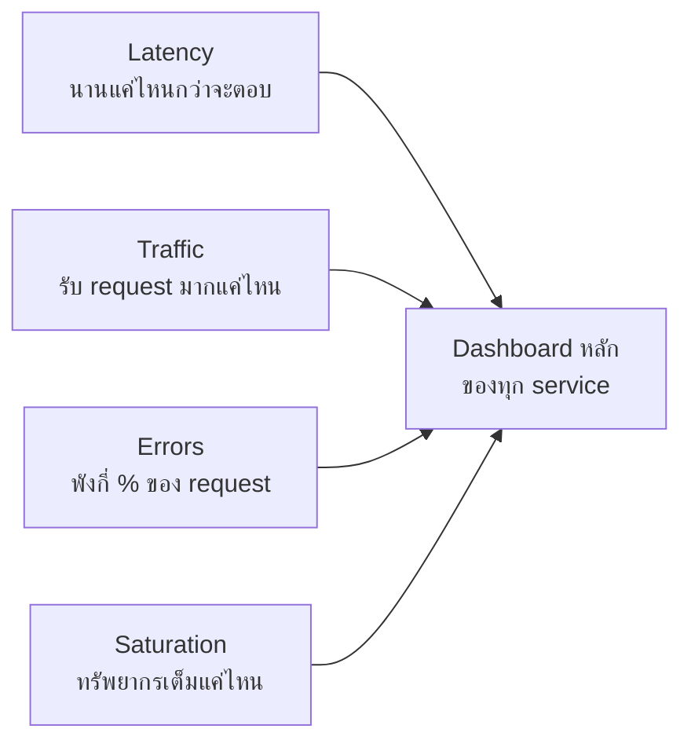

ห้องนักบินเครื่องบินมีมิเตอร์เป็นร้อยตัว แต่นักบินไม่ได้จ้องทุกตัวตลอดเวลา — มี**หน้าปัดหลักไม่กี่ตัว** (ความสูง, ความเร็ว, เชื้อเพลิง, ทิศทาง) ที่บอกได้ว่าเครื่องกำลังบินปกติหรือกำลังมีปัญหา ตัวที่เหลือค่อยไปดูตอนต้องสืบสวนเจาะลึก ระบบ production ก็เหมือนกัน — มี metric เป็นร้อยเป็นพันตัวที่เก็บได้ แต่ทีม SRE ของ Google สรุปไว้ว่าถ้าจะเลือก**หน้าปัดหลัก** สำหรับทุก service มีแค่ 4 ตัวที่ขาดไม่ได้ เรียกว่า <mark class="hl-term">**Four Golden Signals**</mark>

## Latency, Traffic, Errors, Saturation



| Signal | ตอบคำถามว่า | ตัวอย่าง metric |
|---|---|---|
| **Latency** | request ตอบกลับช้าแค่ไหน | p50/p95/p99 response time |
| **Traffic** | ตอนนี้รับโหลดมากแค่ไหน | requests/second |
| **Errors** | ความล้มเหลวเกิดขึ้นกี่ % | error rate (5xx / total requests) |
| **Saturation** | ทรัพยากรใกล้เต็มแค่ไหน | CPU/memory/queue depth % ใช้งาน |

## กับดักของ Latency — อย่าเฉลี่ยรวม Success กับ Error

<mark class="hl-warning">ข้อผิดพลาดที่พบบ่อยสุดคือเอา latency ของ request **ที่สำเร็จ**กับ**ที่ error** มาเฉลี่ยรวมกัน — request ที่ error มักตอบกลับเร็วผิดปกติ (fail fast, เช่น validation ล้มเหลวตั้งแต่ต้นทาง) พอเอาไปเฉลี่ยรวมจะทำให้ตัวเลข latency ดูดีเกินจริง ทั้งที่ user จำนวนมากกำลังเจอ error</mark> วิธีที่ถูกต้องคือแยกวัด latency เฉพาะ request ที่สำเร็จ แล้วดู error rate เป็นอีกตัวแยกต่างหาก

อีกกับดักคือใช้**ค่าเฉลี่ย (average)** แทน**percentile** — เฉลี่ยถูกลาก outlier กลบง่าย ถ้า user ส่วนใหญ่ตอบเร็วแต่มี 1% ที่ช้ามาก ค่าเฉลี่ยอาจยังดูปกติ ทั้งที่ user 1% นั้นกำลังทุกข์ทรมานจริง — ทีม SRE จึงนิยมดู <mark class="hl-term">p95/p99 latency</mark> (95%/99% ของ request เร็วกว่าค่านี้) แทนค่าเฉลี่ย เพราะสะท้อนประสบการณ์ของ user กลุ่มที่แย่ที่สุดได้ตรงกว่า

## Saturation ต่างจาก Utilization ยังไง

<mark class="hl-insight">Utilization บอกว่าทรัพยากร "ถูกใช้งานอยู่กี่ %" ส่วน Saturation บอกว่าทรัพยากร "รับงานเพิ่มไม่ไหวแล้วหรือยัง" — CPU 70% utilization อาจยังรับงานเพิ่มได้สบาย แต่ queue length ที่เพิ่มขึ้นเรื่อยๆ (แม้ CPU ยังไม่ถึง 100%) คือสัญญาณ saturation ว่าระบบกำลังตามงานไม่ทัน</mark> Saturation จึงมักดูจากความยาว queue หรือจำนวน thread ที่รอคิว ไม่ใช่แค่ % การใช้ทรัพยากรอย่างเดียว

## ตัวอย่าง Alert ที่ตั้งจาก 4 Golden Signals

```
ALERT: checkout-service
  p99 latency > 800ms for 5m       (Latency)
  requests/sec drops > 50% vs 1h ago  (Traffic — อาจบอกว่า upstream พัง ไม่ใช่แค่ลดลงเพราะคนน้อย)
  5xx rate > 2% for 3m             (Errors)
  queue depth > 1000 for 2m        (Saturation)
```

4 signals นี้ไม่ได้แทนที่ metric อื่นๆ ที่เจาะจงตาม business (เช่น "จำนวน order ที่สำเร็จ") แต่เป็น**เซ็ตขั้นต่ำ**ที่ควรมีครบสำหรับทุก service ก่อนจะไปเพิ่ม metric เฉพาะทาง — ถ้า service ไหนยังไม่มี dashboard เลย เริ่มจาก 4 ตัวนี้ก่อนเสมอ

> คำถามสัมภาษณ์: "ถ้าต้อง monitor service ใหม่ให้เสร็จใน 1 วัน จะเลือก metric อะไรก่อน" — คำตอบที่ดีคือเริ่มจาก Four Golden Signals (Latency แยก success/error, Traffic, Errors, Saturation) เพราะครอบคลุมคำถามพื้นฐานที่สุดว่า "service กำลังทำงานปกติไหม" ได้ครบทุกมุมโดยไม่ต้องรู้ business logic ของ service นั้นเลยด้วยซ้ำ
