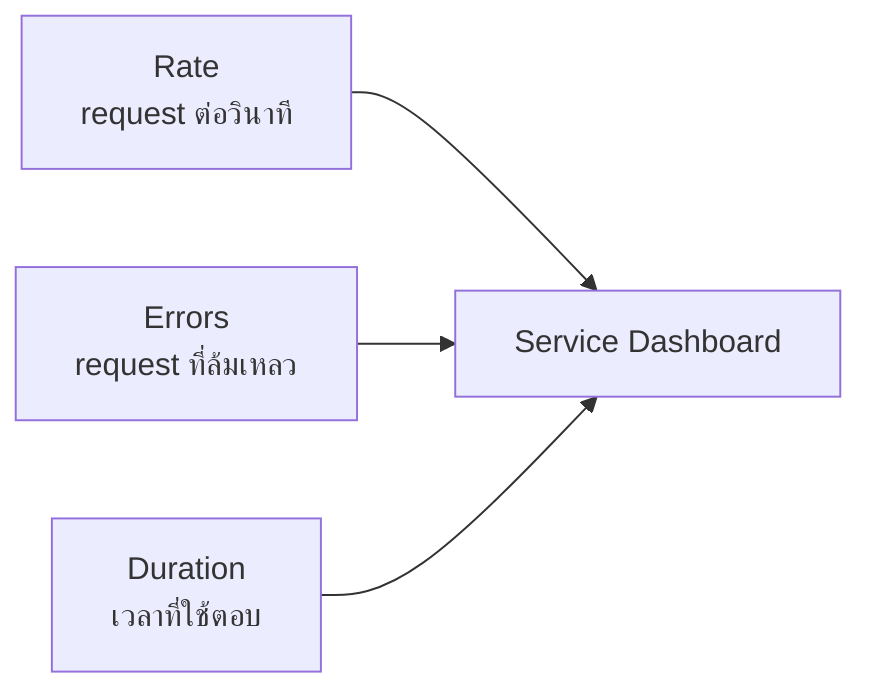
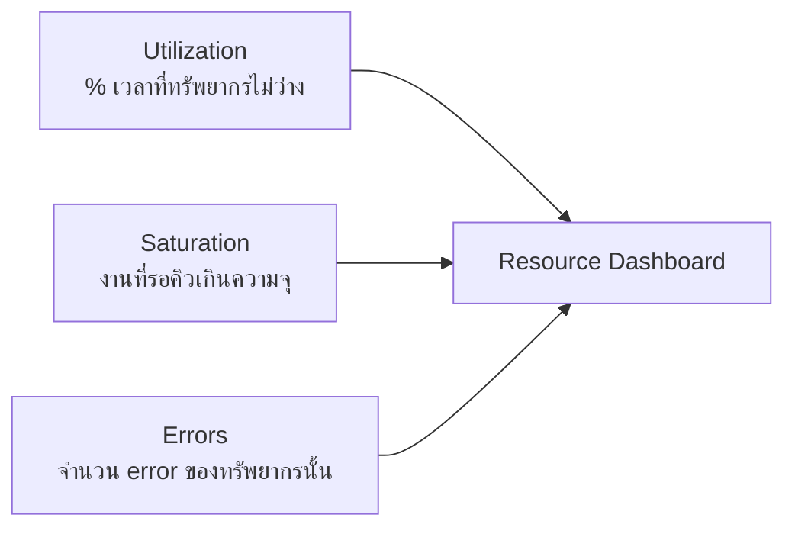

Four Golden Signals บอกว่าต้องดู Latency, Traffic, Errors, Saturation — แต่พอเปิดหน้า dashboard จริง คำถามคือ**จะจัดกลุ่ม metric ยังไงให้ไม่ต้องนั่งนึกจากศูนย์ทุกครั้ง** สอง framework ที่ตอบโจทย์นี้ตรงคือ <mark class="hl-term">**RED Method**</mark> กับ <mark class="hl-term">**USE Method**</mark> — สองอันนี้ไม่ใช่คู่แข่งกัน แต่มองระบบจากคนละมุม: อันหนึ่งมองจาก "บริการที่รับ request" อีกอันมองจาก "ทรัพยากรที่ถูกใช้"

## RED Method — มุมมองจาก Service



<mark class="hl-term">RED = Rate, Errors, Duration</mark> — ออกแบบมาสำหรับ**service ที่รับ request** (API, microservice) สังเกตว่า 3 ตัวนี้คือ Traffic/Errors/Latency จาก Four Golden Signals นั่นเอง เพียงแต่ RED เจาะจงไปที่มุมมอง request-driven ล้วนๆ (ไม่รวม Saturation เพราะ Saturation เป็นเรื่องของทรัพยากรเบื้องหลัง ไม่ใช่ตัว request โดยตรง)

- **Rate** — มี request เข้ามากี่ครั้งต่อวินาที
- **Errors** — กี่ % ของ request ที่ล้มเหลว
- **Duration** — แต่ละ request ใช้เวลานานแค่ไหน (ควรดู percentile ไม่ใช่ค่าเฉลี่ย เหมือนที่เรียนไปในหัวข้อ Golden Signals)

## USE Method — มุมมองจากทรัพยากร



<mark class="hl-term">USE = Utilization, Saturation, Errors</mark> — คิดค้นโดย Brendan Gregg ออกแบบมาสำหรับ**ทรัพยากรระบบ** (CPU, memory, disk I/O, network) ไม่ใช่ตัว request — ใช้ตอนต้องสืบว่า "ทรัพยากรตัวไหนในเครื่องเป็นคอขวด"

- **Utilization** — ทรัพยากรถูกใช้งานอยู่กี่ % ของเวลา
- **Saturation** — มีงานรอคิวเกินกว่าที่ทรัพยากรนั้นรับไหวหรือไม่ (เช่น run queue length ของ CPU)
- **Errors** — เกิด error ของตัวทรัพยากรเองหรือไม่ (เช่น disk I/O error, packet drop)

## เลือกใช้ตัวไหนตอนไหน

| สถานการณ์ | ใช้ Framework ไหน | เหตุผล |
|---|---|---|
| ทำ dashboard หลักของ API/microservice | RED | มองจาก request ตรงกับสิ่งที่ user สัมผัส |
| database CPU พุ่งสูงแต่ error rate ของ API ปกติ | USE | ต้องสืบที่ระดับทรัพยากร ไม่ใช่ request |
| สงสัยว่า service ช้าเพราะ CPU/disk/network คอขวด | USE | ไล่ทรัพยากรทีละตัวหาคอขวด |
| ตั้ง SLO ให้ user-facing endpoint | RED | SLO ผูกกับประสบการณ์ user ไม่ใช่ทรัพยากรภายใน |

<mark class="hl-insight">RED กับ USE ไม่ได้แทนที่กัน — มักใช้คู่กัน: RED เป็นตัวบอกว่า "service กำลังมีปัญหา" (error rate/latency สูงขึ้น) ส่วน USE เป็นตัวช่วยสืบต่อว่า "สาเหตุมาจากทรัพยากรตัวไหน" (เช่น disk I/O saturated) — RED บอกอาการที่ user เจอ USE บอกอวัยวะที่ป่วย</mark>

## ตัวอย่างการสืบสวนจริง

```
1. RED dashboard: checkout-service error rate พุ่งจาก 0.5% เป็น 12%
2. สงสัยว่าเป็นเพราะ database — เปิด USE dashboard ของ DB server
3. USE dashboard: disk I/O utilization 98%, saturation queue ยาวขึ้นเรื่อยๆ
4. สรุป: disk I/O เป็นคอขวด ทำให้ query ช้าลงจน request ฝั่ง service timeout
```

ลำดับนี้แสดงให้เห็นว่า RED กับ USE ทำงานเป็นคู่กัน — เริ่มจาก RED เห็น**อาการ**ที่ user เจอ แล้วไล่ต่อด้วย USE เพื่อหา**อวัยวะ**ที่เป็นต้นเหตุจริง

> คำถามสัมภาษณ์: "database CPU ขึ้นไป 95% แต่ error rate ของ API ปกติดี ควรกังวลไหม และจะสืบยังไง" — คำตอบที่ดีคือชี้ว่า Utilization สูงอย่างเดียวไม่ได้แปลว่ามีปัญหาเสมอไป ต้องดู Saturation ต่อ (queue รอคิวยาวขึ้นไหม) ถ้า saturation ยังต่ำ ระบบอาจแค่ใช้ทรัพยากรเต็มประสิทธิภาพโดยไม่กระทบ user แต่ถ้า saturation เริ่มสูงตามมา นั่นคือสัญญาณเตือนล่วงหน้าก่อนที่ RED metric (error rate/latency) ของ service จะเริ่มแย่ลงตามมา
