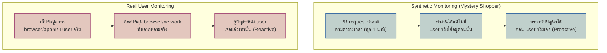

ร้านค้าบางแห่งจ้าง **"mystery shopper"** — คนที่แอบเข้าไปซื้อของเหมือนลูกค้าทั่วไป จับเวลาว่าต้องรอนานแค่ไหน พนักงานตอบคำถามดีไหม — ทำแบบนี้เป็นระยะแม้ไม่มีลูกค้าจริงเดินเข้าร้านเลยตอนนั้น ต่างจากการสำรวจความเห็นจากลูกค้าจริงที่มาซื้อของทุกวัน ซึ่งมีข้อมูลแค่ตอนมีคนมาซื้อจริงเท่านั้น

สองมุมมองนี้คือความต่างระหว่าง <mark class="hl-term">**Synthetic Monitoring**</mark> กับ <mark class="hl-term">**RUM (Real User Monitoring)**</mark>

## Synthetic Monitoring vs RUM

<mark class="hl-insight">**Synthetic Monitoring** ยิง request จำลองจากภายนอกเป็นระยะตามตารางเวลาที่ตั้งไว้ (เช่น ทุก 1 นาที เข้าหน้า login) — ข้อดีคือทำงานได้แม้กลางดึกที่ไม่มี user จริงใช้งานเลย จึง**เจอปัญหาก่อน user จริงเจอ** ส่วน **RUM** เก็บข้อมูลจาก browser/app ของ user จริงทุกคนที่เข้ามาใช้งาน ครอบคลุม browser, network, region ที่หลากหลายกว่าที่ synthetic จะจำลองได้หมด แต่ต้อง**มี user จริงเจอปัญหาก่อนถึงจะรู้**</mark>

## RUM vs APM: มุมมองคนละฝั่งของ Request เดียวกัน

<mark class="hl-warning">อีกคำที่มักสับสนกับ RUM คือ <mark class="hl-term">**APM (Application Performance Monitoring)**</mark> — APM คือมุมมองจาก **server-side** (คล้าย metric/trace ที่เรียนไปแล้วในโมดูลนี้) วัดว่า server ตอบเร็วแค่ไหน ส่วน RUM คือมุมมองจาก **client-side** (สิ่งที่ browser/mobile app ของ user เห็นจริงๆ) — server อาจตอบเร็วมาก (APM ปกติดี) แต่ user ยังรู้สึกว่าเว็บช้า เพราะ JS bundle ใหญ่, third-party script โหลดช้า, หรือ network condition ของ user เอง ซึ่งเป็นสิ่งที่ APM มองไม่เห็นเลย</mark>

## เทียบ 3 มุมมอง

| มิติ | Synthetic Monitoring | RUM | APM |
|---|---|---|---|
| มุมมองจาก | จำลอง request จากภายนอก | Browser/App ของ user จริง | Server-side |
| Proactive/Reactive | Proactive (เจอก่อน user) | Reactive (เจอหลัง user) | Proactive/Reactive ผสม |
| ทำงานได้แม้ไม่มี user จริงไหม | ได้ | ไม่ได้ ต้องมี user ใช้งาน | ได้ (วัดที่ server) |
| ตอบคำถามอะไร | "endpoint สำคัญยังทำงานปกติไหม" | "user จริงเจอปัญหาอะไรบ้าง" | "server ตอบเร็วแค่ไหน" |

> คำถามสัมภาษณ์: "Dashboard APM กับ server metric ทุกตัวปกติดีหมด แต่ user บ่นเข้ามาว่าเว็บช้า ควรสงสัยอะไรก่อน" — คำตอบที่ดีคือชี้ว่า server-side ปกติไม่ได้แปลว่า user experience ปกติ ปัญหามักอยู่ที่ client-side ที่ APM มองไม่เห็น (bundle size, third-party script, network condition ของ user) วิธีตรวจสอบคือเปิดดูข้อมูล RUM ที่เก็บจาก browser จริงของ user ถ้ายังไม่มี RUM ติดตั้งไว้ นี่คือสัญญาณว่าต้องเพิ่ม
