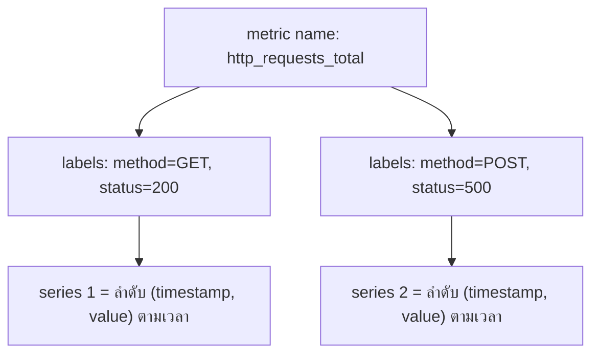

ลองนึกภาพสมุดจดอุณหภูมิที่บ้าน — แต่ละหน้าไม่ได้จดแค่ "อุณหภูมิ" เฉยๆ แต่จดแยกตาม**ห้อง** (ห้องนอน, ห้องครัว) แล้วในแต่ละหน้าก็มีแถวจดค่าไปเรื่อยๆ ตามเวลา (08:00 = 26°C, 09:00 = 27°C, ...) ถ้าอยากรู้ "อุณหภูมิห้องนอนตอน 9 โมง" ก็เปิดหน้าห้องนอน ไล่หาแถวเวลา 9 โมง — นี่คือโครงสร้างข้อมูลที่ <mark class="hl-term">**Prometheus**</mark> และ time-series database ทั่วไปใช้เก็บ metric

## Metric, Label, Sample

- **Metric name** — ชื่อสิ่งที่วัด เช่น `http_requests_total`, `cpu_usage_percent`
- **Label** — คู่ key-value ที่ระบุ**มิติ**ของ metric นั้น เช่น `method="GET"`, `status="200"` — label ต่างค่ากันแม้ metric name เดียวกันคือ**คนละ series**
- **Sample** — คู่ (timestamp, value) หนึ่งจุดในเวลา

<mark class="hl-insight">metric name + ชุด label ที่ต่างกัน = time series คนละเส้น — `http_requests_total{method="GET"}` กับ `http_requests_total{method="POST"}` คือ series แยกกันโดยสมบูรณ์ แม้ชื่อ metric จะเหมือนกัน</mark> นี่คือกลไกที่ทำให้ query กรอง/รวม metric ตาม dimension ต่างๆ ได้ (จะเรียนใน PromQL หัวขัดถัดไป)

## 4 ประเภทของ Metric

| ประเภท | ค่าพฤติกรรม | ตัวอย่าง |
|---|---|---|
| **Counter** | เพิ่มขึ้นอย่างเดียว (reset เป็น 0 ตอน restart) | จำนวน request ทั้งหมด, จำนวน error สะสม |
| **Gauge** | ขึ้นลงได้ตามสภาพปัจจุบัน | จำนวน connection ที่เปิดอยู่, memory usage |
| **Histogram** | แจกแจงค่าลง bucket ตามช่วง | latency กระจายเป็นกี่ % ที่ <100ms, <500ms, <1s |
| **Summary** | คล้าย histogram แต่คำนวณ quantile ที่ client ฝั่งเก็บ metric เอง | p95/p99 latency ที่คำนวณไว้ล่วงหน้า |

<mark class="hl-warning">Counter ที่เห็นค่าลดลงกะทันหันไม่ได้แปลว่ามีบั๊ก — มักเกิดจาก process restart แล้ว counter reset กลับเป็น 0 การอ่านค่า counter ตรงๆ จึงไม่ค่อยมีประโยชน์ ต้องดู**อัตราการเพิ่มขึ้น**แทน (`rate()`) ซึ่งจะเรียนในหัวข้อ PromQL ถัดไป</mark>

## ทำไม Time-Series DB ถึงเก็บข้อมูลต่างจาก Relational DB

Relational DB ออกแบบมาให้ UPDATE/DELETE แถวเดิมได้บ่อยๆ แต่ time-series DB อย่าง Prometheus **แทบไม่มีการ UPDATE ค่าเก่าเลย** — เขียนค่าใหม่ต่อท้ายไปเรื่อยๆ ตาม timestamp (append-only) แล้วใช้ระบบ**compaction**อัดข้อมูลเก่าให้กระชับเป็นระยะ กับ**retention policy**ลบข้อมูลที่เก่าเกินไปทิ้ง (เช่น เก็บแค่ 15 วัน) — ดีไซน์แบบนี้ทำให้เขียนข้อมูลจำนวนมากต่อเนื่องได้เร็วมาก แลกกับการไม่เหมาะจะใช้เก็บข้อมูลที่ต้องแก้ไขบ่อยแบบ transactional data

> คำถามสัมภาษณ์: "ทำไม Prometheus ถึงเก็บข้อมูลแบบ append-only ไม่ยอมให้ UPDATE ค่าเก่า" — คำตอบที่ดีคือชี้ว่า metric คือข้อมูลเชิงเวลาที่เขียนรัวๆ ต่อเนื่องตลอดเวลา (ทุก scrape interval) การออกแบบให้ append-only ทำให้เขียนเร็วและไม่ต้องล็อกแถวเดิมเหมือน relational DB ส่วนข้อมูลเก่าที่ไม่ต้องการแล้วจัดการด้วย compaction/retention แทนการ DELETE ทีละแถว
