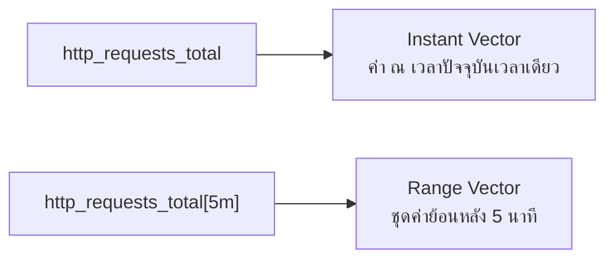

ถ้า SQL คือภาษาที่ใช้ "ถามตาราง" PromQL ก็คือภาษาที่ใช้ "ถาม time series" — แต่คำถามที่ถามกันบ่อยไม่ใช่ "ค่าตอนนี้คือเท่าไหร่" (นั่นง่ายเกินไป) กลับเป็นคำถามแบบ "**อัตราการเปลี่ยนแปลง**ในช่วง 5 นาทีที่ผ่านมาเป็นยังไง" — เพราะอย่างที่เรียนไปในหัวข้อก่อนหน้า metric ประเภท Counter อ่านค่าตรงๆ ไม่มีประโยชน์เท่าดูอัตราการเพิ่ม

## Instant Vector vs Range Vector



- **Instant Vector** — `http_requests_total` — คืนค่า**ล่าสุด** ของทุก series ที่ match (จุดเดียวต่อ series)
- **Range Vector** — `http_requests_total[5m]` — คืนค่า**ทุกจุดย้อนหลัง 5 นาที** ของทุก series ที่ match (ยังไม่ใช่ตัวเลขเดียว ต้องเอาไปประมวลผลต่อ)

Range vector ใช้เดี่ยวๆ ยังไม่ได้ เพราะเป็นชุดข้อมูล ไม่ใช่ตัวเลข — ต้องผ่าน function อย่าง `rate()` ก่อนถึงจะได้ตัวเลขเดียวออกมา plot บน dashboard ได้

## rate() vs increase() — จัดการ Counter Reset ให้อัตโนมัติ

```
rate(http_requests_total[5m])
→ อัตราเพิ่มขึ้นเฉลี่ยต่อวินาที ในช่วง 5 นาทีที่ผ่านมา (requests/sec)

increase(http_requests_total[5m])
→ จำนวนที่เพิ่มขึ้นทั้งหมดในช่วง 5 นาทีที่ผ่านมา (requests รวม)
```

<mark class="hl-insight">`rate()` ฉลาดพอที่จะจัดการ **counter reset** ให้อัตโนมัติ — ถ้า process restart แล้ว counter กระโดดกลับไป 0 กลางช่วงเวลาที่คำนวณ `rate()` จะรู้ว่านี่คือ reset (ค่าลดลงทั้งที่ counter ควรเพิ่มอย่างเดียว) แล้วชดเชยให้ ไม่ทำให้ผลลัพธ์ติดลบผิดปกติ</mark> — นี่คือเหตุผลที่ต้องใช้ `rate()` กับ Counter เสมอ ไม่ใช่เอาค่าดิบมาลบกันเอง

<mark class="hl-warning">ข้อผิดพลาดที่พบบ่อย: ใช้ `rate()` กับ Gauge — `rate()` ออกแบบมาสำหรับ Counter ที่เพิ่มขึ้นอย่างเดียวเท่านั้น เอาไปใช้กับ Gauge (ที่ขึ้นลงได้ตามปกติ) จะได้ผลลัพธ์ที่ไม่มีความหมาย เพราะ Gauge ลดลงเองได้โดยไม่ใช่ reset</mark>

## เขียน Four Golden Signals เป็น PromQL จริง

จากหัวข้อ Four Golden Signals ที่เรียนไปแล้ว มาลองแปลงเป็น query จริง:

```
# Traffic — request ต่อวินาที
sum(rate(http_requests_total[5m]))

# Errors — % ของ request ที่ error
sum(rate(http_requests_total{status=~"5.."}[5m]))
  / sum(rate(http_requests_total[5m])) * 100

# Latency (p99) — จาก histogram
histogram_quantile(0.99, rate(http_request_duration_seconds_bucket[5m]))

# Saturation — queue length เฉลี่ย
avg(queue_depth)
```

`sum by (...)` ใช้เวลาต้องการแยกผลลัพธ์ตาม label บางตัว เช่น `sum by (service) (rate(http_requests_total[5m]))` จะได้ traffic แยกรายทุก service แทนที่จะรวมเป็นตัวเลขเดียว — `histogram_quantile()` คือฟังก์ชันเฉพาะที่ใช้แปลง histogram buckets ให้เป็น percentile อย่าง p99 ได้ (เชื่อมกับ metric ประเภท Histogram ที่เรียนไปในหัวข้อก่อน)

> คำถามสัมภาษณ์: "ทำไม PromQL ถึงต้องใช้ `rate()` ครอบ Counter เสมอ ไม่อ่านค่าตรงๆ" — คำตอบที่ดีคือชี้ว่า Counter สะสมค่าไปเรื่อยๆ และ reset เป็น 0 ทุกครั้งที่ process restart การอ่านค่าดิบจึงไม่สะท้อน "อัตรา" ที่เกิดขึ้นจริง `rate()` คำนวณอัตราเฉลี่ยต่อวินาทีจากช่วงเวลาที่กำหนด และจัดการ counter reset ให้อัตโนมัติ ทำให้ได้ตัวเลขที่มีความหมายสำหรับ dashboard/alert
