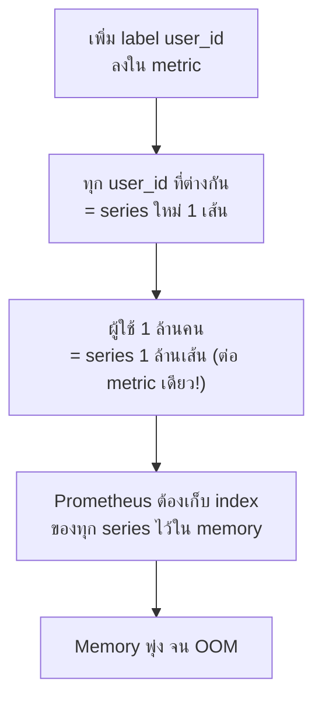

ในหัวข้อ Monitoring vs Observability เคยเรียนว่า <mark class="hl-term">high-cardinality data</mark> (field ที่มีค่าไม่ซ้ำเยอะๆ เช่น `user_id`, `request_id`) คือสิ่งดีที่ทำให้สืบสวนปัญหาไม่คาดคิดได้ — แต่พอมาถึง Prometheus โดยเฉพาะ **high cardinality กลับเป็นระเบิดเวลา** ความจริงสองข้อนี้ไม่ได้ขัดกัน แค่**เครื่องมือต่างชนิดรับมือกับ high cardinality ไม่เท่ากัน**

## ทำไม Cardinality สูงถึงพัง Prometheus โดยเฉพาะ

จากหัวข้อ Time-Series Data Model — metric name + ชุด label ที่ต่างกัน = series คนละเส้น ถ้าเผลอใส่ label ที่มีค่าไม่ซ้ำนับล้าน (เช่น `user_id`, `request_id`, หรือ raw URL path ที่มี ID ปนอยู่) จำนวน series จะ**ระเบิดเป็นเลขชี้กำลัง** เพราะ Prometheus เก็บ**index ของทุก series ไว้ใน memory**เพื่อ query ได้เร็ว — series ยิ่งเยอะ memory ยิ่งพุ่ง จนวันหนึ่ง OOM ทั้ง Prometheus server

<mark class="hl-warning">นี่คือความต่างสำคัญจากระบบ log/trace ที่ออกแบบมารับ high-cardinality field ได้สบาย (เพราะเก็บเป็น event ดิบ ค้นด้วย index แบบอื่น) — Prometheus ออกแบบมาให้ query เร็วด้วยการ index ทุก series ไว้ล่วงหน้า ยิ่ง series เยอะ ยิ่งช้าและกิน memory มากขึ้นเรื่อยๆ ไม่ scale เหมือนระบบ log</mark>

## Label ไหนใส่ได้ ไหนห้ามใส่

| Label | ใส่ได้ไหม | เหตุผล |
|---|---|---|
| `method="GET"` | ได้ | ค่าจำกัด (GET/POST/PUT/...) ไม่กี่แบบ |
| `status="500"` | ได้ | ค่าจำกัด (HTTP status code มีจำกัด) |
| `service="checkout"` | ได้ | จำนวน service ในระบบมีจำกัด |
| `user_id="8842"` | **ห้าม** | user นับล้านคน = series นับล้าน |
| `request_id="a1b2c3"` | **ห้าม** | ทุก request unique = series ไม่จำกัด |
| `url="/orders/8842"` | **ห้าม** ถ้า raw path มี ID ปน | ต้อง normalize เป็น `/orders/:id` ก่อน |

กฎง่ายๆ: <mark class="hl-insight">label ที่ดีคือ label ที่มี**ค่าจำกัดและรู้ล่วงหน้าได้คร่าวๆ** ว่ามีกี่แบบ (bounded cardinality) — ถ้า label ไหนค่าโตไปเรื่อยๆ ตามจำนวน user/request ให้ย้ายไปเก็บใน log หรือ trace แทน ไม่ใช่ metric label</mark> เพราะ log/trace ออกแบบมารับ high-cardinality โดยเฉพาะ ส่วน metric ควรเก็บแค่ตัวเลขสรุปตามมิติที่จำกัด

## วิธีแก้ถ้าจำเป็นต้องดูรายละเอียดระดับ user

ถ้าต้องการสืบปัญหาระดับ user_id เจาะจง ให้ใช้แนวทางที่เรียนไปแล้วในหัวข้อ Monitoring vs Observability — **metric บอกว่ามีปัญหา (aggregate) แล้วค่อยกระโดดไปดู trace/log ที่ tag ด้วย user_id นั้นเพื่อสืบรายละเอียด** ไม่ใช่พยายามยัด user_id เข้าไปเป็น metric label ตั้งแต่แรก — แบ่งงานตามจุดแข็งของแต่ละเครื่องมือ: metric สรุปภาพรวมถูกๆ เร็วๆ, log/trace เจาะรายละเอียดเมื่อจำเป็น

> คำถามสัมภาษณ์: "ทีมอยากเพิ่ม label `user_id` เข้าไปใน metric `http_requests_total` เพื่อ debug ง่ายขึ้น เห็นด้วยไหม" — คำตอบที่ดีคือไม่เห็นด้วย เพราะ `user_id` เป็น unbounded high-cardinality label ที่จะทำให้จำนวน series ใน Prometheus ระเบิดตามจำนวน user จนกิน memory จน OOM ควรเก็บ metric แค่ dimension ที่ bounded (เช่น status, method) แล้วใช้ log หรือ trace ที่ tag ด้วย user_id/request_id สำหรับ debug ระดับรายบุคคลแทน
