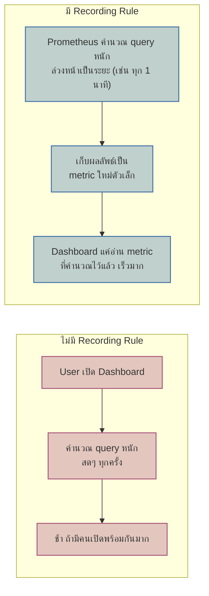
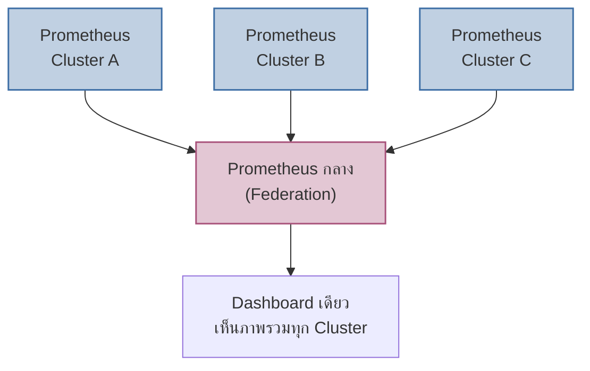

เคยเรียน PromQL พื้นฐานไปแล้ว (query สดๆทุกครั้งที่เปิด dashboard) — แต่ถ้า dashboard นั้นมีคนเปิดดูพร้อมกันหลายสิบคน แต่ละครั้งต้องคำนวณ query ที่หนัก (เช่น `rate()` ข้อมูลย้อนหลัง 7 วัน) ซ้ำใหม่ทุกครั้ง เซิร์ฟเวอร์ Prometheus จะโดนถามคำถามเดิมซ้ำๆจนแบกไม่ไหว

## Recording Rules: คำนวณล่วงหน้า ไม่ต้องคิดใหม่ทุกครั้ง

<mark class="hl-term">**Recording Rule**</mark> คือการบอก Prometheus ให้คำนวณ query ที่หนักหรือใช้บ่อยไว้ล่วงหน้าเป็นระยะ แล้วเก็บผลลัพธ์เป็น metric ใหม่ตัวเล็กๆ — เวลา dashboard ต้องใช้ค่านี้ ก็แค่อ่าน metric ที่คำนวณไว้แล้ว ไม่ต้องคำนวณ query หนักซ้ำทุกครั้งที่มีคนเปิดดู

<mark class="hl-insight">เคยเรียน Cardinality Explosion ไปแล้ว — Recording Rule ช่วยลด**load จากการ query ซ้ำๆ** แต่ไม่ได้แก้ปัญหา cardinality สูงที่ต้นตอ (metric ที่ cardinality สูงยังกิน storage เท่าเดิม) สองปัญหานี้แก้กันคนละจุด ต้องแก้ทั้งสองอย่างถ้าจะจัดการ Prometheus ขนาดใหญ่ให้ยั่งยืน</mark>

## Federation: รวมข้อมูลจาก Prometheus หลายตัว

<mark class="hl-term">**Federation**</mark> คือให้ Prometheus ตัวกลางดึงข้อมูล**สรุป** (มักเป็นผลจาก recording rule ไม่ใช่ raw metric ทั้งหมด) จาก Prometheus ตัวลูกหลายตัวมารวม — ใช้ตอนมีหลาย cluster/region ที่แต่ละที่มี Prometheus ของตัวเอง แต่ต้องการ dashboard เดียวเห็นภาพรวมทั้งองค์กร

## Remote Write: เมื่อ Prometheus เองไม่พอสำหรับ Long-term Storage

<mark class="hl-warning">Prometheus ถูกออกแบบมาให้เก็บข้อมูลระยะสั้น-กลาง (ปกติไม่กี่สัปดาห์) ถ้าต้องการเก็บ metric ย้อนหลังเป็นปี (เช่น เพื่อดู trend การเติบโตของระบบ) ต้องส่งข้อมูลออกไปเก็บที่ **long-term storage ภายนอก** ผ่านกลไก <mark class="hl-term">**Remote Write**</mark> (เช่น ส่งไปเก็บที่ Thanos, Mimir, Cortex) — Prometheus ตัวเดิมยังทำหน้าที่ scrape และ alert ตามปกติ แค่ส่งสำเนาข้อมูลออกไปเก็บระยะยาวเพิ่ม</mark>

## เทียบ 3 เทคนิคขั้นสูง

| เทคนิค | แก้ปัญหาอะไร | ใช้ตอนไหน |
|---|---|---|
| Recording Rule | Query หนักถูกคำนวณซ้ำทุกครั้ง | Dashboard ที่มีคนเปิดดูบ่อย/query ซับซ้อน |
| Federation | อยากเห็นภาพรวมข้าม cluster/region | มี Prometheus หลายตัวแยกกันตาม cluster |
| Remote Write | Prometheus เก็บข้อมูลได้ระยะสั้นเกินไป | ต้องการ retention ระยะยาว (เป็นเดือน-ปี) |

> คำถามสัมภาษณ์: "Dashboard องค์กรที่มีคนเปิดดูพร้อมกันหลายร้อยคนเริ่มโหลดช้า ควรแก้ยังไงก่อนที่จะคิดเรื่องเพิ่ม hardware" — คำตอบที่ดีคือเช็คก่อนว่า query ที่ dashboard ใช้เป็น query หนัก (เช่น `rate()` ย้อนหลังนาน) ที่ถูกคำนวณสดใหม่ทุกครั้งหรือเปล่า ถ้าใช่ ควรทำ Recording Rule คำนวณล่วงหน้าไว้ก่อน ซึ่งมักแก้ปัญหาความช้าได้โดยไม่ต้องเพิ่ม hardware เลย
