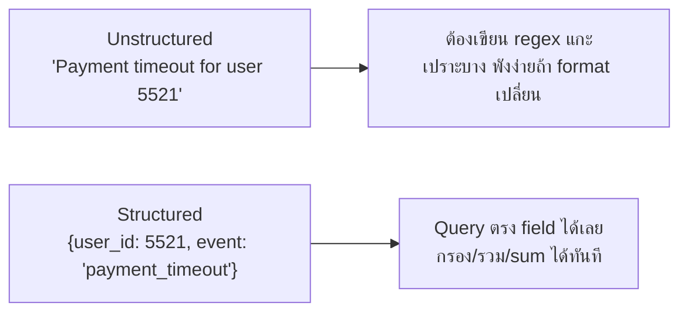

ในหัวข้อ Observability (โมดูล Reliability) เคยเห็นตัวอย่าง log แบบนี้มาแล้ว:

```
2026-09-06T10:22:41Z [ERROR] order-service req_id=8a3f user_id=5521 msg="payment timeout after 3000ms" gateway=stripe
```

สังเกตว่า log บรรทัดนี้ไม่ใช่แค่ข้อความยาวๆ ให้คนอ่าน — มันมี**field แยกชัดเจน** (`req_id`, `user_id`, `gateway`) นี่คือหัวใจของ <mark class="hl-term">**Structured Logging**</mark> ต่างจาก log แบบเดิมที่เขียนเป็นประโยคอิสระ (unstructured) แบบ `"Payment timeout for user 5521 via stripe after 3000ms"` ซึ่งอ่านด้วยตาคนง่ายกว่า แต่**เครื่องประมวลผลต่อไม่ได้เลย**

## Unstructured vs Structured



| มิติ | Unstructured | Structured |
|---|---|---|
| เขียนง่าย | ง่าย พิมพ์ยังไงก็ได้ | ต้องคิด schema field ล่วงหน้า |
| ค้นหา | grep + regex เปราะบาง | query field ตรงๆ เช่น `user_id=5521` |
| รวม/สรุปสถิติ | ทำแทบไม่ได้ | `count by (event)` ได้เลย |
| เปลี่ยน log message ทีหลัง | ไม่กระทบ query เก่า (เพราะ query ด้วย regex) | อาจกระทบถ้าเปลี่ยนชื่อ field |

<mark class="hl-warning">ปัญหาคลาสสิกของ unstructured log: มีคนแก้ข้อความ log จาก `"Payment timeout"` เป็น `"Payment time out"` (เว้นวรรคต่าง) แล้ว alert/dashboard ที่ grep คำเดิมอยู่**เงียบหายไปเฉยๆ**โดยไม่มีใครรู้ตัว — เพราะ regex ที่ตั้งไว้ไม่ match ข้อความใหม่แล้ว</mark> Structured logging แก้ปัญหานี้ตรงจุด: query อิง**ชื่อ field** ที่คงที่ (เช่น `event="payment_timeout"`) ไม่ใช่ข้อความอิสระที่แก้ได้ตลอดเวลา

## รูปแบบที่นิยม — JSON Line

```json
{"timestamp":"2026-09-06T10:22:41Z","level":"ERROR","service":"order-service","req_id":"8a3f","user_id":5521,"event":"payment_timeout","duration_ms":3000,"gateway":"stripe"}
```

หนึ่งบรรทัด = หนึ่ง JSON object เรียกว่า <mark class="hl-term">JSON Lines (JSONL)</mark> — เลือกใช้ JSON เพราะ**เครื่องมือ parse มีอยู่แล้วทุกภาษา** ไม่ต้องเขียน parser เอง และต่อกับระบบ log aggregation แทบทุกตัวได้ทันที (จะเรียนใน pipeline หัวข้อถัดไป)

## Correlation ID — เชื่อม Log หลายบรรทัดเป็นเรื่องเดียวกัน

<mark class="hl-insight">field ที่สำคัญที่สุดใน structured log คือ **correlation ID** (`req_id` ในตัวอย่างข้างบน) — ทุก log ที่เกิดจาก request เดียวกัน ไม่ว่าจะผ่านกี่ service ต้องแปะ `req_id` เดียวกันเสมอ พอเกิดปัญหา แค่ query `req_id=8a3f` ก็เห็น log ทุกจุดที่ request นั้นผ่าน เรียงตามเวลาได้ทันที</mark> — concept นี้คือรากฐานเดียวกับ trace ID ที่จะเรียนในหัวข้อ Distributed Tracing ถัดไปในโมดูลนี้ เพียงแต่ correlation ID ในบริบท log ยังไม่ต้องมีข้อมูล timing/span ละเอียดเท่า distributed trace

> คำถามสัมภาษณ์: "ทำไม structured logging ถึงสำคัญสำหรับระบบที่มีหลาย service" — คำตอบที่ดีคือชี้ว่า unstructured log ต้องพึ่ง regex ที่เปราะบางและพังง่ายเมื่อข้อความเปลี่ยน ส่วน structured log มี field คงที่ให้ query/กรอง/สรุปสถิติได้แม่นยำ และเมื่อผูกกับ correlation ID จะตามรอย request เดียวข้ามหลาย service ได้ ซึ่งจำเป็นมากขึ้นเรื่อยๆ เมื่อระบบเป็น microservices
