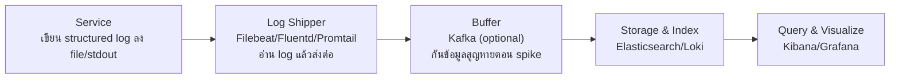
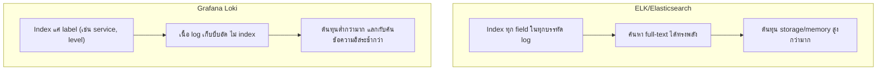

ระบบที่มี service วิ่งอยู่หลายสิบเครื่อง แต่ละเครื่อง log ลงไฟล์ตัวเองบน disk — พอเกิดปัญหา ต้อง SSH เข้าไปทีละเครื่อง `grep` หา log เอง เป็นฝันร้ายที่ทีม SRE ทุกทีมเคยเจอ ทางแก้คือรวบ log จากทุกเครื่องมาไว้ที่**จุดเดียว** ให้ query ได้จากที่เดียวจบ เรียกว่า <mark class="hl-term">**Centralized Logging**</mark>

## Pipeline มาตรฐาน 4 ขั้น

1. **Service** เขียน structured log (จากหัวข้อก่อนหน้า) ออกไปที่ stdout หรือไฟล์
2. **Log Shipper** (Filebeat, Fluentd, Promtail) วิ่งอยู่ทุกเครื่อง คอยอ่าน log ใหม่แล้วส่งต่อไปปลายทาง — ไม่ใช่ตัว service เขียนตรงไปที่ storage เอง เพื่อไม่ให้ network ล่มกระทบ service หลัก
3. **Buffer** (มักเป็น Kafka) กันข้อมูลสูญหายเวลา log พุ่งสูงกว่าที่ storage รับไหว
4. **Storage & Index + Query** เก็บและทำให้ค้นหาได้เร็ว

## ELK Stack vs Grafana Loki — ปรัชญาต่างกันตรง Index

| มิติ | ELK (Elasticsearch) | Grafana Loki |
|---|---|---|
| วิธี index | index **ทุก field** ในทุกบรรทัด | index แค่ **label** จำนวนน้อย (เหมือน Prometheus) |
| ค้นหา full-text | เร็วและทรงพลัง | ช้ากว่า ต้อง grep เนื้อ log ที่ query ได้ |
| ต้นทุน storage | สูงกว่ามาก (index ทุกอย่าง) | ต่ำกว่ามาก (index แค่ label) |
| เหมาะกับ | ต้อง full-text search ซับซ้อนบ่อย | อยากประหยัดต้นทุน, ใช้คู่กับ Prometheus/Grafana อยู่แล้ว |

<mark class="hl-insight">Loki จงใจ**ไม่ index เนื้อ log** เพราะเรียนรู้จากปัญหา cardinality explosion แบบเดียวกับที่เจอใน Prometheus (หัวข้อก่อนหน้า) — ถ้า index ทุก field ของทุกบรรทัด log เท่ากับสร้าง cardinality สูงมหาศาลจนต้นทุนพุ่ง Loki เลยเลือก index แค่ label จำนวนจำกัด (เช่น `service`, `level`) แล้วเก็บเนื้อ log จริงแบบบีบอัดไว้ค้นทีหลังตอน query จริงๆ เท่านั้น — แลก search เร็วสุดๆ กับต้นทุนที่ต่ำกว่า ELK มาก</mark>

## เลือกยังไงในทางปฏิบัติ

<mark class="hl-warning">ทีมที่เลือก ELK เพราะอยากได้ full-text search ที่ทรงพลัง มักไม่คาดคิดว่าต้นทุน storage จะพุ่งเร็วแค่ไหนเมื่อ traffic โต — เพราะ index ทุก field คือ trade-off ที่จ่ายด้วยพื้นที่เก็บและ memory มหาศาล ทีมที่ scale ไม่ทันมักต้องย้ายมาใช้ Loki หรือลด retention ลงกะทันหันตอนบิลพุ่ง</mark> คำแนะนำทั่วไป: ถ้าทีมใช้ Prometheus + Grafana อยู่แล้ว (เรียนไปในโมดูลนี้) Loki เข้ากันเป็นธรรมชาติเพราะใช้ label-based query แบบเดียวกัน ส่วนถ้าต้องการ full-text search ที่ซับซ้อนจริงจัง (เช่น ค้นหาข้อความอิสระในเอกสารจำนวนมาก) ELK ยังตอบโจทย์ได้ดีกว่า

> คำถามสัมภาษณ์: "ทำไม Grafana Loki ถึงประหยัดต้นทุนกว่า Elasticsearch มาก ทั้งที่เก็บ log เหมือนกัน" — คำตอบที่ดีคือชี้ว่า Elasticsearch index ทุก field ในทุกบรรทัด log ทำให้ค้นหา full-text ได้ทรงพลังแต่ต้นทุน storage/memory สูงมาก ส่วน Loki index แค่ label จำนวนจำกัด (แนวคิดเดียวกับ Prometheus) แล้วเก็บเนื้อ log แบบบีบอัดไว้ค้นตอน query จริงเท่านั้น จึงประหยัดกว่ามาก แลกกับการค้นข้อความอิสระที่ช้ากว่า
