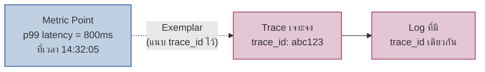
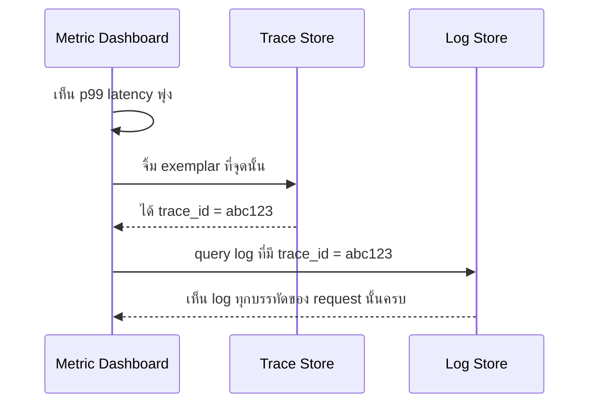

เคยเรียนมาแล้วว่า metric, log, trace คือสามเสาหลักของการสังเกตระบบ (โมดูล Reliability) แต่ในทางปฏิบัติ สามอย่างนี้มักอยู่**คนละที่ คนละเครื่องมือ** — เห็น metric ว่า latency พุ่ง แต่ต้องเปิดอีกหน้าจอไปหา log เอง เปิดอีกหน้าไปหา trace เอง ไม่มีอะไรเชื่อมกันตรงๆ

## Exemplar: สะพานเชื่อมจาก Metric ไปหา Trace

<mark class="hl-term">**Exemplar**</mark> คือตัวอย่าง `trace_id` ที่แนบไปกับ metric sample จุดหนึ่ง — เวลาเห็นกราฟ latency พุ่งสูงที่จุดใดจุดหนึ่ง สามารถ "จิ้ม" ตรงจุดนั้นแล้วกระโดดตรงไปหา trace จริงที่ทำให้ค่านั้นเกิดขึ้นได้ทันที ไม่ต้องเดาว่า request ไหนคือตัวการ

<mark class="hl-insight">ก่อนมี exemplar การเชื่อม metric กับ trace ทำได้แค่**เดาช่วงเวลา** (เห็น metric พุ่งช่วง 14:32 ก็ไปกรอง trace ในช่วงเวลานั้นเอง ซึ่งอาจมีหลายร้อย trace ให้ไล่ดู) — exemplar ทำให้ metric แต่ละจุด**ชี้ตรงไปยัง trace ที่แท้จริง** ไม่ต้องเดาช่วงเวลาแล้วกรองเอง</mark>

## Correlation ID: เชื่อม Log กับ Trace

เคยเรียน Structured Logging และ Span & Trace ไปแล้ว — ถ้า log แต่ละบรรทัดมี field `trace_id` เดียวกับ trace ที่ request นั้นสร้างขึ้น จะสามารถ**query log ทั้งหมดที่เกี่ยวกับ trace เจาะจงนั้นได้ทันที**

<mark class="hl-warning">การเชื่อมนี้ทำงานได้ก็ต่อเมื่อ**ทุกระบบใช้ trace_id เดียวกันตลอดทาง** — ถ้า log format คนละแบบ ไม่มี field trace_id หรือ trace context ไม่ถูก propagate ข้าม service (ที่เรียนไปแล้วเรื่อง Trace Context Propagation) การเชื่อม metric-trace-log จะขาดตอนทันที กลับไปเป็นการเดาช่วงเวลาแบบเดิม</mark>

> คำถามสัมภาษณ์: "ทีมมี Grafana (metric), Jaeger (trace), Loki (log) แยกกันคนละตัว อยากให้สืบสวน incident เร็วขึ้นโดยไม่ต้องสลับหน้าจอไปมา 3 รอบ ควรทำอะไรก่อน" — คำตอบที่ดีคือชี้ไปที่การเปิดใช้ exemplar บน metric ที่สำคัญ (เช่น latency histogram) ให้แนบ trace_id ไว้ และตรวจให้แน่ใจว่า log ทุก service มี field trace_id เดียวกับที่ trace ใช้ — เมื่อทำครบสองอย่างนี้ dashboard ที่เห็น metric ผิดปกติสามารถจิ้มตรงไปหา trace และ log ที่เกี่ยวข้องได้ทันทีโดยไม่ต้องเดาช่วงเวลาแล้วไล่หาเอง
