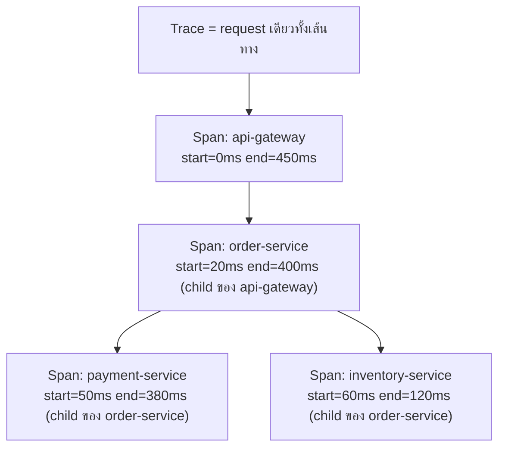

ในหัวข้อ Structured Logging เรียนไปแล้วว่า correlation ID (`req_id`) ช่วยเชื่อม log หลายบรรทัดที่มาจาก request เดียวกันเข้าด้วยกัน — แต่ correlation ID บอกได้แค่ "log พวกนี้มาจาก request เดียวกัน" ไม่ได้บอก**โครงสร้างเวลา**ว่าแต่ละ service ใช้เวลานานแค่ไหน หรือใครเรียกใครก่อนหลัง <mark class="hl-term">**Distributed Tracing**</mark> ต่อยอด concept นี้ไปอีกขั้น ด้วยการเก็บทั้ง**เวลาเริ่ม-จบ**และ**ความสัมพันธ์แบบ parent-child**ของทุกจุดที่ request ผ่าน

## Span คือหน่วยพื้นฐานของ Trace



- **Trace** — เส้นทางทั้งหมดของ request เดียว ตั้งแต่เข้าระบบจนออก
- **Span** — หนึ่งช่วงงานภายใน trace (เช่น 1 service call, 1 database query) มี **start time, end time, และ parent span** ของตัวเอง
- **Trace ID** — รหัสเดียวกันที่ทุก span ในเส้นทางเดียวกันใช้ร่วมกัน (คล้าย correlation ID แต่มีโครงสร้าง parent-child เพิ่มเข้ามา)
- **Span ID** — รหัสเฉพาะของ span นั้นๆ ใช้บอกว่า span ไหนเป็นลูกของ span ไหน

<mark class="hl-insight">ความต่างจาก correlation ID แบบ flat ในหัวข้อก่อน — trace ไม่ได้แค่บอกว่า "log กลุ่มนี้มาด้วยกัน" แต่บอก**โครงสร้างเวลาซ้อนกันเป็นชั้นๆ**ว่า span ไหนเป็นลูกของ span ไหน เริ่ม-จบตอนไหน ทำให้มองเห็นได้ทันทีว่า service ไหนกินเวลาไปเยอะสุดในเส้นทางทั้งหมด</mark>

## ลองดู Waterfall จริง

กดจำลอง request ด้านล่างดูโครงสร้าง span ที่ซ้อนกัน — สังเกตว่า span ที่เป็นลูก (child) จะเริ่มทีหลัง parent เสมอ และจบก่อนหรือพร้อม parent เสมอ (ไม่มีทางที่ child จะกินเวลานานกว่า parent ที่ครอบมันอยู่)

```demo
component: TraceWaterfallDemo
caption: Distributed Trace Waterfall — คลิกแถบเพื่อดูรายละเอียดแต่ละ span
```

<mark class="hl-warning">กับดักที่พบบ่อย: มองแค่ "trace นี้ใช้เวลารวม 450ms" แล้วคิดว่าช้าเพราะ service ทั้งหมดทำงานต่อเนื่องกัน — แต่ถ้า span ลูกหลายตัวทำงาน**ขนานกัน** (parallel calls) เวลารวมของ parent จะไม่เท่ากับผลรวมเวลาของ child ทุกตัว ต้องดู waterfall จริงว่า span ไหนซ้อนทับเวลากันบ้าง ไม่ใช่บวกเวลาทุก span ตรงๆ</mark>

## ทำไมต้องมีทั้ง Log และ Trace

| | Log (structured) | Trace |
|---|---|---|
| บอกอะไร | เหตุการณ์แต่ละจุด พร้อมรายละเอียด | โครงสร้างเวลาและลำดับการเรียกข้าม service |
| ตอบคำถาม | "เกิดอะไรขึ้น เป๊ะๆ ตรงนี้" | "ช้า/พังตรงไหนในสายพาน request" |
| เชื่อมกันด้วย | correlation ID (`req_id`) | trace ID + span ID (มีโครงสร้าง parent-child) |

Log กับ Trace ไม่ได้แข่งกัน — มักใช้คู่กัน: **Trace บอกว่า span ไหนช้า/error** แล้วค่อยกระโดดไปดู **log ของ span นั้นเจาะจง** (ที่ tag ด้วย trace ID เดียวกัน) เพื่อดูรายละเอียดว่าเกิดอะไรขึ้นเป๊ะๆ ที่จุดนั้น — ลำดับการสืบสวนแบบนี้ตรงกับที่เรียนไปแล้วในหัวข้อ Monitoring vs Observability (Metric บอกว่ามีปัญหา → Trace บอกว่าปัญหาอยู่ตรงไหน → Log บอกรายละเอียด)

> คำถามสัมภาษณ์: "Trace ID ต่างจาก Correlation ID ที่ใช้ใน log ยังไง" — คำตอบที่ดีคือชี้ว่า correlation ID แค่บอกว่า log กลุ่มไหนมาจาก request เดียวกัน (flat, ไม่มีโครงสร้าง) ส่วน trace ID มาพร้อมกับ span ที่มี start/end time และความสัมพันธ์ parent-child ชัดเจน ทำให้มองเห็นได้ว่า service ไหนในสายพาน request กินเวลาไปเยอะสุด ไม่ใช่แค่รู้ว่า log เกี่ยวข้องกันเฉยๆ
