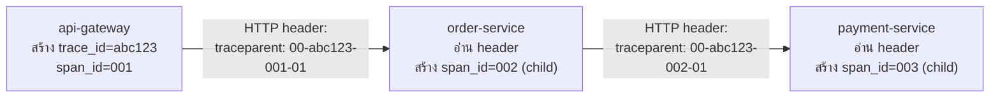

Trace ID กับ Span ID มีประโยชน์แค่ตอนที่**ทุก service ในเส้นทาง request รู้จักมันเหมือนกัน** — ถ้า `api-gateway` สร้าง trace ID ไว้ แต่เวลาเรียกต่อไปยัง `order-service` ไม่ได้ส่ง trace ID นั้นไปด้วย `order-service` ก็จะสร้าง trace ใหม่ของตัวเอง กลายเป็น trace แยกกัน 2 เส้นที่ไม่รู้จักกันเลยทั้งที่มาจาก request เดียวกัน — ปัญหานี้แก้ด้วย <mark class="hl-term">**Trace Context Propagation**</mark>

## ส่ง Trace Context ผ่าน HTTP Header



มาตรฐานที่ใช้กันทั่วไปตอนนี้คือ <mark class="hl-term">**W3C Trace Context**</mark> — ส่ง trace context ผ่าน HTTP header ชื่อ `traceparent`:

```
traceparent: 00-4bf92f3577b34da6a3ce929d0e0e4736-00f067aa0ba902b7-01
             │  └─── trace ID (32 hex) ───────┘ └─ span ID (16 hex) ┘ │
           version                                              flags
```

ทุก service ที่รับ request ต้อง**อ่าน header นี้**, สร้าง span ใหม่ของตัวเองโดยใช้ trace ID เดิม (แต่ span ID ใหม่ที่ผูกเป็น child ของ span ID ที่ได้รับมา), แล้ว**ส่ง header ใหม่ต่อ**ไปยัง service ถัดไปด้วย span ID ของตัวเองแทนที่ — chain นี้ทำให้ทุก span ที่เกิดขึ้นทั้งเส้นทางอยู่ใน trace เดียวกัน

## จุดที่ Propagation มักพังในทางปฏิบัติ

<mark class="hl-warning">Trace ขาดตอนกลางทางบ่อยที่สุดตรงจุดที่**ไม่ใช่ synchronous HTTP call ตรงๆ** — เช่น ส่ง message เข้า queue (RabbitMQ, Kafka) แล้ว consumer อีกฝั่งประมวลผลทีหลัง ถ้าไม่ได้ตั้งใจแนบ trace context ไปกับ message header ด้วย consumer จะเริ่ม trace ใหม่ที่ไม่เชื่อมกับฝั่ง producer เลย เกิดเป็น "trace ขาดตอน" ที่ทีมสืบปัญหาไม่ออกว่า async job นี้เกิดจาก request ไหน</mark>

จุดเสี่ยงอื่นๆ ที่มักลืม:

| จุดเสี่ยง | ปัญหา | ทางแก้ |
|---|---|---|
| Message Queue (Kafka/RabbitMQ) | trace ขาดตอนที่ consumer | แนบ trace context ไปใน message header/metadata เอง |
| Background job / cron | ไม่มี request ต้นทางให้ propagate จาก | สร้าง trace ใหม่ตั้งแต่ job เริ่ม พร้อม tag ว่าเป็น background |
| Library เก่าที่ไม่รองรับ auto-instrumentation | header ไม่ถูกอ่าน/ส่งต่ออัตโนมัติ | ต้อง manual instrument จุดนั้นเอง |
| Retry/Circuit Breaker (จากโมดูล Reliability) | retry อาจสร้าง span ใหม่ที่ดูเหมือนไม่เกี่ยวกัน | tag retry attempt เป็น attribute ใน span เดิม ไม่ใช่ span แยก |

## ทำไมต้องมี "Sampling Decision" ติดไปกับ Context ด้วย

<mark class="hl-insight">สังเกตว่า `traceparent` มี flag ส่วนท้าย (เช่น `01`) — นี่คือ**sampling decision** ที่ service ต้นทางตัดสินใจไว้แล้วว่า trace นี้จะถูกเก็บ (sampled) หรือไม่ ส่งต่อไปพร้อม context เพื่อให้ทุก service ในเส้นทางตัดสินใจ**ตรงกัน**ทั้งหมด — ถ้าแต่ละ service สุ่มตัดสินใจเองอิสระ จะได้ trace ที่เก็บ span ไม่ครบทุกจุด กลายเป็น trace ที่ไม่สมบูรณ์ใช้สืบสวนไม่ได้เต็มที่</mark> (เหตุผลของการ sample trace เองก็เพราะเก็บทุก trace ของทุก request มีต้นทุนสูง คล้ายกับที่เรียนไปเรื่อง log sampling ในหัวข้อ Log Levels)

> คำถามสัมภาษณ์: "ทีมเพิ่ม async message queue เข้ามาในระบบ แล้วจู่ๆ trace ที่เคยเห็นครบทุก service กลับขาดตอนตรง consumer ฝั่ง queue จะแก้ยังไง" — คำตอบที่ดีคือชี้ว่าสาเหตุคือไม่ได้ propagate trace context ผ่าน message header ตอน publish ต้องแก้โดยแนบ traceparent (หรือเทียบเท่า) ไปในตัว message header/metadata ตอน producer ส่ง แล้วให้ consumer อ่าน header นั้นมาสร้าง span ใหม่เป็น child ของ trace เดิม ไม่ใช่ปล่อยให้ consumer เริ่ม trace ใหม่เอง
