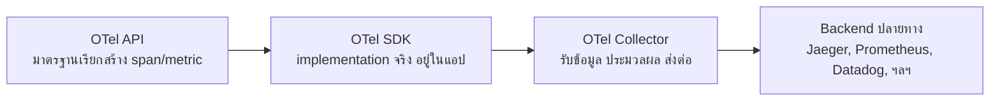
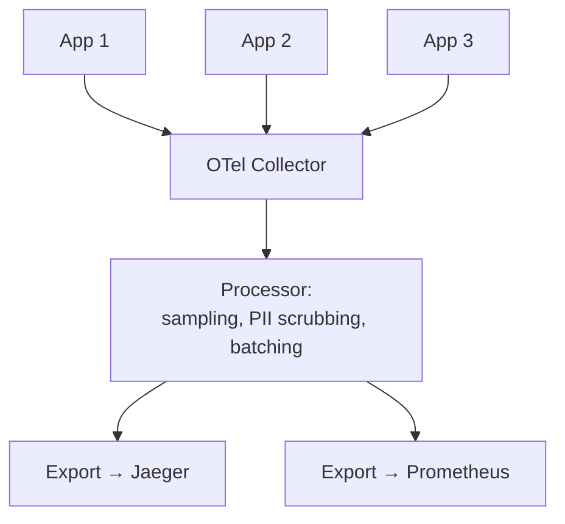

ก่อนหน้านี้ ถ้าทีมอยากใช้ tracing ต้องผูกโค้ดกับ library เฉพาะของแต่ละ vendor — ใช้ Jaeger ต้องเขียนโค้ดแบบหนึ่ง อยาก migrate ไป Zipkin หรือ APM ของ cloud provider ต้องแก้โค้ด instrument ใหม่ทั้งหมด เหมือนเปลี่ยนแบรนด์ปลั๊กไฟแล้วต้องเปลี่ยนเต้ารับทั้งบ้าน <mark class="hl-term">**OpenTelemetry (OTel)**</mark> แก้ปัญหานี้ด้วยการเป็น**มาตรฐานกลาง**ที่ไม่ผูกกับ vendor ไหน

## 3 ส่วนประกอบของ OpenTelemetry

- **API** — ชุดคำสั่งมาตรฐานสำหรับสร้าง span/metric ในโค้ด (เช่น `tracer.startSpan()`) — โค้ด application เรียกผ่าน API นี้เท่านั้น ไม่ผูกกับ backend ปลายทางเลย
- **SDK** — ตัว implementation จริงที่ทำงานเบื้องหลัง API (sampling, batching, ส่งออก)
- **Collector** — process แยกต่างหากที่รับข้อมูลจากทุกแอป ประมวลผล (filter, transform, batch) แล้วส่งต่อไปยัง backend ที่เลือกได้อิสระ

<mark class="hl-insight">จุดสำคัญที่สุดคือแอปพลิเคชันคุยกับ **API มาตรฐาน**เท่านั้น ไม่รู้จักว่า backend ปลายทางคือ Jaeger, Datadog หรือตัวไหน — จะเปลี่ยน backend ทีหลังแค่เปลี่ยน config ที่ Collector ไม่ต้องแก้โค้ด instrument ในแอปแม้แต่บรรทัดเดียว</mark> นี่คือสิ่งที่แก้ปัญหา vendor lock-in ที่เจอในยุคก่อนหน้า OTel

## Auto-Instrumentation vs Manual Instrumentation

| | Auto-Instrumentation | Manual Instrumentation |
|---|---|---|
| ติดตั้ง | attach library/agent เข้าไป ไม่ต้องแก้โค้ด | เขียนโค้ดสร้าง span เองในจุดที่ต้องการ |
| ครอบคลุม | เฉพาะ library ที่มี auto-instrument รองรับ (HTTP client, DB driver ที่นิยม) | ครอบคลุม business logic เฉพาะทางที่ auto-instrument มองไม่เห็น |
| ความเร็วเริ่มต้น | เร็วมาก ได้ trace พื้นฐานทันที | ต้องเขียนเพิ่มทีละจุด |
| รายละเอียด | ระดับ framework/library (HTTP call, query) | กำหนดเองได้ เช่น "ขั้นตอน validate order" |

<mark class="hl-warning">ทีมส่วนใหญ่เริ่มด้วย auto-instrumentation เพราะเห็นผลไว แต่พอ trace ครอบคลุมแค่ระดับ HTTP/DB call จะ**มองไม่เห็น business logic ภายใน** เช่น "ทำไม validate order ถึงช้า" เพราะ auto-instrument ไม่รู้จัก business logic เฉพาะทาง — ต้องเพิ่ม manual instrumentation ในจุดสำคัญทางธุรกิจเองเพื่อให้ trace มีความหมายมากขึ้น ไม่ใช่พึ่ง auto-instrument อย่างเดียวตลอดไป</mark>

## OTel Collector — ทำไมไม่ส่งตรงจากแอปไปหา Backend เลย

เหตุผลเดียวกับที่เรียนไปในหัวข้อ Centralized Log Pipeline (Log Shipper ไม่ให้แอปเขียนตรงไป storage) — **Collector แยกหน้าที่ประมวลผล/ส่งออกออกจากตัวแอป** ทำให้เปลี่ยน backend, ปรับ sampling rate, หรือ scrub ข้อมูลอ่อนไหว (PII) ได้จากจุดเดียวโดยไม่ต้อง deploy แอปใหม่ทุกตัว และแอปเองก็ไม่ต้องรอ backend ที่อาจช้าหรือล่มชั่วคราว

> คำถามสัมภาษณ์: "ทำไมองค์กรถึงอยากย้ายจาก vendor-specific tracing library มาใช้ OpenTelemetry" — คำตอบที่ดีคือชี้ว่า OpenTelemetry แยก API ที่โค้ด application เรียกใช้ ออกจาก backend ปลายทางที่เก็บ trace จริง ทำให้เปลี่ยน backend (เช่นจาก Jaeger ไป Datadog) ได้แค่ปรับ config ที่ Collector โดยไม่ต้องแก้โค้ด instrument ในทุกแอปใหม่ ต่างจากยุคก่อนที่ผูกโค้ดกับ vendor library โดยตรง เปลี่ยน vendor ทีต้องเขียนโค้ดใหม่ทั้งหมด
