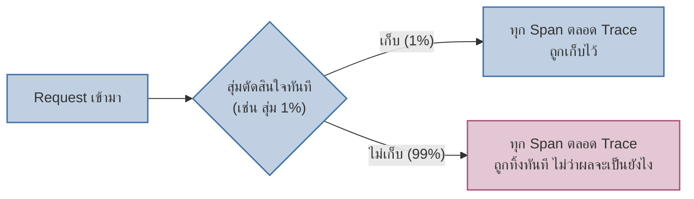
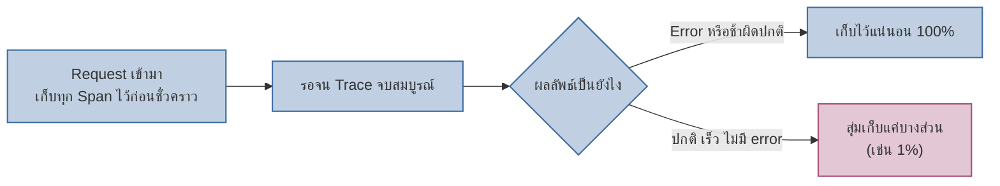

เคยพูดถึงแนวคิด tail-based sampling สั้นๆไปแล้วในโมดูล Advanced Observability Internals (บท Observability Cost) — บทนี้เจาะรายละเอียดว่ามันทำงานต่างจาก head-based sampling ยังไงจริงๆ

ระบบที่มี traffic สูงมาก (แสนๆ request ต่อวินาที) ไม่สามารถเก็บ trace ของทุก request ได้ — ต้อง**สุ่มเก็บบางส่วน** คำถามคือ: จะสุ่ม**ตอนไหน**และ**ยังไง**ถึงไม่พลาด trace ที่สำคัญ

## Head-based Sampling: ตัดสินใจตั้งแต่ต้น



<mark class="hl-term">**Head-based Sampling**</mark> ตัดสินใจสุ่มเก็บหรือทิ้ง trace **ตั้งแต่ span แรกเริ่ม** ก่อนที่จะรู้ผลลัพธ์สุดท้ายของ request นั้นเลยว่าจะสำเร็จ ล้มเหลว หรือช้าผิดปกติ — ข้อดีคือ**ตัดสินใจเร็ว ไม่ต้องเก็บ span ไว้รอ** (แต่ละ service ตัดสินใจเก็บ/ทิ้งได้ทันที) แต่ข้อเสียคือ**เสี่ยงพลาด trace ที่น่าสนใจที่สุด** — trace ที่จะกลายเป็น error หรือช้าผิดปกติ อาจถูกสุ่มทิ้งไปตั้งแต่ต้นโดยไม่รู้ตัว

## Tail-based Sampling: รอดูผลลัพธ์ก่อนตัดสินใจ



<mark class="hl-term">**Tail-based Sampling**</mark> รอให้ trace ทั้งหมด**จบก่อน** (เห็นผลลัพธ์สุดท้ายแล้ว) ถึงจะตัดสินใจว่าจะเก็บหรือทิ้ง — ทำให้เก็บ trace ที่ error/ช้าผิดปกติได้แม่นยำ 100% เสมอ (ไม่พลาดเคสสำคัญ) ส่วน trace ปกติที่ไม่มีอะไรน่าสนใจก็สุ่มทิ้งได้ตามสัดส่วนที่ตั้งไว้เหมือนเดิม

<mark class="hl-warning">ข้อเสียของ tail-based sampling คือต้อง**buffer (เก็บชั่วคราว) span ทุกตัวของ trace ทุก trace ไว้ก่อน** จนกว่า trace นั้นจะจบ — ต้องมี Collector ที่รวบรวม span จากทุก service ของ trace เดียวกันไว้ด้วยกันก่อนตัดสินใจ ทำให้ต้องใช้ memory/cost ของ collector สูงกว่า head-based sampling ที่แต่ละ service ตัดสินใจทันทีโดยไม่ต้องรอใคร</mark>

## เทียบ Head-based vs Tail-based

| มิติ | Head-based Sampling | Tail-based Sampling |
|---|---|---|
| ตัดสินใจตอนไหน | ทันทีที่ request เข้ามา (ต้น trace) | หลังเห็นผลลัพธ์ทั้ง trace แล้ว (ปลาย trace) |
| เก็บ Trace ที่ Error/ช้าได้แม่นยำแค่ไหน | ไม่แน่นอน อาจพลาดถ้าสุ่มไม่โดน | แม่นยำ 100% เพราะรู้ผลลัพธ์ก่อนตัดสินใจ |
| Resource ที่ต้องใช้ | ต่ำ แต่ละ service ตัดสินใจเอง ไม่ต้องรอ | สูงกว่า ต้อง buffer span รอทั้ง trace จบ |
| เหมาะกับ | ระบบ traffic สูงมาก ต้องการความเร็ว/cost ต่ำ | ระบบที่ต้องการไม่พลาด trace ของ incident สำคัญ |

```demo
component: SamplingRaceDemo
caption: ยิง request หลายๆครั้ง สังเกตว่า Tail-based เก็บ Error ได้ครบเสมอ ส่วน Head-based เก็บได้แค่บางส่วน
```

> คำถามสัมภาษณ์: "ทีมใช้ head-based sampling สุ่ม 1% มาตลอด แต่พอเกิด incident ที่กระทบ request แค่ 0.1% กลับไม่มี trace เก็บไว้เลยสักตัว ควรแก้ยังไง" — คำตอบที่ดีคือชี้ว่านี่คือข้อจำกัดคลาสสิกของ head-based sampling ที่สุ่มทิ้งก่อนรู้ผลลัพธ์ วิธีแก้คือเปลี่ยนไปใช้ tail-based sampling ที่รอดูผลลัพธ์ก่อนตัดสินใจ จะเก็บ trace ที่ error หรือช้าผิดปกติได้เสมอ 100% แม้จะเกิดขึ้นน้อยแค่ไหนก็ตาม โดยแลกกับต้องมี collector ที่รองรับการ buffer span รอทั้ง trace จบก่อน
