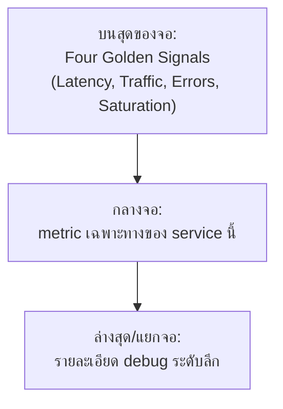

ห้องควบคุมโรงไฟฟ้าไม่ได้ติดจอแสดงมิเตอร์ทุกตัวขนาดเท่ากันเรียงกันเป็นแถว — มี**จอใหญ่ตรงกลาง**แสดงค่าที่สำคัญที่สุดไม่กี่ตัว (กำลังไฟที่ผลิตได้, อุณหภูมิ reactor) ให้ operator กวาดตาดูรู้ทันทีว่าปกติไหม ส่วนรายละเอียดปลีกย่อยอยู่ในจอย่อยที่ต้องเปิดดูเฉพาะตอนสืบสวน — dashboard ของระบบซอฟต์แวร์ก็ควรออกแบบแบบเดียวกัน ไม่ใช่ยัดทุก metric ที่มีลงจอเดียว

## จัดลำดับความสำคัญ: Golden Signals อยู่บนสุดเสมอ

จากหัวข้อ Four Golden Signals ที่เรียนไปแล้วในโมดูล Monitoring Fundamentals — 4 signals นั้นควรอยู่**บนสุดของทุก dashboard** เสมอ เพราะตอบคำถามแรกที่ทุกคนอยากรู้ "ตอนนี้ปกติไหม" ได้เร็วที่สุด ส่วน metric เฉพาะทางของ business (เช่น "จำนวน order ที่สำเร็จ") ค่อยอยู่ถัดลงมา

## เลือกชนิดกราฟให้ตรงกับคำถาม

| ชนิดข้อมูล | Visualization ที่เหมาะ | เหตุผล |
|---|---|---|
| แนวโน้มตามเวลา (เช่น traffic, error rate) | **Time-series line chart** | เห็น pattern/trend และจุดที่เปลี่ยนแปลงกะทันหันชัดเจน |
| ค่าปัจจุบันเทียบ threshold (เช่น "healthy/unhealthy ตอนนี้") | **Single Stat / Gauge** | กวาดตาดูครั้งเดียวรู้ทันทีว่าปกติไหม ไม่ต้องอ่านกราฟ |
| การกระจายของค่า (เช่น latency กี่ % อยู่ช่วงไหน) | **Heatmap** | เห็นการกระจายทั้งหมดในภาพเดียว ไม่ใช่แค่ค่าเฉลี่ยที่บังรายละเอียด |
| เปรียบเทียบหลายรายการ (เช่น error แยกตาม service) | **Table / Bar chart** | เรียงลำดับหาตัวที่แย่สุดได้ง่าย |

<mark class="hl-warning">กับดักที่พบบ่อย: เอา Single Stat มาแสดง**ค่าเฉลี่ย latency** เพียงตัวเดียว — ค่าเฉลี่ยกลบรายละเอียดสำคัญได้ง่าย (เหมือนที่เรียนไปในหัวข้อ Four Golden Signals เรื่อง p95/p99) Single Stat เหมาะกับค่าที่มีความหมายเดี่ยวๆ จริงๆ เช่น error rate หรือ uptime % ส่วน latency ควรใช้ time-series ที่ plot หลาย percentile พร้อมกัน ไม่ใช่ single stat ตัวเดียว</mark>

## หนึ่ง Dashboard ควรมีผู้ชมกลุ่มเดียว

<mark class="hl-insight">Dashboard ที่พยายามตอบสนองทุกคนพร้อมกัน (ผู้บริหารอยากเห็นภาพรวม, on-call อยากเห็นรายละเอียด debug) มักจบด้วยการที่**ไม่มีใครใช้จริง** เพราะทั้งสองกลุ่มต้องเลื่อนหาข้อมูลที่ตัวเองต้องการท่ามกลาง panel ที่ไม่เกี่ยวกับตัวเอง — แนวทางที่ดีคือแยก dashboard ตามผู้ชม: **Overview dashboard** (Golden Signals + business metric หลัก สำหรับดูภาพรวมเร็วๆ) กับ **Drill-down dashboard** (รายละเอียดเจาะจง service/component สำหรับ debug ตอน incident)</mark>

## Dashboard Overload — เมื่อ Panel เยอะเกินจนไม่มีใครมอง

<mark class="hl-warning">ทีมที่เพิ่ม panel ใหม่ทุกครั้งที่มีคำถามใหม่ๆ มักจบด้วย dashboard ที่มี 50+ panel ที่ไม่มีใครไถดูครบทุกตัวอีกต่อไป — เหมือนกับ alert fatigue (เรียนในหัวข้อ Alerting & SLO ถัดไป) ที่ notification เยอะเกินจนคนเริ่มเมินเฉย dashboard ที่ panel เยอะเกินไปก็ทำให้คนเริ่ม**เมิน**การเปิดดู panel สำคัญปนไปกับ panel ที่ไม่มีใครใช้แล้ว</mark> ควรทบทวน dashboard เป็นระยะ ลบ panel ที่ไม่มีใครเปิดดูออก แทนที่จะเพิ่มไปเรื่อยๆ

> คำถามสัมภาษณ์: "ทีมอยากทำ dashboard เดียวให้ทั้งผู้บริหารและ on-call engineer ใช้ร่วมกัน เห็นด้วยไหม" — คำตอบที่ดีคือไม่เห็นด้วย เพราะสองกลุ่มต้องการข้อมูลคนละระดับ (ภาพรวมเร็วๆ vs รายละเอียด debug) การยัดรวมกันมักทำให้ทั้งสองฝ่ายต้องเลื่อนหาสิ่งที่ตัวเองต้องการ ควรแยกเป็น overview dashboard กับ drill-down dashboard ที่มีผู้ชมและวัตถุประสงค์ชัดเจนแยกกัน
