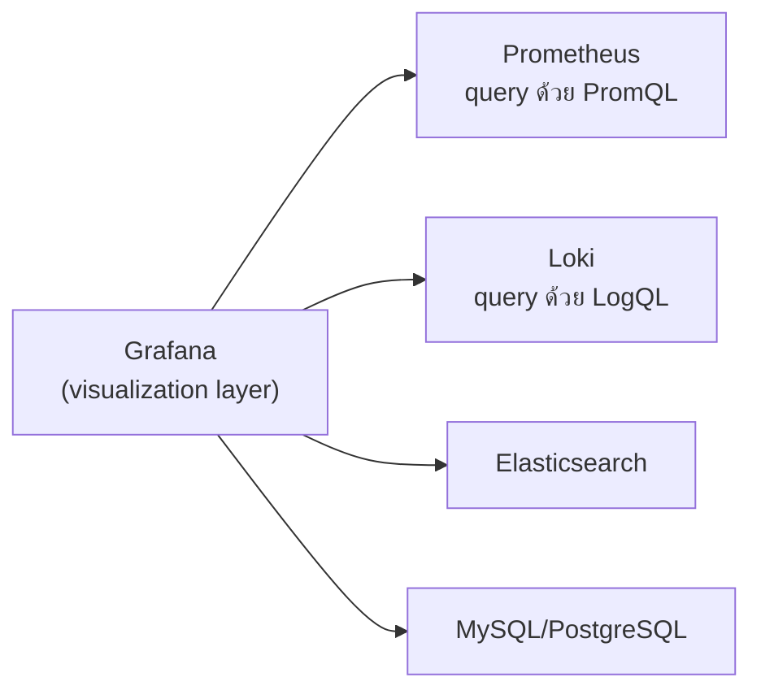

Prometheus มี expression browser ในตัวให้ query PromQL ดูกราฟง่ายๆ ได้ Loki ก็มีหน้า query คล้ายกัน — แต่ทั้งคู่ไม่ได้ออกแบบมาให้สร้าง dashboard ที่สวยงาม แชร์กับทีม หรือรวมข้อมูลจากหลายแหล่งไว้ในจอเดียว นี่คือช่องว่างที่ <mark class="hl-term">**Grafana**</mark> เข้ามาเติมเต็ม — Grafana ไม่ได้เก็บข้อมูลเอง แต่เป็น**ชั้น visualization** ที่ต่อกับ data source ได้หลายชนิดพร้อมกัน

## Grafana แยกชั้นออกจาก Data Source โดยตั้งใจ



แต่ละ panel ใน Grafana เลือกได้ว่าจะดึงข้อมูลจาก data source ไหน แล้ว**เขียน query ด้วยภาษาของ data source นั้น** (PromQL สำหรับ Prometheus ที่เรียนไปแล้ว, LogQL สำหรับ Loki) — <mark class="hl-insight">ความสามารถที่ทรงพลังที่สุดคือ**รวม panel จากหลาย data source ไว้ใน dashboard เดียวกัน** เช่น panel บนสุดดึง metric จาก Prometheus (error rate พุ่งขึ้น) panel ล่างดึง log จาก Loki (กรองด้วยช่วงเวลาเดียวกัน) ทำให้เห็นทั้งอาการและรายละเอียดในจอเดียว ไม่ต้องสลับแอประหว่างดู metric กับดู log</mark>

## ทำไมต้องแยก Visualization ออกจาก Storage

การแยก Grafana ออกจากตัว data source ให้ประโยชน์เดียวกับที่เรียนไปแล้วในหัวข้อ OpenTelemetry (แยก API instrumentation ออกจาก backend) — <mark class="hl-warning">ถ้าผูก dashboard เข้ากับ UI เฉพาะของแต่ละ storage โดยตรง พอเปลี่ยน storage (เช่นจาก Elasticsearch ไป Loki ตามที่เรียนไปในหัวข้อ Centralized Log Pipeline) ทีมต้องสร้าง dashboard ใหม่หมด แต่ถ้าใช้ Grafana เป็นชั้นกลาง แค่เปลี่ยน data source connection ปลาย query ส่วนใหญ่ก็ยังใช้โครงสร้าง dashboard เดิมได้ต่อ</mark>

## Template Variables — Dashboard เดียว ใช้ได้กับทุก Service

ปัญหาที่พบเมื่อระบบมี service เยอะ: จะสร้าง dashboard แยกทีละ service เป็นสิบๆ อันไหม? Grafana แก้ด้วย <mark class="hl-term">**Template Variables**</mark> — สร้าง dropdown ตัวแปร เช่น `$service` แล้วเขียน query แบบ parameterized:

```
sum(rate(http_requests_total{service="$service"}[5m]))
```

| ชนิด Variable | ใช้ยังไง |
|---|---|
| **Query variable** | ดึงค่ามาจาก query จริง เช่น รายชื่อ service ทั้งหมดที่มี metric | 
| **Custom variable** | กำหนดค่าตายตัวเอง เช่น environment: production/staging |
| **Interval variable** | ปรับช่วงเวลา aggregate (5m, 1h, 1d) ได้จาก dropdown เดียวกัน |

พอมี `$service` เป็น dropdown ผู้ใช้แค่**เปลี่ยนค่าใน dropdown** dashboard เดียวกันก็ใช้ดู service ไหนก็ได้ทันที ไม่ต้อง maintain dashboard แยกทีละ service ให้ซ้ำซ้อน — ลดภาระดูแล dashboard ลงมหาศาลเมื่อระบบโตขึ้นเรื่อยๆ

> คำถามสัมภาษณ์: "ทำไมองค์กรที่มี 50 microservices ถึงไม่สร้าง dashboard แยกทีละ service" — คำตอบที่ดีคือชี้ว่าการ maintain dashboard 50 ชุดแยกกันเป็นภาระมหาศาล (ทุกครั้งที่ปรับ layout ต้องแก้ 50 ที่) แนวทางที่ดีกว่าคือใช้ Grafana Template Variable สร้าง dashboard เดียวที่ parameterize ด้วย `$service` แล้วให้ผู้ใช้เลือก service จาก dropdown แทน ลดจำนวน dashboard ที่ต้องดูแลลงเหลือชุดเดียว
