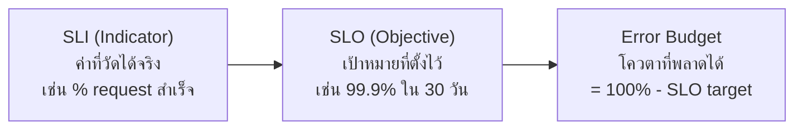

Golden Signals dashboard ตอบคำถามระดับ engineer ("latency/error rate ตอนนี้เท่าไหร่") แต่ผู้บริหารหรือ product owner ไม่ได้อยากรู้ตัวเลขดิบแบบนั้น — เขาอยากรู้คำถามที่ตรงกว่า: **"เรารักษาสัญญาที่ให้ไว้กับ user ได้ไหม"** dashboard ที่ตอบคำถามนี้ตรงๆ ต้องแปลง metric ดิบให้เป็นภาษาที่ผูกกับ**เป้าหมายทางธุรกิจ** เรียกว่า <mark class="hl-term">**SLI/SLO Dashboard**</mark>

## SLI กับ SLO คืออะไร

- **SLI (Service Level Indicator)** — ตัวเลขที่วัดได้จริง เช่น "% ของ request ที่ตอบสำเร็จภายใน 500ms"
- **SLO (Service Level Objective)** — เป้าหมายที่ตั้งไว้สำหรับ SLI นั้น เช่น "SLI ต้อง ≥ 99.9% ในช่วง 30 วันที่ผ่านมา"
- **Error Budget** — โควตาความล้มเหลวที่ยอมรับได้ = 100% - SLO target (SLO 99.9% แปลว่า error budget คือ 0.1%)

<mark class="hl-insight">สังเกตว่า SLI มาจาก metric ตัวเดียวกับที่เรียนไปแล้วใน Four Golden Signals (Errors, Latency) เพียงแต่ SLI เลือก**เฉพาะตัวที่ผูกกับประสบการณ์ user โดยตรง**และตั้งกรอบเวลาที่ชัดเจน (เช่น rolling 30 วัน) ไม่ใช่แค่ดู real-time เฉยๆ แบบ dashboard ระดับ engineer</mark>

## ออกแบบหน้าจอ SLI/SLO ให้อ่านง่ายในแวบเดียว

| Panel | แสดงอะไร | ชนิดกราฟ |
|---|---|---|
| SLI ปัจจุบัน vs SLO target | เช่น "99.95% (target 99.9%)" | Gauge/Single Stat — เขียวถ้าเกิน target, แดงถ้าต่ำกว่า |
| SLI ย้อนหลัง 30 วัน | แนวโน้มว่าเข้าใกล้/ห่างจาก target | Time-series line พร้อมเส้น target คั่น |
| Error budget เหลือเท่าไหร่ | % ของโควตาที่ยังไม่ถูกใช้ | Gauge หรือ burn-down chart |

<mark class="hl-warning">กับดัก: ตั้ง SLO ไว้สูงเกินจริง (เช่น 99.99% ทั้งที่ระบบไม่เคยทำได้ขนาดนั้น) — SLO ที่ไม่สมจริงทำให้ error budget หมดตลอดเวลา ทีมจึงเลิกสนใจ dashboard เพราะมันแดงตลอดจนไม่มีความหมายอีกต่อไป SLO ควรตั้งจากข้อมูลจริงในอดีตบวกกับสิ่งที่ business ยอมรับได้ ไม่ใช่ตั้งให้สูงที่สุดเท่าที่จะทำได้</mark>

## จุดที่ต่อยอดในหัวข้อถัดไป

Dashboard นี้แสดง**สถานะ**ของ error budget ได้ แต่ยังไม่ได้พูดถึงว่าจะทำอะไรเมื่อ budget ใกล้หมด — เช่น ควรแจ้งเตือนใคร ตอนไหน และป้องกัน alert fatigue ยังไงเมื่อ budget เริ่มไหม้เร็วผิดปกติ เรื่องนี้จะเรียนต่อในหัวข้อ **Alerting & SLO** ถัดไปในโมดูลนี้

> คำถามสัมภาษณ์: "ทำไม dashboard สำหรับผู้บริหารถึงควรแสดง SLI/SLO แทนที่จะแสดง raw metric อย่าง error rate ตรงๆ" — คำตอบที่ดีคือชี้ว่า raw metric อย่าง error rate ไม่มีบริบทว่า "แย่แค่ไหนถึงเรียกว่าแย่" ส่วน SLI/SLO ผูกตัวเลขนั้นเข้ากับเป้าหมายทางธุรกิจที่ตกลงกันไว้ล่วงหน้า (เช่น 99.9% ใน 30 วัน) ทำให้ผู้ที่ไม่ใช่ engineer อ่านแล้วรู้ทันทีว่า "รักษาสัญญากับ user ได้ไหม" โดยไม่ต้องตีความตัวเลขดิบเอง
