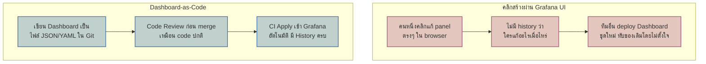
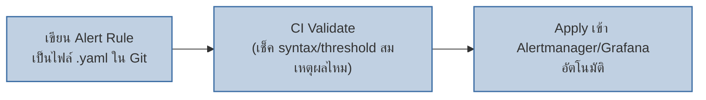

เคยเรียน Infrastructure as Code ไปแล้ว (โมดูล Infrastructure as Code & Chaos Engineering) — หลักการ "เขียนสภาพที่ต้องการเป็นไฟล์โค้ด แทนคลิกสร้างเอง" ใช้กับ dashboard และ alert ได้เหมือนกัน

## ปัญหาของ Dashboard ที่คลิกสร้างผ่าน UI

<mark class="hl-insight">Dashboard ที่คลิกสร้างผ่าน UI มีปัญหาเดียวกับ Pet Server ที่เรียนไปแล้ว (โมดูล Infrastructure as Code) — ไม่มีใครจำได้ครบว่าใครแก้อะไรไปบ้าง ไม่มี rollback ที่ชัดเจนถ้าแก้พลาด <mark class="hl-term">**Dashboard-as-Code**</mark> แก้ปัญหานี้ด้วยการเก็บ dashboard เป็นไฟล์ใน Git — เห็น diff ก่อน merge, มี history ครบ, rollback ได้แค่ revert commit</mark>

## Alerting-as-Code เชื่อมกับ GitOps

<mark class="hl-warning">เคยเรียน Reconcile Loop ของ GitOps ไปแล้ว — Dashboard/Alerting-as-Code ทำงานตามหลักการเดียวกัน: **Git คือ source of truth** ของ config ทั้ง dashboard และ alert ไม่ใช่สภาพที่เห็นใน UI ตอนนั้น ถ้ามีคนคลิกแก้ผ่าน UI ตรงๆ โดยไม่ผ่าน Git การเปลี่ยนแปลงนั้นเสี่ยงถูกทับหายไปตอน deploy รอบถัดไป เหมือน drift ที่เรียนไปแล้วในโมดูล IaC</mark>

## เทียบ UI-based กับ As-Code

| มิติ | คลิกสร้างผ่าน UI | Dashboard/Alerting-as-Code |
|---|---|---|
| History การเปลี่ยนแปลง | ไม่มี หรือมีแค่ log ภายใน tool | อยู่ใน Git log ครบ ตรวจสอบย้อนหลังได้ |
| Review ก่อนเปลี่ยนแปลง | ไม่มี ใครก็แก้ได้ทันที | ผ่าน Pull Request เหมือน code |
| Rollback | ยาก ต้องจำว่าค่าเดิมคืออะไร | `git revert` เดียวจบ |
| ย้าย Environment (dev→staging→prod) | ต้องคลิกสร้างใหม่ทุกที่ | Apply ไฟล์เดียวกันได้ทุก environment |

> คำถามสัมภาษณ์: "ทีมมี Dashboard สำคัญที่ถูกแก้บ่อยจนจำไม่ได้ว่า threshold ของ alert ตัวไหนถูกเปลี่ยนไปเมื่อไหร่ ควรแก้ยังไง" — คำตอบที่ดีคือย้าย dashboard/alert ทั้งหมดไปเป็น Dashboard-as-Code / Alerting-as-Code เก็บเป็นไฟล์ใน Git ตั้ง CI ให้ apply เข้า Grafana/Alertmanager อัตโนมัติ ทุกการเปลี่ยนแปลงจะต้องผ่าน pull request มี history ชัดเจนว่าใครเปลี่ยน threshold อะไรเมื่อไหร่ และ rollback ได้ทันทีด้วย git revert ถ้าเปลี่ยนแล้วมีปัญหา
