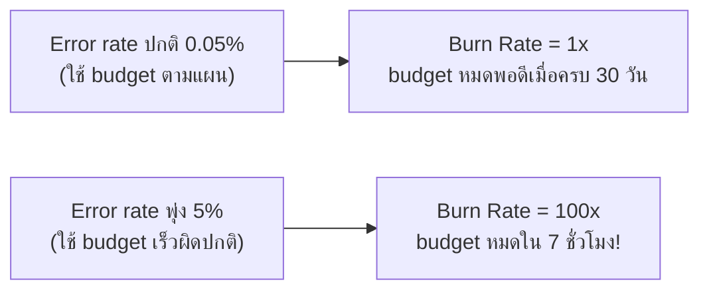

ในหัวข้อ SLI/SLO Dashboard เคยเห็น error budget เป็นแค่**ตัวเลขนิ่งๆ**บนจอ — SLO 99.9% แปลว่ามี budget 0.1% ให้พลาดได้ในรอบ 30 วัน แต่คำถามที่ dashboard เฉยๆ ตอบไม่ได้คือ **"ตอนนี้เรากำลังใช้ budget เร็วเกินไปหรือเปล่า"** — ถ้า error พุ่งขึ้นตอนนี้แล้วรอดู dashboard พรุ่งนี้ budget อาจหมดไปแล้วโดยไม่มีใครรู้ตัวทัน นี่คือปัญหาที่ <mark class="hl-term">**Error Budget Burn Rate**</mark> เข้ามาแก้

## Burn Rate คืออะไร

<mark class="hl-term">Burn Rate</mark> คืออัตราที่ error budget กำลังถูกใช้ไป เทียบกับอัตราที่**ควรจะ**ใช้ถ้าจะพอดีหมดตอนสิ้นรอบ SLO — burn rate = 1x แปลว่ากำลังใช้ budget ตามแผนปกติ (จะหมดพอดีตอนครบ 30 วัน) ส่วน burn rate = 100x แปลว่ากำลังเผา budget เร็วกว่าปกติ 100 เท่า ถ้าปล่อยไว้แบบนี้ budget ทั้งเดือนจะหมดภายในไม่กี่ชั่วโมง

<mark class="hl-insight">จุดสำคัญคือ burn rate ทำให้ alert ได้**เร็วกว่า**การรอดู SLI ตกต่ำกว่า SLO ตรงๆ — ถ้ารอให้ SLI 30 วันตกต่ำกว่า 99.9% จริงๆ ถึงจะ alert ก็สายเกินไปแล้ว (ความเสียหายเกิดขึ้นเต็มที่) burn rate ช่วยจับสัญญาณ "กำลังจะพัง" ได้ตั้งแต่ชั่วโมงแรกๆ ของปัญหา ไม่ต้องรอครบ 30 วัน</mark>

## Multi-Window, Multi-Burn-Rate Alerting

<mark class="hl-warning">ถ้าตั้ง alert แค่เงื่อนไขเดียว (เช่น "burn rate > 2x ใน 1 ชั่วโมง") จะเจอปัญหาสองด้าน: ตั้ง window สั้นเกินไปจะ alert ไวเกินจาก error ชั่วครู่ที่หายเองได้ (false positive, สร้าง alert fatigue ที่จะเรียนในหัวข้อถัดไป) ตั้ง window ยาวเกินไปจะรู้ตัวช้าเกินไปกับปัญหารุนแรงที่เกิดฉับพลัน</mark> ทางแก้ที่ Google SRE ใช้คือ**ผสมหลายเงื่อนไขพร้อมกัน**:

| ระดับ | Window สั้น | Window ยาว | Burn Rate | Action |
|---|---|---|---|---|
| Critical (page ทันที) | 5 นาที | 1 ชั่วโมง | 14.4x | ปลุกคนมาแก้ตอนนี้ — budget จะหมดใน <2 วัน |
| Warning (ticket) | 30 นาที | 6 ชั่วโมง | 6x | สร้าง ticket ให้ดูตอนเช้า — budget จะหมดใน ~5 วัน |

การใช้ window สองระดับ (สั้น+ยาว) พร้อมกันคือการยืนยันว่า**ปัญหาเกิดขึ้นจริงและต่อเนื่อง** ไม่ใช่ noise ชั่วครู่ — window สั้นจับสัญญาณเร็ว window ยาวยืนยันว่าไม่ใช่ spike แค่ 1 นาทีที่หายเอง

## เชื่อมกับ Golden Signals และ SLI ที่เรียนมา

burn rate คำนวณจาก error rate เดียวกับที่เป็น SLI (จากหัวข้อ SLI/SLO Dashboard) ซึ่งก็มาจาก Errors ใน Four Golden Signals — ทุกอย่างในโมดูลนี้ผูกเป็นสายเดียวกัน: **Golden Signals วัด → SLI เลือกตัวที่สำคัญกับ user → SLO ตั้งเป้า → Error Budget คำนวณโควตา → Burn Rate alert เมื่อใช้โควตาเร็วผิดปกติ**

> คำถามสัมภาษณ์: "ทำไมการ alert ด้วย burn rate ถึงดีกว่าการ alert ตรงๆ ว่า error rate เกิน threshold" — คำตอบที่ดีคือชี้ว่า burn rate ผูกกับ**อัตราการใช้ error budget เทียบกับเวลาที่เหลือ** ทำให้แยกแยะได้ว่าปัญหาปัจจุบันจะทำให้ budget หมดเร็วแค่ไหน (เช่น หมดใน 2 วันเทียบกับ 30 วัน) ส่วน threshold ตรงๆ ไม่มีมิติเวลานี้ ทำให้ปรับ severity ของ alert ตามความเร่งด่วนจริงไม่ได้ และมักเจอปัญหา false positive จาก spike ชั่วครู่ถ้าไม่ผสม multi-window เข้าไปด้วย
