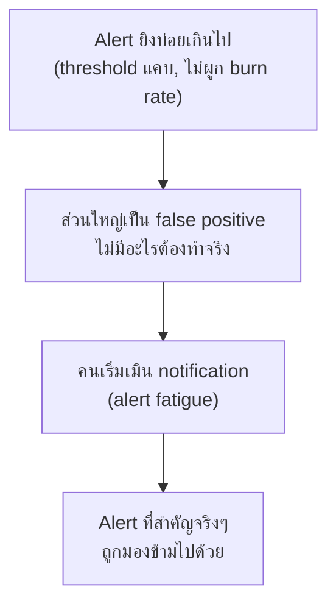

ลองนึกภาพสัญญาณกันขโมยรถที่ดังทุกครั้งที่มีลมพัดแรง — ช่วงแรกเจ้าของรถวิ่งออกมาดูทุกครั้ง พอผ่านไปสักสัปดาห์ที่เสียงดังจากลมพัดล้วนๆ (ไม่เคยมีขโมยจริง) เจ้าของก็**เลิกสนใจเสียงนั้นไปเลย** — วันที่มีขโมยจริงเสียงก็ดังเหมือนเดิม แต่ไม่มีใครวิ่งออกมาดูอีกแล้ว นี่คือ <mark class="hl-term">**Alert Fatigue**</mark> — ปัญหาที่ทำให้ alert ที่เคยมีความหมายกลายเป็นแค่เสียงรบกวน

## ทำไม Alert Fatigue ถึงเกิดขึ้น

สาเหตุหลักมาจาก alert ที่**ไม่ actionable** — ยิงแจ้งเตือนโดยไม่มีอะไรให้คนที่รับ alert ทำได้จริง เช่น alert "CPU 85%" ที่ไม่มีผลกระทบต่อ user เลย (ระบบยังตอบสนองปกติ) หรือ alert ที่ตั้ง threshold แคบเกินจนจับ noise ปกติของระบบทุกวัน — ยิ่งมี alert แบบนี้เยอะ คนยิ่งเริ่มเลื่อนผ่านโดยไม่อ่าน ซึ่งอันตรายเพราะ**alert ที่สำคัญจริงก็ถูกมองข้ามไปด้วย**

## หลักการ: ทุก Alert ต้อง Actionable

<mark class="hl-insight">กฎทองของการตั้ง alert คือ**ทุก alert ที่ปลุกคนกลางดึกต้องมีสิ่งที่คนคนนั้นทำได้จริงทันที** — ถ้า alert ไปแล้วสิ่งเดียวที่ทำได้คือ "รอดูไปก่อน" หรือ "ไม่มีอะไรทำได้ตอนนี้" แปลว่า alert นั้นตั้งผิดจุด ควรเปลี่ยนเป็น dashboard ให้เช็คตอนเช้าแทน ไม่ใช่ปลุกคนกลางดึก</mark> — นี่คือเหตุผลที่ multi-window burn rate alerting (จากหัวข้อก่อนหน้า) แยกระดับ severity ชัดเจน: critical ที่ต้อง page ทันที ต้องเป็นเรื่องที่ทำอะไรได้จริงตอนนั้น ส่วนที่รอได้ควรเป็นแค่ ticket

## จัดระดับ Alert ตาม Severity

| ระดับ | ช่องทาง | เกณฑ์ |
|---|---|---|
| **Page** (ปลุกกลางดึก) | โทร/SMS ผ่านระบบ on-call | กระทบ user จริง, ต้องแก้ทันที, burn rate สูง |
| **Ticket** | สร้าง issue ให้ดูตอนเช้า | ผิดปกติแต่ยังไม่กระทบ user ทันที |
| **Log/Dashboard เฉยๆ** | ไม่แจ้งเตือนใคร | ข้อมูลอ้างอิง ไม่ต้องมีคนตอบสนอง |

<mark class="hl-warning">ทีมที่เพิ่งเริ่มทำ alerting มักตั้งทุกอย่างเป็น Page เพราะ "เผื่อไว้ก่อน" — ผลคือ on-call ถูกปลุกทุกคืนด้วยเรื่องที่ไม่ต้องรีบแก้ พอเจอเหตุการณ์จริงที่ต้องรีบ คนที่ควรตื่นมาแก้ก็เหนื่อยล้าจาก alert ก่อนหน้าจนตอบสนองช้าลง หรือแย่กว่านั้นคือ mute การแจ้งเตือนไปเลย</mark>

## Runbook — ลดเวลาคิดตอนถูกปลุกกลางดึก

ทุก alert ระดับ Page ควรแนบ <mark class="hl-term">Runbook</mark> — เอกสารสั้นๆ บอกขั้นตอนตรวจสอบ/แก้ปัญหาเบื้องต้นสำหรับ alert นั้นโดยเฉพาะ เพื่อลดเวลาที่คนถูกปลุกกลางดึกต้องมานั่งคิดว่า "alert นี้แปลว่าอะไร ต้องเช็คตรงไหนก่อน" — runbook ที่ดีควรมีลิงก์ตรงไปยัง dashboard ที่เกี่ยวข้อง (จากหัวข้อ Dashboard Design Principles) และขั้นตอน escalate ถ้าแก้เองไม่ได้

> คำถามสัมภาษณ์: "ทีมมี alert 50 ตัวที่ยิงทุกวัน แต่ on-call บอกว่าไม่เคยต้องทำอะไรจริงจังกับส่วนใหญ่เลย ควรแก้ยังไง" — คำตอบที่ดีคือไล่ทบทวน alert ทุกตัวด้วยคำถาม "alert นี้ actionable ไหม มีอะไรให้คนทำได้จริงตอนได้รับไหม" alert ที่ไม่ actionable ควรลดระดับเป็น ticket หรือแค่ dashboard แทนการ page เพราะการปล่อยให้ alert ที่ไม่จำเป็นยิงต่อไปจะสร้าง alert fatigue จนคนเริ่มเมิน alert ที่สำคัญจริงๆ ไปด้วย
