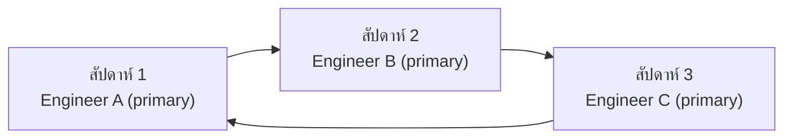
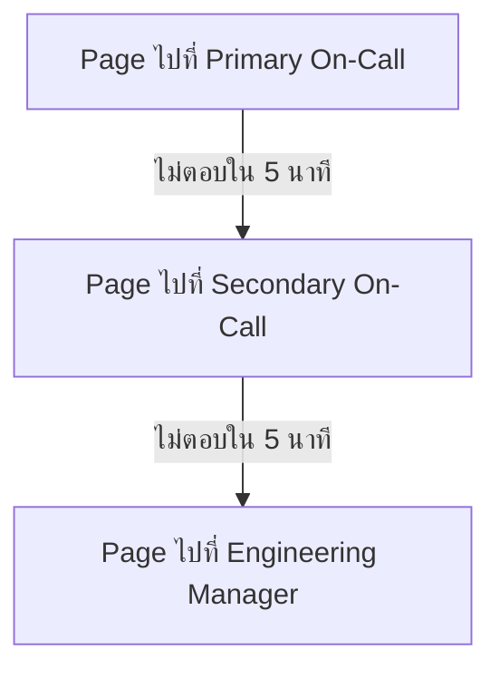

alert ที่ actionable กับ runbook ที่ชัดเจนยังไม่พอ — ต้องมี**คนที่รับผิดชอบตอบสนอง**อยู่เสมอ ไม่ว่าจะดึกแค่ไหนหรือวันหยุดไหน ระบบที่จัดสรรว่า "ใครต้องตื่นมาแก้ตอนนี้" เรียกว่า <mark class="hl-term">**On-Call**</mark> และกระบวนการแจ้งเตือนคนนั้นเรียกว่า <mark class="hl-term">**Paging**</mark>

## On-Call Rotation — หมุนเวรไม่ให้ใครเหนื่อยคนเดียว

ทีมกำหนดตารางหมุนเวร (rotation) ให้แต่ละคนเป็น**primary on-call**สลับกันไปตามรอบ (เช่นสัปดาห์ละคน) — คนที่เป็น primary คือคนแรกที่ถูก page เมื่อ alert ระดับ critical ยิง (จากหัวข้อ Alert Fatigue) ถ้า on-call กระจุกอยู่ที่คนเดียวตลอดจะนำไปสู่ burnout เร็วมาก การหมุนเวรจึงสำคัญพอๆ กับการตั้ง alert ให้ actionable

## Escalation Policy — ถ้า Primary ไม่ตอบสนองล่ะ

<mark class="hl-warning">ระบบ paging ที่ดีต้องเผื่อกรณีที่ primary on-call ไม่ตอบสนอง (โทรศัพท์ไม่ดัง, หลับลึก, สัญญาณเน็ตหลุด) — ถ้าไม่มี escalation policy สำรอง alert วิกฤตอาจถูกปล่อยทิ้งไว้โดยไม่มีใครแก้เลยทั้งคืน</mark> escalation policy มาตรฐานจึงมีหลายชั้น:

เครื่องมือ paging อย่าง PagerDuty หรือ Opsgenie จัดการ escalation chain นี้อัตโนมัติ — ตั้งกฎไว้ล่วงหน้าว่าถ้าชั้นไหนไม่ตอบสนองภายในเวลาที่กำหนด ให้ไล่ระดับไปหาคนถัดไปเอง ไม่ต้องมีใครมาคอยเช็คว่า primary รับ alert หรือยัง

## Post-Incident Review — ปิดวงจรกลับไปที่ Error Budget

เมื่อเหตุการณ์ critical ถูกแก้แล้ว งานยังไม่จบแค่นั้น — ทีมควรทำ <mark class="hl-term">Post-Incident Review</mark> (บางที่เรียก postmortem) เพื่อสรุปว่าเกิดอะไรขึ้น ทำไมถึงเกิด และจะป้องกันไม่ให้เกิดซ้ำได้ยังไง <mark class="hl-insight">เหตุการณ์ที่ทำให้ error budget ไหม้เร็วผิดปกติ (burn rate สูงจากหัวข้อแรกของโมดูลนี้) คือสัญญาณที่ควรทำ post-incident review เสมอ — ผลของ review มักย้อนกลับไปปรับปรุงจุดต่างๆ ที่เรียนมาตลอด track นี้ เช่น เพิ่ม metric ใหม่ (Monitoring Fundamentals), ปรับ dashboard (Dashboards & Grafana), หรือแก้ runbook ให้ชัดขึ้น (หัวข้อ Alert Fatigue)</mark> — วงจร observability ทั้งหมดจึงไม่ใช่แค่ "ดูว่าพังตรงไหน" แต่เป็นวงจรต่อเนื่องที่ทำให้ระบบแข็งแรงขึ้นเรื่อยๆ ทุกครั้งที่มีเหตุการณ์

> คำถามสัมภาษณ์: "ทำไมต้องมี Secondary On-Call ทั้งที่มี Primary อยู่แล้ว" — คำตอบที่ดีคือชี้ว่า Primary อาจไม่ตอบสนองได้ด้วยเหตุผลต่างๆ (โทรศัพท์ไม่ดัง, หลับลึก, เน็ตหลุด) ถ้าไม่มี escalation policy สำรอง alert ระดับวิกฤตที่กระทบ user จริงอาจถูกปล่อยทิ้งไว้โดยไม่มีใครแก้เลย Secondary On-Call และ escalation chain ที่ไล่ระดับอัตโนมัติจึงเป็นเซฟตี้เน็ตที่จำเป็นสำหรับ alert ที่สำคัญจริงๆ
