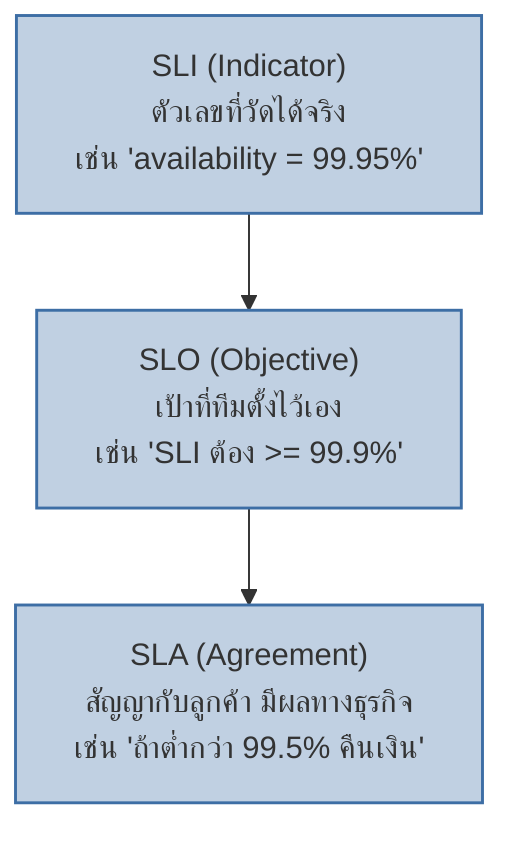
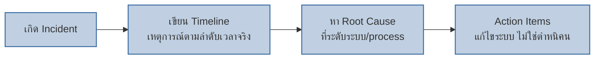

เคยเรียน Error Budget Burn Rate ไปแล้ว — บทนั้นใช้คำว่า "SLO" ผ่านๆ บทนี้จะแยกให้ชัดว่า SLI, SLO, SLA ต่างกันยังไง แล้วต่อด้วยสองแนวคิดสำคัญของ SRE: Toil และ Blameless Postmortem

## SLI vs SLO vs SLA: สามชั้นที่มักสับสน

<mark class="hl-term">**SLI (Service Level Indicator)**</mark> คือตัวเลขที่วัดได้จริงจากระบบ (เช่น % request ที่สำเร็จ, p99 latency) <mark class="hl-term">**SLO (Service Level Objective)**</mark> คือเป้าที่ทีม**ตั้งขึ้นเอง**จาก SLI นั้น (เช่น "SLI ต้องอยู่เหนือ 99.9%") <mark class="hl-term">**SLA (Service Level Agreement)**</mark> คือสัญญา**กับลูกค้า** ที่มีผลทางธุรกิจ/กฎหมายถ้าทำไม่ถึง (เช่น คืนเงินถ้าต่ำกว่าเกณฑ์)

<mark class="hl-insight">SLO มักตั้งไว้**เข้มกว่า** SLA เสมอ — เพื่อให้ทีมมีเวลาแก้ไขก่อนที่จะหลุด SLA จริงซึ่งมีผลทางธุรกิจ เช่น SLO ภายในทีมตั้งไว้ 99.9% แต่ SLA ที่สัญญากับลูกค้าคือ 99.5% — ถ้าหลุด SLO ทีมรู้ตัวและแก้ไขได้ก่อนที่จะหลุด SLA จริง</mark>

## Toil: งานที่ควร Automate ทิ้ง ไม่ใช่ทำมือตลอดไป

<mark class="hl-term">**Toil**</mark> คือคำที่ SRE ใช้เรียกงานที่**ทำซ้ำๆ เป็น manual ไม่สร้างมูลค่าที่ยั่งยืน** (เช่น restart service เดิมที่พังทุกเช้า, copy-paste ค่าจาก dashboard ไปทำรายงานมือทุกสัปดาห์) — งานเหล่านี้ไม่ได้ทำให้ระบบดีขึ้นในระยะยาว แค่ทำให้ "ผ่านไปได้ในวันนี้"

<mark class="hl-warning">ทีม SRE ที่ดีจะจับเวลาว่าสัดส่วนงานที่เป็น toil เทียบกับงานที่สร้างมูลค่าจริง (เช่น ปรับปรุง architecture, เพิ่ม automation) สูงเกินไปหรือยัง — ถ้า toil กิน 50%+ ของเวลาทีม แปลว่าทีมกำลัง "ดับไฟ" ตลอดเวลาโดยไม่มีเวลาไปแก้ต้นเหตุที่ทำให้ต้องดับไฟซ้ำๆ ควรจัดสรรเวลาไป automate toil นั้นทิ้งก่อนที่จะรับงานใหม่เพิ่ม</mark>

## Blameless Postmortem: วิเคราะห์ระบบ ไม่ตัดสินคน

เคยเรียน Post-Incident Review ผ่านๆไปแล้วในบท On-Call & Paging — <mark class="hl-term">**Blameless Postmortem**</mark> คือวัฒนธรรมที่ตั้งใจไม่หาว่า "ใครทำผิด" แต่หาว่า "**ระบบ/process ตรงไหนที่เปิดโอกาสให้เกิดความผิดพลาดนี้ได้**"

<mark class="hl-insight">เหตุผลที่ต้อง blameless ไม่ใช่เพราะ "ใจดี" แต่เพราะ**ผลลัพธ์ทางปฏิบัติ** — ถ้าวัฒนธรรมองค์กรมีการโทษคน คนจะเริ่ม**ปกปิดข้อผิดพลาด**หรือรายงานไม่ครบตอน incident ครั้งถัดไป ทำให้ root cause จริงถูกซ่อนไว้ ไม่มีทางแก้ปัญหาที่ต้นเหตุได้เลย ส่วนวัฒนธรรม blameless ทำให้คนกล้ารายงานทุกรายละเอียดตามจริง เพราะรู้ว่าจะไม่ถูกตำหนิเป็นการส่วนตัว</mark>

> คำถามสัมภาษณ์: "Engineer คนหนึ่งพิมพ์ผิดคำสั่งจนลบข้อมูล production ทีมควรจัดการ postmortem ยังไง" — คำตอบที่ดีคือชี้ว่าไม่ควรจบที่ "ไล่ engineer คนนั้นออกหรือลงโทษ" เพราะไม่แก้ต้นเหตุอะไรเลย คำถามที่ควรถามคือ "ทำไมระบบยอมให้คำสั่งอันตรายขนาดนี้รันได้โดยไม่มีการยืนยัน (confirmation) หรือ safeguard" แล้วแก้ที่ระดับระบบ เช่น เพิ่ม confirmation step ก่อนคำสั่งทำลายข้อมูล, จำกัด permission, หรือทำ backup อัตโนมัติที่กู้คืนได้เร็ว — เพราะถ้าไม่ใช่ engineer คนนี้ ก็จะมีคนอื่นพิมพ์ผิดแบบเดียวกันได้อีกในอนาคต
