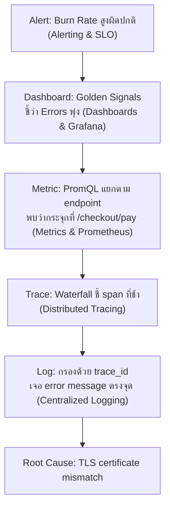

เคสแรกของโมดูลนี้ — ไล่ดูว่าเครื่องมือทุกชิ้นที่เรียนมาตลอด track (metric, log, trace, dashboard, alert) ทำงานร่วมกันจริงยังไงตอนเกิดปัญหาจริงบน production

## ไทม์ไลน์เหตุการณ์

- **02:14** — Burn rate alert ระดับ Critical ยิงเข้า PagerDuty ปลุก on-call: *"checkout-service: burn rate 18x, budget จะหมดใน 1.8 วัน"* (จากหัวข้อ Error Budget Burn Rate)
- **02:16** — on-call เปิด Overview Dashboard (จากหัวข้อ Dashboard Design Principles) — Four Golden Signals บนสุดแสดง **Errors พุ่งจาก 0.3% เป็น 9%** ส่วน Traffic ปกติ
- **02:18** — เปิด PromQL query แยก error ตาม endpoint (`sum by (endpoint) (rate(http_requests_total{status=~"5.."}[5m]))`) พบว่า error กระจุกอยู่ที่ endpoint `/checkout/pay` เท่านั้น
- **02:20** — เปิด Distributed Trace ของ request ที่ error — waterfall แสดง span `payment-gateway-client` ใช้เวลา 4.8 วินาที (ปกติ <200ms) ก่อน timeout
- **02:22** — คัด trace ID จาก span นั้น ไปกรอง structured log ด้วย `trace_id=abc123` — เจอ log บรรทัดเดียวกันซ้ำๆ: `"connection refused: payment-gateway.internal:443"`
- **02:24** — สรุปสาเหตุ: payment gateway ภายนอกที่ทีม infra เพิ่ง rotate TLS certificate เมื่อคืน ทำให้ certificate ใหม่ยังไม่ถูก trust โดย service นี้
- **02:31** — แก้ certificate ให้ตรงกัน, error rate กลับสู่ปกติ, burn rate alert เงียบ

## เส้นทางการสืบสวน — ใช้เครื่องมือแต่ละชั้นตามลำดับ

<mark class="hl-insight">สังเกตลำดับการสืบสวน — Metric บอกว่า**มีปัญหาและปัญหาอยู่ตรงไหนคร่าวๆ** (endpoint ไหน) Trace บอกว่า**span ไหนในเส้นทางที่ช้า** Log บอก**ข้อความ error เป๊ะๆ** — นี่คือลำดับเดียวกับที่เรียนไปตั้งแต่หัวข้อ Monitoring vs Observability ตอนต้น track: จากกว้างไปแคบ จากอาการไปสาเหตุ ไม่มีขั้นไหนข้ามได้เลย</mark>

## ทำไมแต่ละเครื่องมือขาดไม่ได้สักตัว

| ถ้าขาดเครื่องมือนี้ | จะเกิดอะไร |
|---|---|
| ไม่มี Burn Rate Alert | ไม่มีใครรู้ตัวจนกว่า user จะร้องเรียนจำนวนมาก (สายเกินไป) |
| ไม่มี Dashboard | รู้ว่ามีปัญหาแต่ไม่รู้ว่าอยู่ตรงไหนของระบบ |
| ไม่มี Trace | รู้ว่า endpoint ไหน error แต่ไม่รู้ว่า span ไหนในเส้นทางที่ทำให้ช้า |
| ไม่มี Structured Log + Trace ID | รู้ว่า span ไหนช้าแต่ไม่รู้สาเหตุที่แท้จริง ต้อง SSH ไปหาเองทีละเครื่อง |

<mark class="hl-warning">เคสนี้แก้เสร็จภายใน 17 นาที (02:14–02:31) — ถ้าขาดแม้แต่ชั้นเดียว (เช่นไม่มี trace ID เชื่อม log) เวลาสืบสวนจะยืดยาวขึ้นมาก เพราะต้องเดาว่า log บรรทัดไหนเกี่ยวข้องกับ request ที่ error จริงๆ ท่ามกลาง log นับพันบรรทัดต่อวินาที</mark>

> คำถามสัมภาษณ์: "ทีมมี Prometheus, Grafana, และ Loki ครบแล้ว แต่ยังไม่มี Distributed Tracing จำเป็นต้องมีเพิ่มไหม" — คำตอบที่ดีคือชี้ว่าถ้าระบบมีหลาย service ต่อกันเป็นทอดๆ metric บอกได้แค่ว่า endpoint ไหน error แต่ไม่บอกว่า**จุดไหนในเส้นทางข้าม service** ที่เป็นสาเหตุ ต้องไล่เปิด log ทีละ service เดา trace ID เอง ซึ่งช้ากว่ามาก Distributed Tracing จึงจำเป็นเมื่อระบบซับซ้อนขึ้นเป็น microservices หลายชั้น
