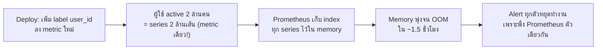

เคสนี้ต่างจากเคสแรก — ไม่ใช่ application พัง แต่เป็น**ตัวระบบ monitoring เองที่พังซะเอง** คำถามคลาสสิกของวงการ SRE คือ "ใครเฝ้าดูคนเฝ้าดู" (who watches the watchers) — เคสนี้ตอบคำถามนั้นตรงๆ

## ไทม์ไลน์เหตุการณ์

- **10:00** — ทีม product deploy feature ใหม่ "ดู order history ของฉัน" เพิ่ม metric `order_history_requests_total` พร้อม label `user_id` เพื่ออยาก debug ง่ายๆ ตาม user รายคน
- **10:45** — Prometheus server เริ่มกิน memory เพิ่มขึ้นเรื่อยๆ แบบไม่หยุด
- **11:20** — Prometheus server **OOM crash** — dashboard ทุกตัวใน Grafana ขึ้น "No Data" พร้อมกันหมด
- **11:21** — ที่ร้ายกว่านั้นคือ **alert ทุกตัวที่ผูกกับ Prometheus ก็หยุดทำงานไปด้วย** — ระบบไม่มีทาง alert ว่า Prometheus เองกำลังตาย เพราะ alerting พึ่งพา Prometheus ตัวเดียวกันนี้
- **11:35** — engineer สังเกตเห็น Grafana "No Data" ด้วยตาเปล่าโดยบังเอิญระหว่างเปิดดู dashboard อื่น ไม่ใช่เพราะมี alert แจ้ง
- **11:50** — restart Prometheus แล้วพังซ้ำภายในไม่กี่นาที เพราะ config ที่ทำให้ memory พุ่งยังอยู่เหมือนเดิม
- **12:10** — สืบจน rollback deploy ของ `order_history_requests_total{user_id=...}` ออก Prometheus กลับมาเสถียร

## สาเหตุ — Cardinality Explosion ตัวเป็นๆ

นี่คือปัญหาเดียวกับที่เรียนไปในหัวข้อ Cardinality Explosion ทุกประการ — `user_id` เป็น unbounded high-cardinality label ที่ไม่ควรใส่เป็น metric label เลย แต่สิ่งที่เคสนี้เพิ่มเข้ามาคือ**ผลกระทบข้างเคียงที่ร้ายแรงกว่า**: เมื่อ Prometheus ตาย alerting ที่ผูกกับมันตายตามไปด้วย ทำให้**ไม่มีระบบไหนแจ้งเตือนว่า monitoring กำลังพัง**

## บทเรียน: Monitor the Monitor

<mark class="hl-warning">Alert ทุกตัวในเคส checkout-latency ก่อนหน้า พึ่งพา Prometheus ที่ยังทำงานปกติอยู่ — แต่ไม่มีใครตั้งคำถามว่า "ถ้า Prometheus เองพังล่ะ ใครจะบอกเรา" ระบบ observability ที่ดีต้องมีชั้นสำรองที่เป็นอิสระจากกัน (เช่น external uptime checker ที่ ping Prometheus/Grafana จากนอกระบบ ไม่พึ่ง Prometheus ตัวเดียวกันวัดตัวเอง) — เหมือนไฟดับทั้งบ้านแล้วไม่มีใครรู้เพราะสัญญาณกันขโมยก็ใช้ไฟเส้นเดียวกัน</mark>

<mark class="hl-insight">เคสนี้เชื่อมกลับไปหลักการจากหัวข้อ Failover & Redundancy ในโมดูล Reliability — ระบบที่ critical ไม่ควรมี single point of failure และ monitoring ก็เป็น "ระบบ critical" ชนิดหนึ่งที่ต้องคิดเรื่อง redundancy เหมือนกัน ไม่ใช่แค่คิดเรื่องนี้กับ business logic เท่านั้น</mark>

## ทางป้องกันที่ทำได้จริง

| มาตรการ | ป้องกันอะไร |
|---|---|
| Code review บังคับเช็ค label ใหม่ทุกครั้งก่อน merge | จับ unbounded label ก่อนถึง production |
| ตั้ง cardinality limit ที่ Prometheus (`sample_limit`) | จำกัดความเสียหายสูงสุดถ้าหลุดผ่านมาได้ |
| External uptime check ที่ไม่พึ่ง Prometheus ตัวเดียวกัน | รู้ตัวทันทีถ้า monitoring stack เองล่ม ไม่ต้องรอสังเกตเห็นด้วยตาเปล่า |

> คำถามสัมภาษณ์: "ทำไมการที่ Prometheus ล่มถึงอันตรายกว่าการที่ service ธรรมดาตัวหนึ่งล่ม" — คำตอบที่ดีคือชี้ว่า service ธรรมดาล่มยังมี alert แจ้งเตือนให้คนมาแก้ได้ แต่ถ้า Prometheus (ซึ่งเป็นตัวที่ยิง alert) ล่มเอง ระบบจะไม่มีทางแจ้งเตือนตัวเองว่าล่ม กลายเป็น blind spot ที่ต้องพึ่งคนสังเกตเห็นด้วยตาเปล่าเท่านั้น จึงต้องมีระบบเฝ้าดูที่เป็นอิสระจาก monitoring stack หลักเสมอ
