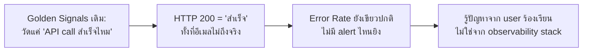

สองเคสก่อนหน้าเป็นเหตุการณ์ที่ **alert ยิงดัง** และทีมตอบสนองได้ทัน — เคสสุดท้ายนี้กลับด้าน: เหตุการณ์ที่ **ไม่มี alert ไหนยิงเลยแม้แต่ครั้งเดียว** ทั้งที่ระบบมีปัญหาจริงต่อเนื่องนานหลายสัปดาห์ นี่คือฝันร้ายที่แท้จริงของทีม observability

## ไทม์ไลน์เหตุการณ์

- **สัปดาห์ที่ 1–3** — ระบบส่งอีเมลยืนยันคำสั่งซื้อ (`order-confirmation-service`) เริ่มส่งอีเมลไม่สำเร็จให้ user บางกลุ่มที่ใช้ email provider เฉพาะเจาะจง (ประมาณ 4% ของ order ทั้งหมด) — Golden Signals dashboard ของ service นี้ยังเขียวปกติทุกตัว เพราะ metric ที่มีวัดแค่ "ส่ง API call ไปหา email provider สำเร็จไหม" (HTTP 200) ไม่ได้วัดว่า**อีเมลไปถึงกล่องข้อความจริงไหม**
- **สัปดาห์ที่ 4** — ทีม customer support เริ่มได้รับ ticket ร้องเรียนสะสม "ไม่ได้รับอีเมลยืนยัน" จำนวนมากขึ้นเรื่อยๆ
- **สัปดาห์ที่ 4 วันที่ 3** — ทีม support ส่งต่อปัญหาให้ engineering หลังพบว่า ticket ประเภทนี้เพิ่มขึ้นผิดปกติ
- **สัปดาห์ที่ 4 วันที่ 4** — engineer เริ่มสืบสวนแบบ ad-hoc — เปิด structured log กรองด้วย `event="email_send"` และ `email_provider="X"` พบว่า HTTP response เป็น 200 จริง แต่ email provider ปฏิเสธเงียบๆ ที่ชั้น downstream (soft bounce ที่ provider ไม่ได้ตอบ error code กลับมาตรงๆ)
- **สัปดาห์ที่ 4 วันที่ 5** — สรุปสาเหตุและเพิ่ม metric ใหม่ที่ตรวจสถานะ delivery จริงจาก webhook ของ email provider ไม่ใช่แค่เช็ค HTTP response ตอนยิง API

## ทำไม Monitoring ที่มีอยู่ถึงจับปัญหานี้ไม่ได้เลย

นี่คือปัญหาที่เรียนไปตั้งแต่หัวข้อแรกสุดของ track — **Monitoring vs Observability** — ทีมมี dashboard ครบ มี alert ครบ (known-unknowns ที่เตรียมไว้ล่วงหน้าครบ) แต่ metric ที่เลือกวัด**ไม่ใช่ตัวที่สะท้อนผลลัพธ์ทางธุรกิจจริง** — วัดแค่ "เรียก API สำเร็จ" ซึ่งเป็นสัญญาณระดับ infrastructure ไม่ใช่ "user ได้รับสิ่งที่ควรได้รับจริงไหม" ซึ่งเป็นคำถามที่ SLI ที่ดีควรตอบ (จากหัวข้อ SLI/SLO Dashboard)

<mark class="hl-insight">ปัญหานี้ไม่ใช่ "ไม่มี observability" — ทีมมี metric, log, trace, dashboard, alert ครบทุกชิ้นตามที่เรียนมาทั้ง track แต่**เลือกวัดผิดจุด** เหมือนมีกล้องวงจรปิดชัดเจนทุกตัว แต่ตั้งกล้องหันผิดทิศ ไม่ได้หันไปทางที่ปัญหาจริงเกิดขึ้น — Observability ไม่ได้อยู่ที่จำนวนเครื่องมือที่มี แต่อยู่ที่**เลือกวัดสิ่งที่สำคัญจริงกับ user**</mark>

## บทเรียนสุดท้ายของ Track — SLI ต้องผูกกับผลลัพธ์ที่ user สัมผัสจริง

<mark class="hl-warning">กับดักที่พบบ่อยที่สุดของทีมที่เพิ่งเริ่มทำ observability คือวัดแค่สิ่งที่**วัดง่าย** (HTTP status code, CPU, memory) แทนที่จะถามก่อนว่า**"user คาดหวังอะไรจากระบบนี้จริงๆ"** แล้วค่อยหา metric ที่สะท้อนสิ่งนั้น แม้จะวัดยากกว่าก็ตาม (เช่น ต้องรอ webhook ยืนยัน delivery จริงจาก provider แทนที่จะเช็คแค่ HTTP response ของตัวเอง)</mark>

## ปิดท้าย Track: เครื่องมือครบ ไม่ได้แปลว่า Observable

ตลอด track นี้ — ตั้งแต่ Monitoring vs Observability, Golden Signals, RED/USE, Prometheus, Structured Logging, Distributed Tracing, Dashboard, ไปจนถึง Alerting & SLO — ทุกหัวข้อสอนวิธี**สร้างเครื่องมือ**ให้ครบ แต่เคสสุดท้ายนี้ย้ำว่าเครื่องมือครบไม่ได้การันตีว่าจะเห็นปัญหาจริงเสมอไป คำถามที่ต้องถามตัวเองซ้ำๆ ตลอดอายุของระบบคือ **"metric ที่เรามีตอนนี้ สะท้อนสิ่งที่ user สัมผัสจริงหรือแค่สิ่งที่วัดง่าย"** — นี่คือของขวัญที่แท้จริงของ track นี้: ไม่ใช่แค่รู้จักเครื่องมือ แต่รู้จักตั้งคำถามที่ถูกต้องกับเครื่องมือที่มี

> คำถามสัมภาษณ์: "ทีมมี dashboard, alert, tracing ครบทุกอย่างตามมาตรฐาน แต่ยังพลาดปัญหาที่กระทบ user ไปหลายสัปดาห์ เป็นไปได้ยังไง" — คำตอบที่ดีคือชี้ว่าการมีเครื่องมือครบไม่ได้แปลว่า metric ที่เลือกวัดนั้นสะท้อนผลลัพธ์ที่ user สัมผัสจริง (เช่น วัดแค่ HTTP response สำเร็จ แทนที่จะวัด delivery จริงปลายทาง) ควรทบทวน SLI เป็นระยะโดยถามว่า "สิ่งนี้คือสิ่งที่ user คาดหวังจริงไหม" ไม่ใช่วัดแค่สิ่งที่ระบบวัดง่ายที่สุด
