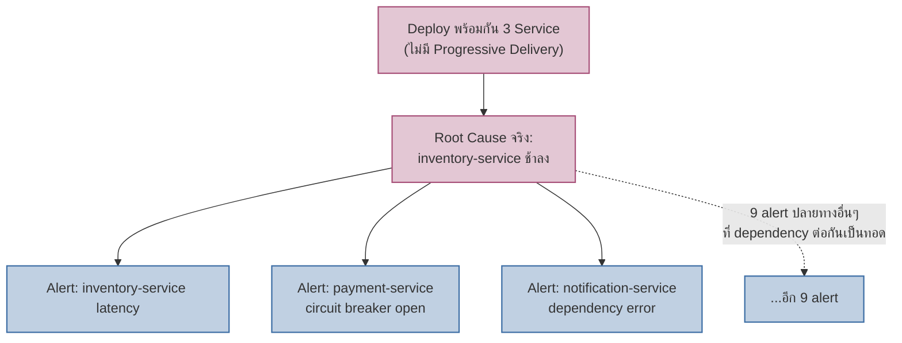

เคสขั้นสูงของโมดูลนี้ — ต่อยอดจากเคสแรก (Checkout Latency) ที่ alert เดียวชี้ตรงไปสาเหตุเดียว มาเป็นสถานการณ์ที่ยากขึ้น: **alert 12 ตัวยิงพร้อมกัน** แล้วต้องหาว่าตัวไหนคือต้นเหตุจริง ตัวไหนคืออาการที่ตามมา

## ไทม์ไลน์เหตุการณ์

- **14:00** — ทีม A, B, C deploy service คนละตัว (order-service, inventory-service, notification-service) พร้อมกันในช่วง 10 นาที บ่ายวันศุกร์ — ไม่มีใครทำ canary/progressive delivery (จากโมดูล CI/CD & GitOps) เพราะคิดว่า "เปลี่ยนแค่เล็กน้อย"
- **14:05** — Alertmanager ยิง **12 alert แยกกัน** ภายใน 3 นาที: `inventory-service latency high`, `payment-service circuit breaker open`, `notification-service dependency error`, และอีก 9 ตัวจาก service ปลายทางต่างๆ
- **14:06** — on-call เปิด PagerDuty เห็น alert ท่วมจอ เริ่ม ack ทีละตัวตามที่เรียนเรื่อง Alert Fatigue — แต่ยังไม่รู้ว่าตัวไหนคือต้นเหตุจริง
- **14:08** — เปิด Distributed Trace ของ request ที่ error หนึ่งตัว เห็น waterfall: `order-service → inventory-service (500ms → 3.2s) → payment-service (circuit breaker เปิด เพราะ timeout รอ inventory) → notification-service (dependency error เพราะรอ payment)`
- **14:10** — เช็ค deploy log พบว่า **inventory-service ตัวเดียว** ที่เพิ่ง deploy เวอร์ชันใหม่ที่มี query ช้าลง — payment-service และ notification-service ไม่ได้เปลี่ยนโค้ดอะไรเลย แค่**ได้รับผลกระทบจาก inventory-service ที่ช้าลง**
- **14:12** — สรุป: จาก 12 alert มีแค่ 1 root cause จริง (inventory-service) ส่วนอีก 11 alert คือ**อาการลูกโซ่**ที่ไล่ตามมาจาก dependency chain
- **14:15** — Rollback เฉพาะ inventory-service ตัวเดียว alert ทั้ง 12 ตัวเงียบภายใน 2 นาที

## เส้นทางการสืบสวน — จาก Alert Storm สู่ Root Cause เดียว

<mark class="hl-insight">alert แต่ละตัวไม่ได้ "โกหก" — payment-service circuit breaker เปิดจริง notification-service dependency error จริง แต่ทั้งหมดคือ**อาการที่ไล่ตามมาจาก dependency chain เดียวกัน** ไม่ใช่ 12 ปัญหาที่แยกจากกัน การไล่ trace เพื่อดู dependency graph จริงคือทางเดียวที่แยกได้ว่า "ตัวไหนคือต้นตอ ตัวไหนคือลูกโซ่" — ไม่ใช่ไล่ ack alert ทีละตัวตามลำดับที่ยิงเข้ามา</mark>

## ทำไมแต่ละเครื่องมือ/practice ขาดไม่ได้สักตัว

| ถ้าขาดสิ่งนี้ | จะเกิดอะไร |
|---|---|
| ไม่มี Progressive Delivery | Deploy 3 service พร้อมกันแบบเต็ม 100% ทันที เพิ่มความเสี่ยง alert storm แบบนี้ |
| ไม่มี Distributed Trace | ไม่รู้ dependency chain ต้องไล่เดาว่า alert ไหนคือต้นเหตุจากอาการที่เห็น 12 ตัว |
| ไม่มีความเข้าใจเรื่อง Alert Fatigue | on-call เสียเวลา ack/investigate ทุก alert แยกกันทีละตัว ทั้งที่ 11 ตัวเป็นอาการเดียวกัน |

<mark class="hl-warning">บทเรียนสำคัญของเคสนี้คือ**อย่าตัดสินความรุนแรงของปัญหาจากจำนวน alert ที่ยิง** — 12 alert ไม่ได้แปลว่ามี 12 ปัญหา อาจมีแค่ 1 root cause ที่ทำให้เกิด symptom กระจายไปตาม dependency graph ทีมที่ไม่มี trace หรือไม่เข้าใจ dependency ของระบบตัวเองดีพอ จะเสียเวลาไล่แก้ symptom ทีละตัวโดยไม่รู้ว่าแก้ที่ inventory-service ตัวเดียวก็จบเรื่องทั้งหมด</mark>

> คำถามสัมภาษณ์: "PagerDuty ยิง alert 20 ตัวพร้อมกันตอนตี 2 จะรู้ได้ยังไงว่าควรเริ่มสืบจากตัวไหนก่อน ไม่ใช่ตอบทีละ 20 ตัว" — คำตอบที่ดีคือชี้ว่าควรมองหา**alert ที่อยู่ต้นสุดของ dependency chain** ก่อน (เปิด distributed trace ของ request ที่ error ดูว่า span แรกที่เริ่มช้า/error คือ service ไหน) แทนที่จะไล่ตอบ alert ตามลำดับเวลาที่ยิงเข้ามา เพราะ alert ที่ยิงก่อนไม่จำเป็นต้องเป็น root cause เสมอไป — บาง service อาจ detect ปัญหาได้เร็วกว่า service อื่นในเชนเดียวกัน ทำให้ alert ของมันขึ้นก่อนทั้งที่ไม่ใช่ต้นเหตุจริง
