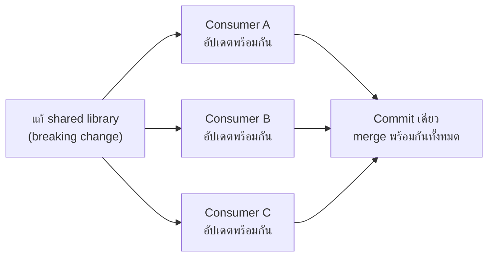

ลองนึกภาพห้องสมุดใหญ่หลังเดียวที่เก็บหนังสือทุกแผนกไว้ด้วยกัน — อยากรู้ว่าหนังสือเล่มไหนอ้างอิงเล่มไหนบ้างก็เดินดูได้ในตึกเดียว แก้ไขสารบัญกลางแล้วทุกแผนกเห็นพร้อมกันทันที นี่คือแนวคิดของ <mark class="hl-term">**Monorepo**</mark> — เก็บโค้ดของหลาย project/service/package ไว้ใน git repository เดียวกัน ตรงข้ามกับการแยก repo ต่อ project ที่คุ้นเคยกันทั่วไป

## จุดแข็ง: Atomic Cross-Project Change

<mark class="hl-insight">จุดแข็งที่สุดของ monorepo คือ**การแก้ breaking change ข้าม project ได้ใน commit เดียว** — ถ้า shared library เปลี่ยน API ทุก consumer ที่ต้องปรับตามสามารถแก้พร้อมกันใน pull request เดียว ตรวจสอบพร้อมกันใน CI เดียว merge พร้อมกันทีเดียว ไม่มีช่วงเวลาที่ library ใหม่ถูก publish แล้ว consumer บางตัวยังไม่ได้อัปเดตตาม (ซึ่งเป็นปัญหาคลาสสิกของ polyrepo ที่จะเรียนในหัวข้อถัดไป)</mark>

## จุดแข็งอื่นๆ

| จุดแข็ง | อธิบาย |
|---|---|
| **Code Visibility** | ทุกคนเห็นโค้ดทุก project ได้ ค้นหา/อ้างอิง cross-project ง่าย ไม่ต้องขอ access แยกทีละ repo |
| **Shared Tooling** | CI config, lint rule, dependency version เดียวกันทั้งองค์กร ไม่ต้อง sync การตั้งค่าข้าม repo |
| **Refactor ขนาดใหญ่** | เปลี่ยน pattern ทั่วองค์กร (เช่น rename function ที่ใช้ทุกที่) ทำครั้งเดียวจบ ไม่ต้องไล่ทำทีละ repo |
| **Dependency ตรงกันเสมอ** | ทุก project ใช้ version ของ shared code ล่าสุดเสมอ ไม่มีปัญหา "repo นี้ยังใช้ library version เก่า" |

## ข้อจำกัดที่ต้องแก้ด้วย Tooling เฉพาะทาง

<mark class="hl-warning">Monorepo ที่โตขึ้นเรื่อยๆ จะเจอปัญหาที่ git ธรรมดาแก้ไม่ไหว — ถ้า build/test ทั้ง repo ทุกครั้งที่มีการเปลี่ยนแปลง (แม้แก้แค่ 1 บรรทัดใน 1 project) เวลา CI จะยืดยาวขึ้นเรื่อยๆ ตามขนาด repo ทั้งหมด ไม่ใช่ตามขนาดของสิ่งที่เปลี่ยนจริง — บริษัทระดับ Google ที่มี monorepo ขนาดหลายสิบล้านไฟล์ต้องสร้างระบบ version control และ build system ของตัวเองขึ้นมาใหม่ทั้งหมด (Piper, Blaze) เพราะ git มาตรฐานรับมือไม่ไหวในสเกลนั้น</mark>

เครื่องมือที่แก้ปัญหานี้ในระดับที่จัดการได้ (ไม่ต้องถึงขนาด Google) คือระบบ build ที่รองรับ <mark class="hl-term">Incremental Build</mark> และ <mark class="hl-term">Affected-Only Testing</mark> — วิเคราะห์ dependency graph ของ project ทั้งหมดในองค์กร แล้ว build/test เฉพาะส่วนที่**ได้รับผลกระทบจริง**จากการเปลี่ยนแปลงล่าสุด ไม่ใช่ทั้ง repo (เครื่องมือกลุ่มนี้ เช่น Nx, Turborepo, Bazel — จะเรียนรายละเอียดในหัวข้อถัดไป)

## ข้อจำกัดด้าน Access Control

<mark class="hl-warning">เพราะทุกคนเห็นโค้ดทุก project ใน repo เดียวกัน การจำกัดสิทธิ์แบบละเอียด (เช่น "ทีม A ห้ามเห็นโค้ดของทีม B") ทำได้ยากกว่า polyrepo มาก — บางองค์กรที่มีข้อกำหนดด้าน compliance เข้มงวด (เช่นแยกทีมตาม regulation) อาจต้องแยกเป็น repo ต่างหากเฉพาะส่วนที่ต้องการ access control เข้มจริงๆ แทนที่จะรวมทุกอย่างไว้ที่เดียว</mark>

> คำถามสัมภาษณ์: "ทำไม monorepo ถึงช่วยเรื่อง breaking change ของ shared library ได้ดีกว่า polyrepo" — คำตอบที่ดีคือชี้ว่า monorepo ทำให้แก้ library และทุก consumer ที่ต้องปรับตามพร้อมกันได้ใน pull request เดียว ตรวจสอบและ merge พร้อมกันทีเดียว ไม่มีช่วงเวลาที่ library เวอร์ชันใหม่ถูก publish ออกไปแล้วแต่ consumer บางตัวยังไม่ได้อัปเดต ต่างจาก polyrepo ที่ต้อง publish library ก่อน แล้วค่อยไปสร้าง PR แยกในแต่ละ consumer repo ทีละที่
