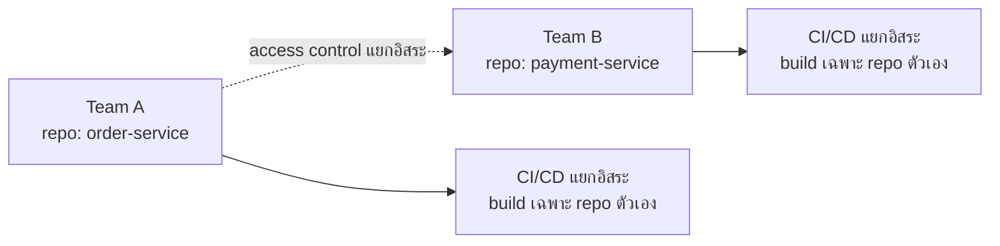
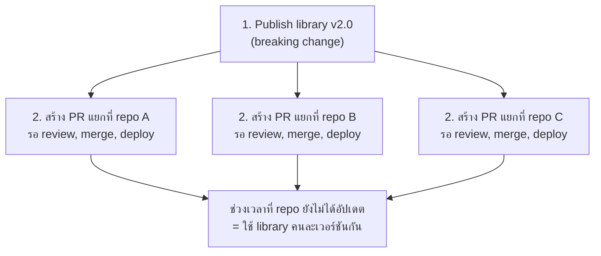

ถ้า monorepo คือห้องสมุดใหญ่หลังเดียว <mark class="hl-term">**Polyrepo**</mark> ก็คือระบบห้องสมุดแยกสาขาตามแผนก — แต่ละแผนกมีตึกของตัวเอง ดูแลกฎระเบียบเอง เข้า-ออกอิสระ ไม่ต้องพึ่งพาแผนกอื่น แต่ถ้าอยากอ้างอิงหนังสือข้ามแผนกก็ต้องเดินทางไปอีกตึกหนึ่ง — นี่คือแนวทางที่คุ้นเคยที่สุดสำหรับทีมส่วนใหญ่: หนึ่ง repository ต่อหนึ่ง service/project

## จุดแข็ง: Ownership และ Isolation ชัดเจน

<mark class="hl-insight">จุดแข็งที่สุดของ polyrepo คือ**ความเป็นอิสระ (isolation)** — แต่ละทีมมี repo ของตัวเอง กำหนด access control, branch protection, CI pipeline ได้ตามที่ทีมต้องการโดยไม่กระทบทีมอื่น การ build/test ก็จำกัดอยู่แค่ scope ของ repo นั้นเท่านั้น ไม่มีปัญหาเรื่อง build ทั้งองค์กรช้าลงเพราะ repo อื่นโตขึ้นแบบที่เจอใน monorepo</mark>

## จุดแข็งอื่นๆ

| จุดแข็ง | อธิบาย |
|---|---|
| **Access Control ละเอียด** | จำกัดสิทธิ์เข้าถึงเป็นรายทีม/รายบุคคลต่อ repo ได้ง่าย เหมาะกับ compliance ที่ต้องแยกส่วน |
| **Deploy อิสระ** | แต่ละ service deploy ตามจังหวะของตัวเอง ไม่ต้องรอ service อื่น ไม่ต้อง coordinate release |
| **CI เร็ว** | scope การ build/test เล็กเท่า repo เดียว ไม่ต้องพึ่ง tooling พิเศษแบบ monorepo ก็ยังเร็วได้ |
| **เริ่มต้นง่าย** | ไม่ต้องตั้งค่า monorepo tooling ซับซ้อน เหมาะกับทีมเล็กหรือเพิ่งเริ่มต้น |

## จุดอ่อน: Cross-Repo Change กลายเป็นฝันร้าย

<mark class="hl-warning">ปัญหาที่ตรงข้ามกับ monorepo เป๊ะๆ — ถ้า shared library เปลี่ยน breaking change ต้อง**publish library เวอร์ชันใหม่ก่อน** แล้วค่อยไปสร้าง pull request แยกในทุก repo ที่ใช้ library นั้น ทีละ repo ระหว่างนั้นจะมีช่วงเวลาที่ consumer บาง repo ยังใช้ library เวอร์ชันเก่าอยู่ (version drift) ซึ่งอาจนำไปสู่ bug ที่ไม่สอดคล้องกันระหว่าง service ต่างๆ ในระบบ</mark>

## จุดอ่อนอื่นๆ

| จุดอ่อน | อธิบาย |
|---|---|
| **Discoverability แย่** | หา code ที่เกี่ยวข้องข้าม repo ยาก ต้องรู้ล่วงหน้าว่า repo ไหนมีอะไร |
| **Tooling กระจัดกระจาย** | แต่ละ repo อาจตั้งค่า CI/lint/dependency ไม่ตรงกัน บำรุงรักษายากขึ้นตามจำนวน repo |
| **Refactor ทั่วองค์กรทำยาก** | เปลี่ยน pattern ที่ใช้ทุกที่ต้องไล่ทำทีละ repo แยกกัน ไม่มีทาง atomic |
| **Package Registry จำเป็น** | shared code ต้อง publish ผ่าน package registry จริง (npm, Maven) ไม่ใช่แค่ import ตรงๆ เหมือน monorepo |

<mark class="hl-insight">สังเกตว่าจุดแข็ง-จุดอ่อนของ polyrepo เป็น**ภาพสะท้อนกลับด้าน**ของ monorepo พอดี — ไม่มีฝั่งไหนดีกว่าอีกฝั่งโดยสมบูรณ์ trade-off หลักคือ**ความเป็นอิสระของแต่ละทีม (polyrepo)** เทียบกับ**ความสอดคล้องกันของทั้งระบบ (monorepo)** — การตัดสินใจเลือกจึงขึ้นอยู่กับว่าองค์กรให้คุณค่ากับด้านไหนมากกว่า จะเรียนกรอบการตัดสินใจนี้ในหัวข้อถัดไป</mark>

> คำถามสัมภาษณ์: "ทำไมทีมที่ใช้ polyrepo มักเจอปัญหา 'service สองตัวใช้ shared library คนละเวอร์ชันกัน' บ่อยกว่า monorepo" — คำตอบที่ดีคือชี้ว่า polyrepo ต้อง publish library ผ่าน package registry ก่อน แล้วแต่ละ consumer repo ต้องอัปเดต dependency เองแยกกันทีละที่ ระหว่างที่ยังอัปเดตไม่ครบทุก repo จะมีช่วงที่ version ไม่ตรงกัน (version drift) ต่างจาก monorepo ที่ทุก project อ้างอิง shared code จากที่เดียวกันโดยตรง ไม่มีช่วง drift แบบนี้เกิดขึ้นได้เลย
