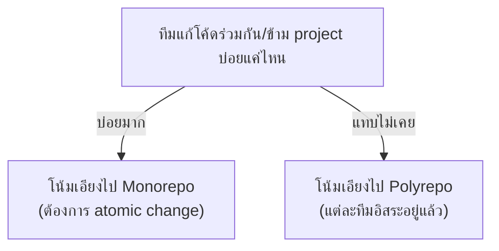

สองหัวข้อก่อนหน้าวาง trade-off ไว้ชัดเจนแล้ว — คำถามที่เหลือคือ**เลือกยังไงในทางปฏิบัติ** และคำตอบไม่ใช่ "monorepo ดีกว่าเสมอ" หรือ "polyrepo ดีกว่าเสมอ" แต่ขึ้นอยู่กับโครงสร้างทีมและระดับความพร้อมด้าน tooling ขององค์กร

## จุดเริ่มต้น: โครงสร้างทีมกำหนดโครงสร้าง Repo

<mark class="hl-insight">หลักการนี้คือภาพสะท้อนของ **Conway's Law** ("องค์กรจะออกแบบระบบที่มีโครงสร้างสื่อสารเหมือนโครงสร้างองค์กรของตัวเอง") ที่เรียนไปแล้วในโมดูล Team Topologies (track System Architecture) — ทีมที่สื่อสารกันบ่อย ทำงานใกล้ชิดกัน (เช่น platform team ที่ดูแล core library ให้ทุกทีม) มักได้ประโยชน์จาก monorepo มากกว่า เพราะการเปลี่ยนแปลงต้องประสานกันบ่อยอยู่แล้ว ส่วนทีมที่เป็นอิสระต่อกันสูง (แยก domain ชัดเจน, deploy คนละจังหวะ, ไม่ค่อยแก้โค้ดร่วมกัน) มักเหมาะกับ polyrepo มากกว่า เพราะไม่ได้ต้องการความสอดคล้องแบบ atomic บ่อยนัก</mark>

## Decision Framework

| คำถามที่ต้องถาม | ถ้าคำตอบคือ... | โน้มเอียงไปทาง |
|---|---|---|
| ทีมแก้ shared library บ่อยแค่ไหน | บ่อยมาก, หลาย consumer ต้อง sync กันตลอด | Monorepo |
| แต่ละทีมต้องการ deploy cadence ที่ต่างกันมากไหม | ต่างกันมาก (บาง service deploy วันละหลายครั้ง บางตัวเดือนละครั้ง) | Polyrepo |
| องค์กรพร้อมลงทุน tooling (Nx/Bazel) ไหม | ยังไม่พร้อม, ทีมเล็ก, ไม่มีคนดูแล build system | Polyrepo (จนกว่าจะพร้อม) |
| ต้องการ access control ละเอียดตาม compliance ไหม | ต้องการมาก (แยกทีมตาม regulation) | Polyrepo |
| ปัญหาหลักตอนนี้คือ version drift ระหว่าง service ไหม | ใช่ เจอบ่อยและเสียเวลามาก | Monorepo |

## Tooling ที่ทำให้ Monorepo Scale ได้จริง

<mark class="hl-warning">องค์กรที่ตัดสินใจย้ายไป monorepo โดยไม่ลงทุน tooling ที่เหมาะสม มักเจอ CI ที่ช้าลงเรื่อยๆ จนกลายเป็นคอขวดของทั้งทีม — monorepo ที่ scale ได้จริงต้องพึ่ง build system ที่รองรับ incremental build และ affected-only testing (จากหัวข้อ Monorepo Fundamentals) ไม่ใช่ git เปล่าๆ</mark>

| เครื่องมือ | จุดเด่น |
|---|---|
| **Nx** | dependency graph visualization, affected command (`nx affected`), caching ทั้ง local/remote |
| **Turborepo** | เน้นความเร็วและ config เรียบง่าย เหมาะกับ JS/TS ecosystem |
| **Bazel** | ระบบ build ระดับ Google ใช้จริง รองรับหลายภาษา, reproducible build เข้มงวด, เรียนรู้ยากกว่าตัวอื่น |

## Hybrid Approach — ไม่ต้องเลือกสุดขั้ว

<mark class="hl-insight">ในทางปฏิบัติ หลายองค์กรไม่ได้เลือกสุดขั้วฝั่งใดฝั่งหนึ่ง — ใช้แนวทาง **"monorepo ต่อ domain"** คือรวม project ที่เกี่ยวข้องกันใกล้ชิด (เช่นทีมเดียวกัน, แก้โค้ดร่วมกันบ่อย) ไว้ใน monorepo เล็กๆ ของ domain นั้น แต่แยก domain ที่ไม่เกี่ยวข้องกันออกเป็น repo ต่างหาก — ได้ประโยชน์ของ atomic change ภายใน domain โดยไม่ต้องแบกรับความซับซ้อนของ monorepo ระดับทั้งองค์กร</mark>

> คำถามสัมภาษณ์: "ทีม 5 คนที่เพิ่งเริ่มสตาร์ทอัพ ควรเริ่มด้วย monorepo หรือ polyrepo" — คำตอบที่ดีคือชี้ว่าทีมเล็กมักได้ประโยชน์จาก polyrepo แบบเรียบง่ายในช่วงแรก (ไม่ต้องลงทุน tooling ซับซ้อน, ทีมเดียวคุยกันได้ตลอดอยู่แล้วไม่จำเป็นต้อง atomic change ผ่าน git) แต่ถ้ารู้ตัวแต่แรกว่าจะมี shared library ที่หลาย service ต้องพึ่งพากันหนักและเปลี่ยนบ่อย การเริ่ม monorepo ตั้งแต่ต้น (ก่อนที่จะมี service เยอะจนย้ายทีหลังยาก) ก็เป็นทางเลือกที่สมเหตุสมผลเช่นกัน ขึ้นอยู่กับลักษณะการพึ่งพากันของโค้ดจริง ไม่ใช่กฎตายตัว
