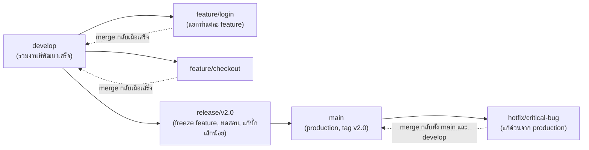

ลองนึกภาพสำนักพิมพ์หนังสือที่ออกฉบับพิมพ์ใหม่ปีละครั้ง — ระหว่างปีมีทีมเขียนต้นฉบับใหม่ไปเรื่อยๆ (แยกเป็นบทร่าง) พอใกล้ถึงกำหนดพิมพ์ก็รวบรวมบทที่พร้อมเข้าเล่ม พิสูจน์อักษรรอบสุดท้าย แล้วค่อยส่งโรงพิมพ์ ถ้าเจอพิมพ์ผิดร้ายแรงหลังพิมพ์ไปแล้วก็ต้องรีบแก้เฉพาะจุดแยกต่างหาก — นี่คือจังหวะการทำงานที่ <mark class="hl-term">**GitFlow**</mark> ถูกออกแบบมาให้รองรับ

## โครงสร้าง Branch ของ GitFlow

GitFlow มี branch ถาวร 2 เส้น (`main` กับ `develop`) และ branch ชั่วคราว 3 ชนิด:

| Branch | แตกจาก | จุดประสงค์ |
|---|---|---|
| **feature/\*** | develop | พัฒนา feature ใหม่ทีละเรื่อง แยกจากกันชัดเจน |
| **release/\*** | develop | เตรียมออก version ใหม่ — freeze feature, ทดสอบ, แก้บั๊กเล็กน้อยก่อนออกจริง |
| **hotfix/\*** | main | แก้ปัญหาด่วนบน production โดยไม่ต้องรอ release cycle ปกติ |

## จุดแข็ง: เหมาะกับซอฟต์แวร์ที่มีรอบ Release ชัดเจน

<mark class="hl-insight">GitFlow ออกแบบมาสำหรับซอฟต์แวร์ที่ออก version เป็นรอบชัดเจน (เช่น desktop app, mobile app ที่ต้องผ่าน app store review, หรือ enterprise software ที่ลูกค้าติดตั้งเอง) — การมี `release/*` branch แยกต่างหากให้เวลาสำหรับทดสอบและ stabilize ก่อนออกจริง โดยไม่บล็อกทีมอื่นที่ยังพัฒนา feature ถัดไปบน `develop` ต่อเนื่อง</mark>

`hotfix/*` ก็ตอบโจทย์สถานการณ์ที่ production มีบั๊กร้ายแรงและต้องแก้ทันที**โดยไม่รวมงานที่ยังไม่เสร็จจาก develop เข้าไปด้วย** — แก้เฉพาะจุด, merge เข้า main ตรงๆ, แล้วค่อย merge กลับ develop ทีหลังเพื่อให้ fix นั้นอยู่ในรอบถัดไปด้วย

## ข้อจำกัด: หนักเกินไปสำหรับซอฟต์แวร์ที่ Deploy บ่อย

<mark class="hl-warning">ทีมที่ deploy วันละหลายครั้ง (เช่น web service ที่ deploy ทุก merge) มักเจอปัญหากับ GitFlow — feature branch ที่แยกจาก develop นานเกินไปก่อน merge จะสะสม merge conflict มากขึ้นเรื่อยๆ (ยิ่งอยู่นานยิ่ง diverge จาก develop มาก) และขั้นตอน develop → release → main ที่ต้องผ่านหลายชั้นทำให้ commit หนึ่งกว่าจะถึง production ใช้เวลานานเกินความจำเป็น</mark> — สำหรับ workflow แบบนี้ มีแนวทางที่เบากว่าและเหมาะกับ continuous deployment มากกว่า จะเรียนในหัวข้อ Trunk-Based Development ถัดไป

> คำถามสัมภาษณ์: "ทำไม GitFlow ถึงเหมาะกับ mobile app มากกว่า web service ที่ deploy บ่อยๆ" — คำตอบที่ดีคือชี้ว่า mobile app ต้องผ่านกระบวนการ review ของ app store ก่อนถึงมือ user ทำให้มีรอบ release ที่ชัดเจนตามธรรมชาติอยู่แล้ว (ไม่สามารถ deploy ทุก commit ได้ทันที) โครงสร้าง release/* ของ GitFlow ที่ให้เวลาทดสอบ stabilize ก่อนออกจึงเข้ากับจังหวะนี้ได้ดี ต่างจาก web service ที่ deploy ได้ทันทีทุกครั้งที่ merge ซึ่งขั้นตอนหลายชั้นของ GitFlow จะกลายเป็นคอขวดที่ไม่จำเป็น
