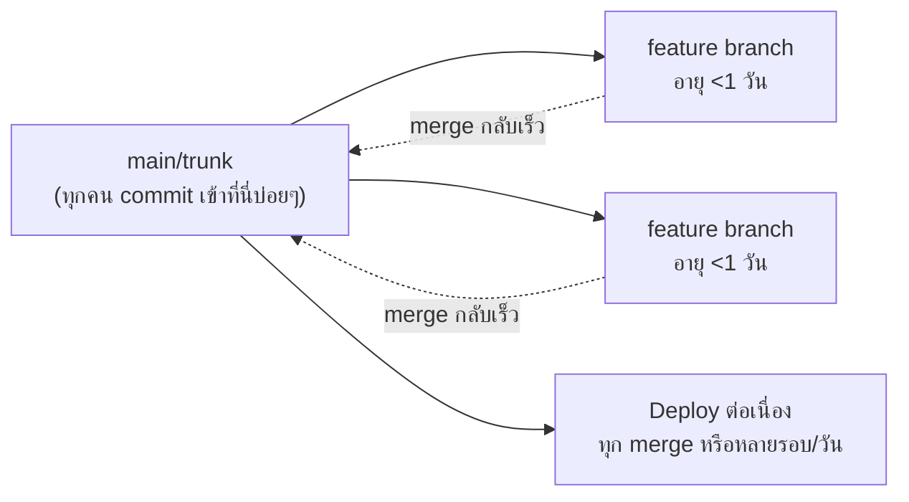
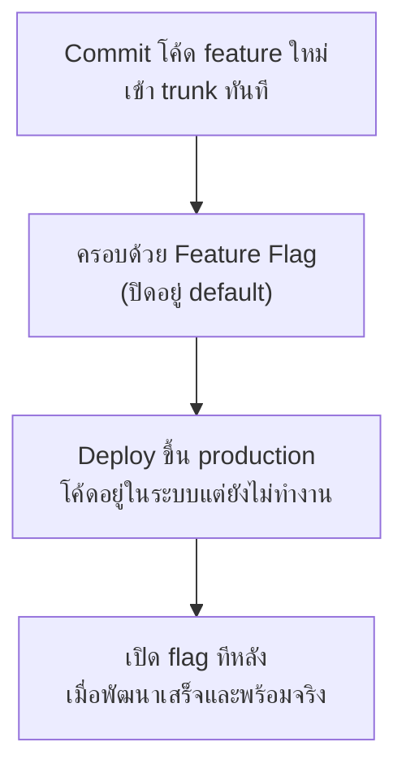

ถ้า GitFlow คือสำนักพิมพ์ที่ออกฉบับใหม่ปีละครั้ง <mark class="hl-term">**Trunk-Based Development**</mark> ก็คือหนังสือพิมพ์รายวัน — เขียนข่าวเสร็จ ส่งพิมพ์ทันที ไม่ต้องรอสะสมข่าวไว้เป็นชุดใหญ่ ทุกคนทำงานบน "ฉบับหลัก" เดียวกันตลอดเวลา ไม่มีฉบับร่างแยกที่ทิ้งไว้นานๆ ก่อนรวมเข้าฉบับหลัก

## หลักการ: Commit เข้า Trunk บ่อยๆ, Branch อายุสั้นมาก

<mark class="hl-insight">หัวใจของ trunk-based development คือ**ทุกคน commit เข้า branch หลัก (trunk) บ่อยที่สุดเท่าที่จะทำได้** (อย่างน้อยวันละครั้ง) แทนที่จะแยก feature branch ทิ้งไว้นานเป็นสัปดาห์แบบ GitFlow — feature branch ที่มีก็มีอายุสั้นมาก (ชั่วโมงถึงไม่เกิน 1 วัน) merge conflict จึงมีโอกาสเกิดน้อยกว่ามาก เพราะไม่มีใคร diverge จาก trunk นานจนโค้ดเริ่มไม่ตรงกัน</mark>

## ปัญหา: แล้ว Feature ที่ยังทำไม่เสร็จล่ะ

คำถามที่ตามมาทันที: ถ้าต้อง commit เข้า trunk บ่อยๆ แล้ว feature ที่ยังทำไม่เสร็จ (ใช้เวลาพัฒนาหลายสัปดาห์) จะทำยังไงไม่ให้ไปกระทบ user ที่ใช้งานจริงบน production — คำตอบคือ <mark class="hl-term">**Feature Flag**</mark>

โค้ดที่ยังทำไม่เสร็จถูก commit เข้า trunk และ deploy ขึ้น production ได้ตามปกติ แต่ถูก**ครอบด้วยเงื่อนไข flag ที่ปิดอยู่** — user ทั่วไปจะไม่เห็นหรือได้รับผลกระทบใดๆ จนกว่าทีมจะพร้อมเปิด flag จริง แนวคิดนี้เชื่อมโยงกับ Canary Deployment ที่เรียนไปแล้วในหัวข้อ Deployment Strategies (โมดูล Reliability) — ทั้งคู่คือการ**แยกขั้นตอน "deploy โค้ดขึ้นระบบ" ออกจาก "เปิดให้ user ใช้งานจริง"** เพียงแต่ feature flag ควบคุมที่ระดับ code path ส่วน canary ควบคุมที่ระดับ traffic routing

## ทำไม Trunk-Based ถึงจำเป็นสำหรับ Continuous Deployment

<mark class="hl-warning">ทีมที่อยากทำ Continuous Deployment (deploy ทุก merge อัตโนมัติ ไม่มีขั้นตอน release แยก) แทบเป็นไปไม่ได้เลยถ้ายังใช้ feature branch ที่มีอายุยืนแบบ GitFlow — เพราะ branch ที่ diverge นานจะสะสมการเปลี่ยนแปลงจำนวนมากก่อน merge ทำให้แต่ละ deploy มีความเสี่ยงสูง (เปลี่ยนแปลงเยอะในครั้งเดียว) trunk-based development แก้ปัญหานี้ตรงจุด: การเปลี่ยนแปลงแต่ละครั้งที่เข้า trunk มีขนาดเล็ก ตรวจสอบง่าย deploy ได้บ่อยและปลอดภัยกว่า</mark>

## เปรียบเทียบกับ GitFlow

| มิติ | GitFlow | Trunk-Based Development |
|---|---|---|
| อายุ feature branch | เป็นสัปดาห์ถึงเป็นเดือน | ชั่วโมงถึงไม่เกิน 1 วัน |
| ความถี่ merge conflict | สูงกว่า (branch diverge นาน) | ต่ำกว่ามาก |
| งานที่ยังไม่เสร็จ | อยู่แยกใน branch จนกว่าจะเสร็จ | อยู่ใน trunk แต่ซ่อนด้วย feature flag |
| เหมาะกับ | รอบ release ชัดเจน (mobile, desktop app) | continuous deployment (web service) |

> คำถามสัมภาษณ์: "ทำไม trunk-based development ถึงต้องพึ่ง feature flag เป็นองค์ประกอบสำคัญ ไม่ใช่แค่ branch สั้นๆ อย่างเดียว" — คำตอบที่ดีคือชี้ว่าถ้า commit เข้า trunk บ่อยแต่ feature ยังทำไม่เสร็จ โค้ดที่ไม่สมบูรณ์จะถูก deploy ขึ้น production ไปด้วย ถ้าไม่มี feature flag ครอบไว้ user จะเจอ feature ที่ยังไม่พร้อมทันที feature flag จึงเป็นกลไกที่ทำให้ "commit บ่อย" กับ "ไม่กระทบ user" เกิดขึ้นพร้อมกันได้ ไม่ต้องรอ feature เสร็จสมบูรณ์ถึงจะ merge
