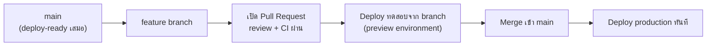
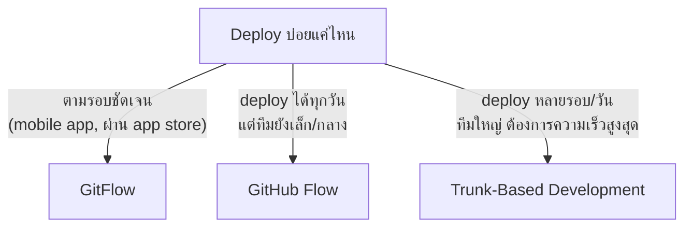

ก่อนปิดหัวข้อนี้ ต้องพูดถึง <mark class="hl-term">**GitHub Flow**</mark> ทางเลือกที่สามที่อยู่ตรงกลางระหว่าง GitFlow กับ Trunk-Based Development — แล้วค่อยสรุปว่าทั้ง 3 แบบควรเลือกใช้ยังไงในทางปฏิบัติ

## GitHub Flow — เรียบง่ายกว่า GitFlow แต่ยังมี PR Review เต็มรูปแบบ

GitHub Flow มีแค่ `main` branch เดียวที่ถือว่า deploy-ready ตลอดเวลา ไม่มี `develop` หรือ `release/*` แบบ GitFlow — ทุก feature แตก branch จาก main, เปิด Pull Request, ผ่าน review และ CI, แล้ว merge กลับเข้า main ทันที จากนั้น deploy production ทันทีที่ merge เสร็จ <mark class="hl-insight">จุดต่างจาก trunk-based development แบบเคร่งครัดคือ GitHub Flow ยังเน้นขั้นตอน Pull Request review ก่อน merge เสมอ ส่วน trunk-based ในบางทีมอาจ commit ตรงเข้า trunk ได้เลยถ้าทีมมี CI ที่แข็งแรงพอ (แต่ส่วนใหญ่ในทางปฏิบัติก็ยังผ่าน PR สั้นๆ เหมือนกัน) ความต่างจึงเป็นเรื่อง**ความยาวของ branch และวัฒนธรรมทีม**มากกว่าโครงสร้างที่ต่างกันสุดขั้ว</mark>

## เปรียบเทียบทั้ง 3 แบบ

| มิติ | GitFlow | GitHub Flow | Trunk-Based Development |
|---|---|---|---|
| จำนวน branch ถาวร | 2 (main, develop) | 1 (main) | 1 (main/trunk) |
| อายุ feature branch | สัปดาห์–เดือน | วัน–สัปดาห์ | ชั่วโมง–1 วัน |
| ต้องมี release branch แยก | ต้องมี | ไม่มี | ไม่มี |
| ความถี่ deploy | ตามรอบ release | ทุกครั้งที่ merge | ทุกครั้งที่ merge (บ่อยกว่า) |
| ต้องพึ่ง Feature Flag | ไม่จำเป็น | แนะนำ | จำเป็นมาก |

## Decision Framework

<mark class="hl-warning">กับดักที่พบบ่อย: ทีมเลือก GitFlow เพราะ "ดูเป็นมาตรฐานที่เคยได้ยิน" ทั้งที่ deploy ทุกวันอยู่แล้ว — ผลคือแบกรับ overhead ของ release branch และขั้นตอนหลายชั้นโดยไม่ได้ประโยชน์อะไรเพิ่มเลย เพราะไม่มีความจำเป็นต้อง stabilize ก่อนออกแบบมีรอบชัดเจนตั้งแต่แรก การเลือก branching strategy ควรเริ่มจากถามว่า**"เรา deploy บ่อยแค่ไหนจริงๆ"** ไม่ใช่เลือกตามความคุ้นเคย</mark>

## สิ่งที่ต้องมีก่อนย้ายไป Trunk-Based Development

การย้ายจาก GitFlow ไป Trunk-Based Development ไม่ใช่แค่เปลี่ยนชื่อ branch — ต้องมีพื้นฐานรองรับก่อน:

| สิ่งที่ต้องมี | เหตุผล |
|---|---|
| CI ที่รันเร็วและน่าเชื่อถือ | เพราะ merge บ่อย ถ้า CI ช้าหรือ flaky จะกลายเป็นคอขวด |
| Feature Flag system | จำเป็นสำหรับซ่อนงานที่ยังไม่เสร็จ (จากหัวข้อก่อนหน้า) |
| Automated Testing Coverage สูง | ลดความเสี่ยงจากการ merge บ่อยโดยไม่มีคน review ละเอียดทุกจุด |
| วัฒนธรรม Code Review ที่รวดเร็ว | branch ที่ค้าง PR นานขัดกับหลักการ merge เร็ว |

> คำถามสัมภาษณ์: "ทีมอยากย้ายจาก GitFlow ไป Trunk-Based Development ทันทีเพื่อ deploy ให้เร็วขึ้น ควรทำเลยไหม" — คำตอบที่ดีคือไม่ควรย้ายทันทีถ้ายังไม่มีพื้นฐานรองรับ เช่น CI ที่เร็วและน่าเชื่อถือ, feature flag system, และ test coverage ที่เพียงพอ — เพราะ trunk-based development พึ่งพาสิ่งเหล่านี้เพื่อทดแทนความปลอดภัยที่ GitFlow ได้จากขั้นตอน release/stabilize ที่ยาวนาน ถ้าย้ายโดยไม่มีพื้นฐานเหล่านี้ก่อน ความเสี่ยงที่โค้ดพังบน production จะเพิ่มขึ้นแทนที่จะลดลง
