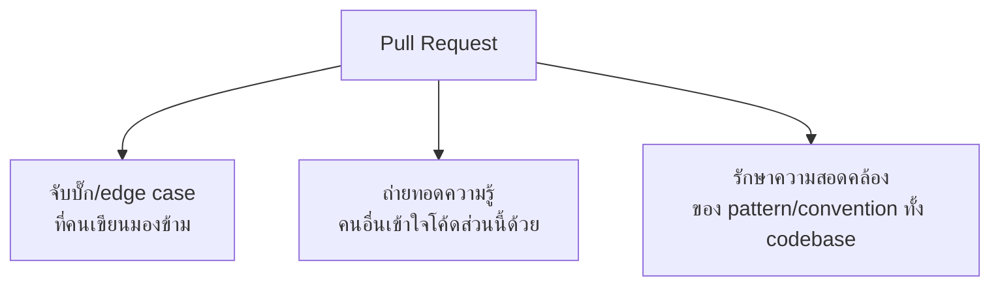

ลองนึกภาพนักบินสองคนในห้องนักบิน — นักบินคนหนึ่งขับ อีกคนคอยตรวจสอบทุกขั้นตอนซ้ำ (checklist, ตัวเลขสำคัญ) ก่อนตัดสินใจอะไรสำคัญ ไม่ใช่เพราะไม่เชื่อใจกัน แต่เพราะรู้ว่า**คนสองคนจับผิดพลาดได้มากกว่าคนเดียว** — นี่คือเหตุผลเดียวกับที่ทีมซอฟต์แวร์ทำ <mark class="hl-term">**Code Review**</mark> ก่อน merge โค้ดทุกครั้ง

## ทำไม Code Review ถึงสำคัญกว่าแค่ "หาบั๊ก"

<mark class="hl-insight">Code Review มีคุณค่า 3 ด้านพร้อมกัน ไม่ใช่แค่ "หาบั๊ก" — ด้านแรกคือจับปัญหาที่คนเขียนมองข้ามเพราะใกล้ชิดกับโค้ดเกินไป ด้านที่สองคือถ่ายทอดความรู้ให้อย่างน้อยอีกหนึ่งคนในทีมเข้าใจโค้ดส่วนนี้ (ลด bus factor — ถ้าคนเขียนลาออก ยังมีคนอื่นเข้าใจ) ด้านที่สามคือรักษาความสอดคล้องของ pattern และ convention ทั่วทั้ง codebase ไม่ให้แต่ละคนเขียนสไตล์ต่างกันจนอ่านยาก</mark>

## PR เล็ก Review ได้ดีกว่า PR ใหญ่

<mark class="hl-warning">งานวิจัยด้าน code review พบซ้ำๆ ว่าคุณภาพการ review ลดลงอย่างมากเมื่อ PR มีขนาดใหญ่ขึ้น — คนตรวจ review PR ที่มี 20 บรรทัดอย่างละเอียด แต่พอเจอ PR 800 บรรทัด มักไถผ่านเร็วๆ แล้วกด approve เพราะอ่านละเอียดทุกบรรทัดไม่ไหว ยิ่ง PR ใหญ่ยิ่งมีโอกาสสูงที่บั๊กจะหลุดผ่าน review ไปได้</mark> — นี่คือเหตุผลเดียวกับที่เรียนไปในหัวข้อ Trunk-Based Development: การ commit บ่อยๆ ด้วย change เล็กๆ ไม่ได้ดีแค่เรื่อง merge conflict แต่ยังทำให้ review มีคุณภาพสูงขึ้นด้วย

## Review ตรงไหน ไม่ต้อง Nitpick ตรงไหน

| ควร Focus | ไม่ควรเสียเวลากับ |
|---|---|
| Logic ถูกต้องไหม, edge case ครบไหม | รูปแบบโค้ด (formatting) ที่ linter/formatter จัดการได้อัตโนมัติ |
| Security, data validation ที่ trust boundary | ความชอบส่วนตัวที่ไม่กระทบความถูกต้อง (เช่น ตั้งชื่อตัวแปรที่อ่านเข้าใจได้อยู่แล้ว) |
| Test coverage ครอบคลุมพอไหม | Nitpick สไตล์ที่ไม่มีผลต่อการทำงานจริง |

<mark class="hl-insight">ทีมที่ effective มักตั้ง automated tooling (linter, formatter, type checker) ให้จัดการเรื่อง style ไปเลยตั้งแต่ CI ก่อนถึงมือ human reviewer — เพื่อให้ human review เหลือเวลาไปโฟกัสกับสิ่งที่เครื่องมือตรวจไม่ได้ (logic, edge case, ความเหมาะสมของ design) ซึ่งเป็นคุณค่าที่แท้จริงของการมีคนมา review</mark>

## วัฒนธรรม Feedback ที่สร้างสรรค์

Code review ที่ดีต้องแยกระหว่าง**การวิจารณ์โค้ด**กับ**การวิจารณ์คน** — คำแนะนำที่ตรงประเด็น ("ฟังก์ชันนี้ไม่ handle กรณี input ว่าง ลอง...") ต่างจากคำวิจารณ์ที่กระทบความรู้สึก ("ทำไมเขียนโค้ดแบบนี้") ทีมที่มีวัฒนธรรม review ที่ดีมักตั้งกฎเบื้องต้น: อธิบายเหตุผลเสมอ (ไม่ใช่แค่ "ผิด"), เสนอทางแก้ไม่ใช่แค่ชี้ปัญหา, และแยกความเห็น (opinion) กับข้อผิดพลาดจริง (blocker) ให้ชัดเจนใน comment

> คำถามสัมภาษณ์: "ทำไม PR ขนาดเล็กถึง review ได้มีคุณภาพกว่า PR ขนาดใหญ่ ทั้งที่เนื้อหาเดียวกันแค่แบ่งเป็นหลาย PR" — คำตอบที่ดีคือชี้ว่าความสามารถของคนในการตรวจจับรายละเอียดลดลงเมื่อปริมาณโค้ดที่ต้องอ่านในครั้งเดียวเพิ่มขึ้น PR ใหญ่มักถูกไถผ่านเร็วๆ เพราะอ่านละเอียดทุกบรรทัดไม่ไหว ทำให้บั๊กมีโอกาสหลุดผ่านมากกว่า ขณะที่ PR เล็กให้ reviewer โฟกัสได้เต็มที่ในแต่ละจุด และยังตรงกับหลักการ commit บ่อยๆ ของ trunk-based development ที่ช่วยลด merge conflict ไปพร้อมกันด้วย
