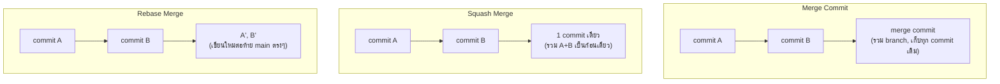

พอ PR ผ่าน review เรียบร้อยแล้ว คำถามถัดไปคือ**จะรวม branch เข้า main ยังไง** — GitHub/GitLab ให้เลือกได้ 3 วิธี ที่ให้ผลลัพธ์บน commit history ต่างกันมาก แม้เนื้อหาโค้ดสุดท้ายจะเหมือนกันทุกวิธี

## 3 วิธีรวม Branch เข้า Main

| วิธี | ผลลัพธ์บน main | เก็บ commit ย่อยไหม |
|---|---|---|
| **Merge Commit** | เพิ่ม merge commit ที่มี 2 parent ต่อท้าย branch เดิมครบ | เก็บครบทุก commit + เห็นจุดที่แตก/รวม branch ชัดเจน |
| **Squash Merge** | รวมทุก commit ใน branch เป็น 1 commit เดียวบน main | ไม่เก็บ — ประวัติย่อยหายไป เหลือแค่ก้อนเดียว |
| **Rebase Merge** | เขียน commit แต่ละตัวใหม่ต่อท้าย main ตรงๆ (ไม่มี merge commit) | เก็บ commit ย่อยไว้ แต่ history เป็นเส้นตรง |

## เมื่อไหร่ใช้แบบไหน

<mark class="hl-insight">**Squash Merge** เหมาะกับทีมส่วนใหญ่ที่ไม่สนใจ commit ย่อยระหว่างพัฒนา (เช่น "fix typo", "wip", "address review comment") — รวมเป็น 1 commit สะอาดต่อ 1 PR ทำให้ history บน main อ่านง่าย ไล่ดู "PR ไหนทำอะไร" ได้ชัดเจน เหมาะกับทีมที่ทำ trunk-based development เพราะ history ที่เป็นเส้นตรงและอ่านง่ายช่วยให้ debug/bisect หาที่มาของบั๊กได้เร็ว</mark>

<mark class="hl-warning">**Merge Commit** เหมาะกับสถานการณ์ที่ต้องการเก็บบริบทว่า "feature นี้พัฒนาเป็นขั้นตอนยังไง" ไว้จริงๆ (เช่น โปรเจกต์ open source ขนาดใหญ่ที่นักพัฒนาหลายคนสนใจประวัติการพัฒนา) แต่ข้อเสียคือ history จะรก มี merge commit เกลื่อนเต็มไปหมด ถ้าทีมมี PR จำนวนมากต่อวัน การไล่ history จะดูสับสนกว่าสองวิธีอื่นมาก</mark>

**Rebase Merge** ให้ history เป็นเส้นตรงเหมือน squash แต่ยังเก็บ commit ย่อยไว้ครบ — เหมาะกับทีมที่ผู้เขียนตั้งใจแบ่ง commit ให้มีความหมายแต่ละก้อนอยู่แล้ว (atomic commit ที่ตั้งใจ ไม่ใช่ "wip" สุ่มๆ) แลกกับความซับซ้อนที่ผู้ใช้ต้องเข้าใจ rebase ให้ดีก่อน ไม่งั้นอาจเจอปัญหาตอน conflict ระหว่าง rebase ที่แก้ยากกว่า merge ธรรมดา

## กับดัก: Force-Push หลัง Rebase

<mark class="hl-warning">Rebase เขียนประวัติ commit ใหม่ทั้งหมด (commit hash เปลี่ยนหมด) ถ้า branch นั้นถูก push ขึ้น remote ไปแล้วและมีคนอื่นดึงไปทำงานต่อ การ rebase แล้ว force-push ทับจะทำให้ประวัติของคนอื่นขัดแย้งกับ remote ทันที — กฎทองคือ**ห้าม rebase branch ที่คนอื่นกำลังใช้งานร่วมอยู่** ใช้ rebase ได้อย่างปลอดภัยเฉพาะ branch ส่วนตัวที่ยังไม่มีใคร pull ไปใช้เท่านั้น</mark>

> คำถามสัมภาษณ์: "ทีมที่ทำ trunk-based development ควรเลือก merge strategy แบบไหนเป็นค่าเริ่มต้น" — คำตอบที่ดีคือ squash merge เพราะให้ history บน main เป็นเส้นตรงและอ่านง่าย (1 PR = 1 commit) ซึ่งเข้ากับหลักการ trunk-based ที่ merge บ่อยๆ ด้วย change เล็กๆ — ถ้าใช้ merge commit จะทำให้ history รกเร็วมากเพราะจำนวน PR ต่อวันสูง ส่วน rebase merge แม้ให้ history เส้นตรงเหมือนกันแต่มีความซับซ้อนเพิ่มขึ้นโดยไม่ได้ประโยชน์ชัดเจนกว่า squash สำหรับ workflow แบบนี้
