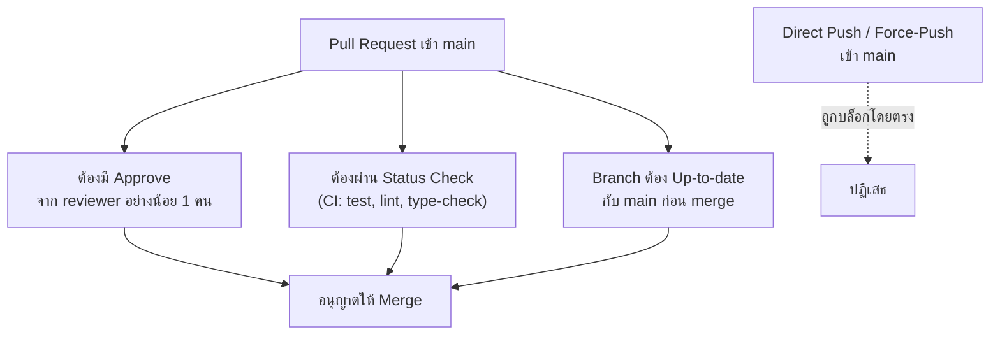

ทีมที่มีวัฒนธรรม review ดี (จากหัวข้อแรก) และเลือก merge strategy ที่เหมาะสม (จากหัวข้อก่อนหน้า) ยังขาดสิ่งสำคัญอย่างหนึ่ง — **การบังคับให้กฎเหล่านี้เกิดขึ้นจริงทุกครั้ง** ไม่ใช่แค่หวังว่าทุกคนจะทำตามกฎเอง มนุษย์ลืมได้ รีบได้ กดดันได้ <mark class="hl-term">**Branch Protection**</mark> คือกลไกที่ทำให้กฎเหล่านี้เป็นข้อบังคับระดับระบบ ไม่ใช่แค่ข้อตกลงปากเปล่า

## กฎ Branch Protection พื้นฐาน

| กฎ | ป้องกันอะไร |
|---|---|
| **Require PR review** | ป้องกันโค้ดเข้า main โดยไม่มีใครตรวจสอบเลย (บังคับวัฒนธรรม review จากหัวข้อแรกให้เกิดขึ้นจริง) |
| **Require status checks ผ่าน** | ป้องกันโค้ดที่ทดสอบไม่ผ่าน (test fail, lint error) เข้า main |
| **Require branch up-to-date** | ป้องกันปัญหา "PR ผ่าน CI ตอนที่แตก branch แต่ main เปลี่ยนไปแล้วจนโค้ดจริงอาจพังแล้ว" |
| **Block force-push เข้า main** | ป้องกันการเขียนทับ history ของ main โดยไม่ตั้งใจหรือโดยอุบัติเหตุ |
| **Block direct push เข้า main** | บังคับให้ทุกการเปลี่ยนแปลงต้องผ่าน PR เสมอ ไม่มีทางลัด |

## ทำไม "Require Branch Up-to-Date" ถึงสำคัญ

<mark class="hl-warning">สถานการณ์ที่พบบ่อย: PR ของเราผ่าน CI ตั้งแต่เช้า แต่ระหว่างวันมี PR อื่น merge เข้า main ไปก่อน ถ้า main branch เปลี่ยนไปในทางที่ขัดกับโค้ดของเรา (แม้ git ไม่เห็น conflict ตรงๆ) การ merge PR ของเราเข้าไปอาจทำให้ main พังได้ทั้งที่ CI ของ PR เราเขียวตลอด เพราะ CI รันตอนที่ branch ยังไม่ทันเห็นการเปลี่ยนแปลงล่าสุด</mark> — กฎ "ต้อง update branch ให้ตรงกับ main ล่าสุดก่อน merge ได้" (แล้วรอ CI รันใหม่บน commit ที่ update แล้ว) แก้ปัญหานี้โดยตรง แม้จะทำให้ merge ช้าลงเล็กน้อยก็ตาม

## ระดับความเข้มงวดที่ต่างกันตามบริบท

<mark class="hl-insight">ไม่ใช่ทุก branch ต้องการความเข้มงวดระดับเดียวกัน — main/production branch ควรเข้มงวดที่สุด (ทุกกฎข้างต้นครบ) ส่วน branch ทดลองหรือ branch ของ personal project อาจไม่จำเป็นต้องเข้มขนาดนั้น การตั้ง branch protection จึงควรเลือกใช้ตามความสำคัญของ branch นั้น ไม่ใช่ตั้งกฎเดียวกันหมดทุก branch จนทีมรู้สึกอึดอัดโดยไม่จำเป็น</mark>

## Required Reviewers — จุดเริ่มต้นก่อนไปหัวข้อถัดไป

Branch protection บางระบบให้กำหนดได้ว่า**ใครต้องเป็นคน approve** ไม่ใช่แค่ "มีคน approve ก็พอ" — เช่น การเปลี่ยนแปลงไฟล์ที่เกี่ยวกับ payment ต้องมี reviewer จากทีม payment approve ด้วยเสมอ ระบบที่ทำเรื่องนี้อย่างเป็นระบบทั่วทั้ง repo เรียกว่า <mark class="hl-term">CODEOWNERS</mark> ซึ่งจะเรียนรายละเอียดเต็มรูปแบบในหัวข้อ Git Workflow at Scale ถัดไป

> คำถามสัมภาษณ์: "ทีมมีกฎว่าทุก PR ต้องมีคน review ก่อน merge แต่ยังเจอโค้ดที่ไม่มีใคร review หลุดเข้า main บ่อยๆ เกิดจากอะไร" — คำตอบที่ดีคือชี้ว่าถ้ากฎนั้นเป็นแค่ข้อตกลงปากเปล่าโดยไม่มี branch protection บังคับจริงในระบบ (เช่น GitHub branch protection rule) คนที่รีบหรือลืมยังสามารถ push ตรงเข้า main ได้อยู่ดี ต้องเปิดใช้ "require PR review" และ "block direct push" ที่ระดับ branch protection เพื่อให้กฎนี้เป็นข้อบังคับที่ระบบปฏิเสธการ merge ที่ไม่ผ่านเงื่อนไขโดยอัตโนมัติ ไม่ต้องพึ่งวินัยของคนเพียงอย่างเดียว
