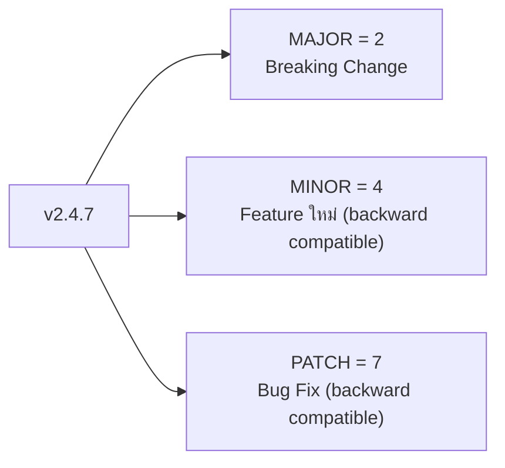

ลองนึกภาพฉลากยาที่บอกแค่ "ยาตัวใหม่" โดยไม่บอกว่าเปลี่ยนสูตรจากเดิมแค่ไหน — คนไข้จะกล้ากินยาตัวใหม่นี้แทนตัวเดิมไหมถ้าไม่รู้ว่าเปลี่ยนไปมากแค่ไหน <mark class="hl-term">**Semantic Versioning (SemVer)**</mark> แก้ปัญหานี้สำหรับซอฟต์แวร์ — ทำให้เลขเวอร์ชันเองบอกได้ทันทีว่า**อัปเกรดแล้วปลอดภัยแค่ไหน** โดยไม่ต้องไปอ่าน changelog ก่อน

## โครงสร้าง MAJOR.MINOR.PATCH



| ส่วน | เพิ่มเมื่อไหร่ | ตัวอย่าง |
|---|---|---|
| **MAJOR** | มี breaking change — API เปลี่ยนจนโค้ดเดิมของ consumer อาจพัง | ลบ function ออก, เปลี่ยน signature, เปลี่ยนพฤติกรรม default |
| **MINOR** | เพิ่ม feature ใหม่ แต่ยัง backward compatible | เพิ่ม function ใหม่, เพิ่ม optional parameter |
| **PATCH** | แก้บั๊ก โดยไม่เปลี่ยน API เลย | แก้ logic ผิดพลาด, แก้ performance โดยพฤติกรรมเดิม |

<mark class="hl-insight">คุณค่าที่แท้จริงของ SemVer ไม่ใช่แค่การนับเลข — มันคือ**สัญญา (contract)** ระหว่างผู้ maintain library กับ consumer: ถ้าเห็นแค่ PATCH เปลี่ยน (2.4.7 → 2.4.8) consumer อัปเกรดได้ทันทีโดยไม่ต้องอ่านอะไรเพิ่ม ถ้าเห็น MINOR เปลี่ยน (2.4.7 → 2.5.0) อัปเกรดได้อย่างมั่นใจว่าโค้ดเดิมไม่พัง แต่ถ้าเห็น MAJOR เปลี่ยน (2.4.7 → 3.0.0) ต้องหยุดอ่าน changelog ก่อนอัปเกรดเสมอ เพราะมีโอกาสสูงที่โค้ดเดิมจะพัง</mark>

## ทำไมสัญญานี้ถึงสำคัญมากในบริบท Polyrepo

จากหัวข้อ Polyrepo Fundamentals (โมดูล Monorepo vs Polyrepo) — ปัญหา **version drift** เกิดเพราะ consumer แต่ละ repo อัปเดต dependency ไม่พร้อมกัน SemVer ช่วยให้ทีมตัดสินใจได้ทันทีว่าอัปเดตตอนนี้เสี่ยงแค่ไหน โดยไม่ต้องไปไล่อ่านโค้ดจริงของ library ก่อน — นี่คือกลไกที่ทำให้ ecosystem ของ package แยกจากกัน (npm, Maven, PyPI) ทำงานร่วมกันได้อย่างเชื่อถือได้ในสเกลใหญ่

## Version Range — ความยืดหยุ่นที่ควบคุมได้

```
"lodash": "^4.17.21"   → ยอมรับ 4.x.x ใดๆ ที่ ≥ 4.17.21 (MINOR/PATCH อัปเดตอัตโนมัติ)
"lodash": "~4.17.21"   → ยอมรับ 4.17.x ใดๆ ที่ ≥ 4.17.21 (แค่ PATCH อัปเดตอัตโนมัติ)
"lodash": "4.17.21"    → ตรึง version นี้เท่านั้น (exact pin)
```

<mark class="hl-warning">Package manager อย่าง npm ใช้สัญลักษณ์ `^` และ `~` เพื่อกำหนด**ช่วง version ที่ยอมรับอัตโนมัติ**โดยอิง SemVer เป็นพื้นฐาน — `^4.17.21` บอกว่ายอมรับ MINOR/PATCH ใหม่ทั้งหมด (เพราะ SemVer สัญญาว่าจะ backward compatible) แต่จะไม่ข้ามไป major version 5 เองเด็ดขาด เพราะนั่นอาจมี breaking change สิ่งนี้ทำงานได้ถูกต้องก็ต่อเมื่อ library ที่เราใช้**ปฏิบัติตามกฎ SemVer จริง** — ถ้า maintainer ใส่ breaking change มาใน MINOR โดยไม่ตั้งใจ (ผิดกฎ SemVer) consumer ที่ใช้ `^` จะโดนพังโดยไม่รู้ตัวทันที</mark>

> คำถามสัมภาษณ์: "ทำไมการใส่ breaking change ลงใน PATCH version (เช่น 2.4.7 → 2.4.8) ถึงเป็นเรื่องร้ายแรงมากกว่าที่คิด" — คำตอบที่ดีคือชี้ว่า consumer จำนวนมากตั้งค่า dependency แบบ `^` หรือ `~` ที่ยอมรับ PATCH อัปเดตโดยอัตโนมัติโดยไม่ตรวจสอบเอง เพราะเชื่อในสัญญาของ SemVer ว่า PATCH จะไม่มี breaking change ถ้า maintainer ใส่ breaking change เข้าไปใน PATCH consumer จำนวนมากจะโดนพังพร้อมกันโดยไม่รู้ตัวและหาสาเหตุไม่เจอง่ายๆ เพราะไม่มีใครคาดคิดว่า PATCH จะทำให้พัง
