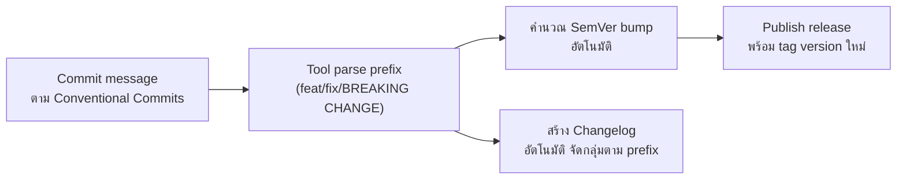

SemVer บอกวิธี**คิด**เลขเวอร์ชันไว้ชัดเจนแล้ว — แต่คำถามที่ตามมาคือ **ใครเป็นคนตัดสินใจว่า commit นี้ควรขึ้น MAJOR, MINOR หรือ PATCH** ถ้าปล่อยให้คนตัดสินใจเองทุกครั้งตอน release ย่อมมีโอกาสตัดสินใจผิดพลาดหรือลืมได้ — ทางแก้คือทำให้**ข้อความ commit เองเป็นตัวบอกคำตอบ** แล้วให้เครื่องมือคำนวณเวอร์ชันให้อัตโนมัติ

## Conventional Commits — มาตรฐานข้อความ Commit ที่เครื่องอ่านได้

```
feat: เพิ่มปุ่ม dark mode ใน settings         → MINOR bump
fix: แก้ปัญหา checkout ค้างเมื่อ cart ว่าง      → PATCH bump
docs: อัปเดต README                          → ไม่ bump version
feat!: เปลี่ยนโครงสร้าง response ของ /api/user  → MAJOR bump (! หรือ BREAKING CHANGE)
```

<mark class="hl-term">**Conventional Commits**</mark> กำหนดรูปแบบข้อความ commit ให้มี prefix ที่สื่อความหมายชัดเจน (`feat:`, `fix:`, `docs:`, `chore:`, ฯลฯ) — prefix เหล่านี้ไม่ใช่แค่ให้คนอ่านง่ายขึ้น แต่**เครื่องมือ automation อ่านแล้วตัดสินใจ version bump ได้เองโดยไม่ต้องมีคนมานั่งตัดสินใจ**



## Release Automation — จาก Manual สู่ Automatic

<mark class="hl-insight">ก่อนมี tooling พวกนี้ ทีมต้องนั่งเขียน changelog เองทุกครั้งก่อน release (ไล่ดู commit/PR ย้อนหลัง สรุปเอง) และต้องตัดสินใจเองว่ารอบนี้ควรขึ้น version ไหน — งานที่ทั้งน่าเบื่อและมีโอกาสพลาดสูง (ลืมใส่บาง change ลง changelog, บวก version ผิดประเภท) เครื่องมืออย่าง `semantic-release` หรือ `standard-version` อ่าน commit history ที่เขียนตาม Conventional Commits แล้ว**ตัดสินใจ version bump และสร้าง changelog ให้อัตโนมัติทั้งหมด** ไม่ต้องมีคนมานั่งตัดสินใจเอง</mark>

## Changelog อัตโนมัติ จัดกลุ่มตาม Commit Type

```markdown
## v2.5.0

### Features
- เพิ่มปุ่ม dark mode ใน settings

### Bug Fixes
- แก้ปัญหา checkout ค้างเมื่อ cart ว่าง

### Breaking Changes
- เปลี่ยนโครงสร้าง response ของ /api/user
```

<mark class="hl-warning">Changelog ที่สร้างด้วยมือมักมีปัญหา**ไม่ครบ**และ**ไม่สม่ำเสมอ** — คนเขียนอาจลืม change เล็กๆ ที่ดูไม่สำคัญ หรือจัดกลุ่มไม่ตรงกันระหว่างแต่ละ release (บาง release มีหัวข้อ "Improvements" บางอันไม่มี) เมื่อ commit message เป็นระบบตาม Conventional Commits การสร้าง changelog กลายเป็นแค่การ parse ข้อความและจัดกลุ่มอัตโนมัติ ได้ผลลัพธ์ที่สม่ำเสมอทุกครั้งโดยไม่ต้องพึ่งความจำของคน</mark>

## ทำไมเรื่องนี้เชื่อมกับ CI/CD ต่อ

Release automation มักผูกเข้ากับ CI pipeline โดยตรง — เมื่อ merge PR เข้า main (หลังผ่าน branch protection ที่เรียนไปแล้ว) ระบบจะรัน tool ที่ parse commit history, ตัดสินใจ version bump, สร้าง changelog, tag version ใหม่, และ publish package โดยอัตโนมัติทั้งหมดในขั้นตอนเดียว ทีมไม่ต้องมีขั้นตอน "manual release" แยกต่างหากอีกต่อไป

> คำถามสัมภาษณ์: "ทำไมทีมที่ใช้ semantic-release ถึงเข้มงวดกับรูปแบบ commit message มากเป็นพิเศษ" — คำตอบที่ดีคือชี้ว่า semantic-release อ่าน commit message เพื่อตัดสินใจ version bump และสร้าง changelog แบบอัตโนมัติทั้งหมด ถ้า commit message ไม่ตรงตามรูปแบบ Conventional Commits (เช่น พิมพ์ผิด หรือลืมใส่ prefix) เครื่องมือจะตีความผิดหรือมองข้าม commit นั้นไปเลย ทำให้ version bump ผิดหรือ changelog ไม่ครบ การเข้มงวดกับรูปแบบจึงจำเป็นเพราะระบบทั้งหมดพึ่งพาความถูกต้องของข้อความ commit โดยตรง ไม่มีคนมาตรวจสอบซ้ำอีกชั้น
