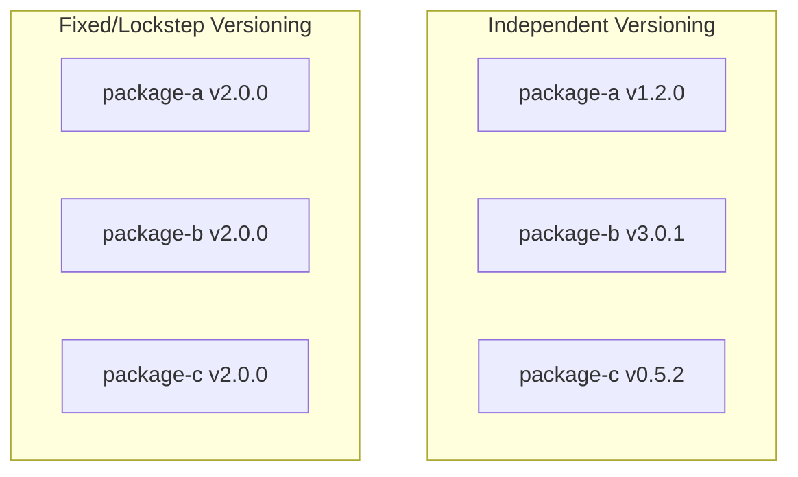

SemVer และ release automation ที่เรียนมาตอบโจทย์ package เดียวได้ชัดเจน — แต่ถ้าเป็น monorepo (จากโมดูล Monorepo vs Polyrepo) ที่มีหลาย package อยู่ใน repo เดียวกัน คำถามใหม่จะโผล่ขึ้นมาทันที: **แต่ละ package ควรมีเลขเวอร์ชันของตัวเอง หรือทุก package ควรขึ้นเวอร์ชันพร้อมกันทั้งหมด**

## สองแนวทางหลัก

| แนวทาง | อธิบาย |
|---|---|
| **Independent Versioning** | แต่ละ package มีเลขเวอร์ชันเป็นของตัวเอง ตาม SemVer ของ change ที่เกิดกับ package นั้นจริงๆ |
| **Fixed/Lockstep Versioning** | ทุก package ใน monorepo ขึ้นเวอร์ชันพร้อมกันเป็นชุดเดียว แม้บาง package จะไม่มีอะไรเปลี่ยนเลยก็ตาม |

## Independent Versioning — สะท้อนความจริงของแต่ละ Package

<mark class="hl-insight">ข้อดีของ independent versioning คือเลขเวอร์ชันสื่อความหมายตรงกับสิ่งที่เกิดขึ้นจริงกับ package นั้น — ถ้า `package-c` เพิ่งเริ่มพัฒนา (v0.5.2) ในขณะที่ `package-b` เสถียรมานาน (v3.0.1) เลขเวอร์ชันบอกความจริงนี้ตรงๆ consumer ที่ใช้แค่ `package-b` ก็ไม่ต้องเห็น version bump ทุกครั้งที่ `package-c` เปลี่ยน ทั้งที่ตัวเองไม่ได้รับผลกระทบอะไรเลย</mark> — ข้อเสียคือซับซ้อนกว่าในการจัดการ ต้อง track ว่า package ไหนเปลี่ยนบ้างในแต่ละรอบ release และต้องมี tooling ที่ฉลาดพอจะคำนวณแยกแต่ละ package

## Fixed Versioning — เรียบง่าย แต่ Version Bump บ่อยเกินจำเป็น

<mark class="hl-warning">ข้อเสียของ fixed versioning คือ package ที่ไม่มีการเปลี่ยนแปลงเลยก็ยังต้องขึ้นเวอร์ชันตามไปด้วยทุกครั้งที่ package อื่นใน monorepo เปลี่ยน — สร้างความสับสนให้ consumer ที่เห็น version bump บ่อยผิดปกติทั้งที่ไม่มีอะไรเปลี่ยนจริงสำหรับ package ที่ตัวเองใช้ แต่ข้อดีคือเรียบง่ายมาก — บอกได้ทันทีว่า "ทุกอย่างใน monorepo v2.0.0" ทำงานร่วมกันได้แน่นอน ไม่ต้องกังวลเรื่อง compatibility matrix ระหว่าง package ภายใน monorepo เดียวกัน</mark>

## เครื่องมือที่ใช้จริง

| เครื่องมือ | รองรับแนวทางไหน |
|---|---|
| **Changesets** | เน้น independent versioning — นักพัฒนาเขียนไฟล์ "changeset" อธิบาย change ทีละ package แล้วเครื่องมือคำนวณ version bump ให้อัตโนมัติตอน release |
| **Lerna** | รองรับทั้งสองแบบ ปรับ config ได้ว่าจะ fixed หรือ independent |
| **Nx Release** | integrate กับ Nx (เครื่องมือ monorepo จากหัวข้อ Choosing Repo Strategy) รองรับทั้งสองแบบเช่นกัน |

## เลือกยังไง

<mark class="hl-insight">กฎทั่วไป: ถ้า package ใน monorepo เป็น**อิสระต่อกันจริงๆ** (แต่ละตัวมี consumer ต่างกัน, release cycle ต่างกัน) independent versioning เหมาะกว่าเพราะสะท้อนความจริง แต่ถ้า package ทั้งหมดถูกออกแบบให้**ใช้ร่วมกันเป็นชุดเสมอ** (เช่น monorepo ของ framework ที่มี core + plugin ที่ผูกกันแน่น ต้องใช้ version ตรงกันเป๊ะถึงทำงานได้) fixed versioning จะลดความสับสนเรื่อง compatibility ได้มากกว่า</mark>

> คำถามสัมภาษณ์: "monorepo ที่มี 20 package แต่ละตัวใช้กันคนละกลุ่ม consumer ควรใช้ independent หรือ fixed versioning" — คำตอบที่ดีคือ independent versioning เพราะ package ที่เป็นอิสระต่อกัน (คนละ consumer, คนละ release cycle) ไม่ควรถูกบังคับให้ version bump พร้อมกันทั้งที่ไม่มีอะไรเปลี่ยน การ fixed versioning ในกรณีนี้จะสร้างความสับสนให้ consumer โดยไม่มีประโยชน์ ต่างจากกรณีที่ package ทั้งหมดต้องใช้ version ตรงกันเป๊ะถึงทำงานได้ ซึ่ง fixed versioning จะเหมาะกว่า
