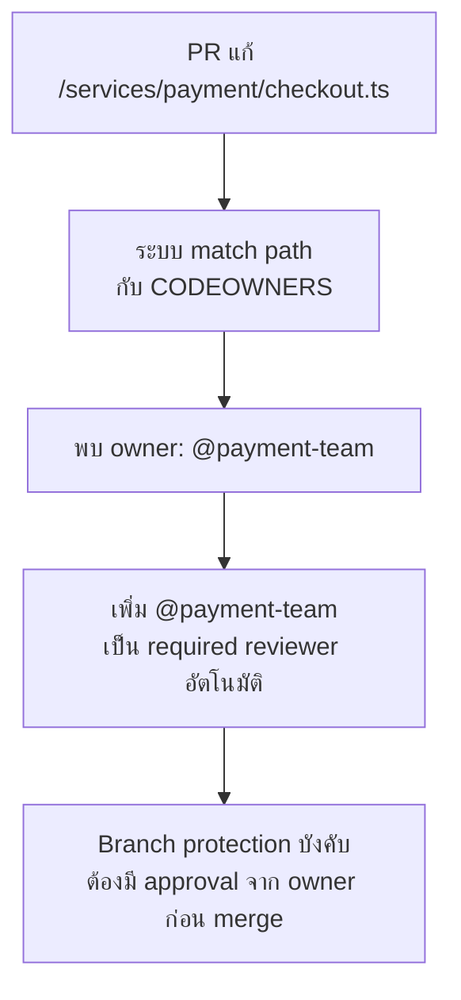

จากหัวข้อ Branch Protection (โมดูล Code Review & Merge Strategy) — required reviewer เป็นกฎที่บังคับว่า "ต้องมีคนรีวิวก่อน merge" แต่ไม่ได้บอกว่า**ใครควรเป็นคนรีวิว** ใน repo เล็กที่มีคนไม่กี่คน ใครรีวิวก็ได้ แต่ใน repo ใหญ่ที่มีหลายทีมแตะโค้ดเดียวกัน คำถามนี้กลายเป็นเรื่องสำคัญทันที — จะให้คนที่ไม่รู้จัก payment service เลยมารีวิว PR ที่แก้ payment service ได้ยังไง

## CODEOWNERS คือแผนที่ความเป็นเจ้าของโค้ด

```
# .github/CODEOWNERS

# Default owner ทั้ง repo
*                       @platform-team

# แต่ละ service มีเจ้าของตัวเอง
/services/payment/      @payment-team
/services/auth/         @auth-team @security-team
/services/notification/ @notification-team

# ไฟล์เฉพาะทาง ownership ซ้อนทับ path ปกติ
/services/payment/migrations/  @payment-team @dba-team
*.tf                    @infra-team
```

<mark class="hl-term">**CODEOWNERS**</mark> คือไฟล์ที่แมป path ในโค้ดกับทีมหรือคนที่เป็นเจ้าของ path นั้น — เมื่อมี PR แก้ไฟล์ใน path ไหน ระบบจะ**เพิ่ม owner ของ path นั้นเป็น required reviewer ให้อัตโนมัติ** ไม่ต้องมีใครมานั่งไล่ดูเองว่า PR นี้ควรส่งให้ทีมไหนรีวิว



## ทำไมต้องผูกกับ Branch Protection ถึงมีความหมาย

<mark class="hl-insight">CODEOWNERS อย่างเดียวไม่มีผลบังคับอะไรเลย — มันแค่**บอก**ว่าใครเป็นเจ้าของ ต้องเปิด branch protection rule "Require review from Code Owners" ควบคู่กันไป ระบบถึงจะ**บังคับ**ว่า PR ที่แตะ path นั้นต้องได้ approve จาก owner จริงๆ ก่อน merge ได้ — ไม่ใช่แค่คำแนะนำที่ใครจะข้ามก็ได้ เหมือนที่เรียนไปในหัวข้อ Branch Protection ว่ากฎที่ไม่มีการบังคับใช้จริงในระบบเท่ากับไม่มีกฎ</mark>

## Pattern การเขียนที่ต้องระวัง — Rule ท้ายไฟล์ชนะ

<mark class="hl-warning">CODEOWNERS ทำงานแบบ**rule สุดท้ายที่ match ชนะ** (คล้าย `.gitignore`) ไม่ใช่ rule แรกที่ match — ถ้าเขียน `*` ไว้บนสุดแล้วตามด้วย path เฉพาะทางด้านล่าง path เฉพาะทางจะ override `*` ได้ถูกต้อง แต่ถ้าสลับลำดับผิด (เขียน path เฉพาะทางไว้บนแล้ว `*` ไว้ล่างสุด) `*` จะ override ทุกอย่างที่เขียนไว้ก่อนหน้าโดยไม่มี error เตือนเลย เป็นบั๊กที่เงียบและตรวจจับยากมาก เพราะทุกอย่าง syntax ถูกหมด</mark>

## Ownership ในสเกลใหญ่ — ปัญหาที่ CODEOWNERS แก้ไม่หมด

| ปัญหา | CODEOWNERS แก้ได้ไหม |
|---|---|
| ใครควร review PR นี้ | ✅ แก้ได้ตรงจุด |
| Path ไม่มี owner ระบุไว้เลย (โค้ดกำพร้า) | ❌ ต้องมี fallback `*` หรือ policy บังคับให้ทุก path ต้องมี owner |
| Owner ลาออกจากทีมแต่ยังอยู่ในไฟล์ | ❌ ต้องมี process ทบทวน CODEOWNERS เป็นระยะ ไม่ใช่ set แล้วลืม |
| Team ใหม่แยกออกจากทีมเดิม (org เปลี่ยนโครงสร้าง) | ❌ ต้องอัปเดต CODEOWNERS ให้ตรงกับ team structure จริง — เชื่อมกับ Conway's Law ที่เรียนในโมดูล Monorepo vs Polyrepo |

> คำถามสัมภาษณ์: "ทีมมี CODEOWNERS ไฟล์ครบทุก path แล้ว แต่ยังเจอปัญหา PR ค้างนานเพราะ owner ไม่ว่างรีวิว ควรแก้ยังไง" — คำตอบที่ดีคือชี้ว่า CODEOWNERS แก้ปัญหา "ใครควรรีวิว" แต่ไม่แก้ปัญหา "owner มีเวลารีวิวไหม" — ควรกำหนดหลาย owner ต่อ path (ไม่ใช่คนเดียว) เพื่อกระจายภาระ, ตั้ง SLA ว่า PR ต้องได้ review ภายในกี่ชั่วโมง, และพิจารณาว่าทีมนั้น owner หลาย path เกินไปจนกลายเป็นคอขวดหรือเปล่า ซึ่งอาจสะท้อนปัญหา team topology ที่ต้องแก้ที่ต้นตอ ไม่ใช่แค่ปรับ CODEOWNERS
