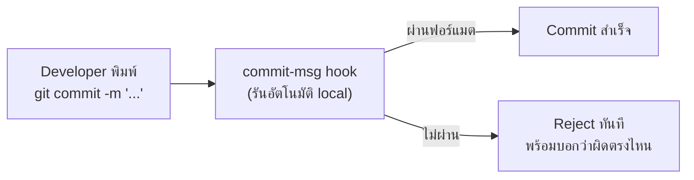

จากหัวข้อ Conventional Commits (โมดูล Versioning & Release Management) — รู้แล้วว่า `feat:`, `fix:`, `BREAKING CHANGE` คือรูปแบบที่เครื่องมือ automation ใช้คำนวณ version bump และสร้าง changelog แต่มีคำถามที่ยังไม่ได้ตอบ: **ถ้านักพัฒนาลืมใส่ prefix หรือพิมพ์ผิด จะเกิดอะไรขึ้น** ใน repo ที่มีคนสิบกว่าคนเขียน commit ทุกวัน การหวังให้ทุกคน "จำได้เอง" ไม่ใช่กลยุทธ์ที่ยั่งยืน

## ปัญหาของการพึ่งวินัยคนล้วนๆ

<mark class="hl-warning">Convention ที่ไม่มีการบังคับใช้จริงจะค่อยๆ เสื่อมสภาพเสมอ — สัปดาห์แรกทุกคนเขียน commit ตามฟอร์แมตเป๊ะ พอผ่านไปเดือนสองเดือน จะเริ่มมี commit "fix bug", "wip", "update" หลุดเข้ามาเรื่อยๆ เพราะไม่มีอะไรบล็อกมันไว้ — ปัญหาไม่ได้อยู่ที่คนขี้เกียจ แต่อยู่ที่ระบบไม่มี feedback loop ทันทีตอนที่ทำผิด กว่าจะรู้ตัวก็ตอน release ที่ changelog พังไปแล้ว</mark>

## Git Hooks — จุดที่เช็กได้เร็วที่สุด



<mark class="hl-term">**commit-msg hook**</mark> คือสคริปต์ที่ git รันอัตโนมัติทุกครั้งก่อน commit จะสำเร็จ — เครื่องมืออย่าง `commitlint` ผูกกับ hook นี้ผ่าน `husky` (ทำให้ทุกคนที่ clone repo ได้ hook เดียวกันอัตโนมัติ ไม่ต้อง setup มือ) เพื่อตรวจสอบว่าข้อความ commit ตรงตาม Conventional Commits ก่อนปล่อยให้ commit เกิดขึ้นจริง

```bash
$ git commit -m "fixed the login bug"
⧗   input: fixed the login bug
✖   subject may not be empty [subject-empty]
✖   type may not be empty [type-empty]
✖   found 2 problems, 0 warnings
```

## ทำไมต้องเช็กที่ Local ไม่ใช่รอเช็กที่ CI อย่างเดียว

<mark class="hl-insight">ยิ่งเจอปัญหาเร็วเท่าไหร่ ต้นทุนแก้ยิ่งถูกเท่านั้น — ถ้าปล่อยให้ commit message ผิดฟอร์แมตหลุดเข้าไปแล้วให้ CI เป็นคนจับตอน push หรือตอนเปิด PR นักพัฒนาต้องย้อนกลับไปแก้ commit history (ซึ่งอาจแปลว่าต้อง rebase ทั้ง branch ถ้ามีหลาย commit ตามมาแล้ว) แต่ถ้า hook เช็กตั้งแต่ตอน `git commit` ที่เครื่อง local ปัญหาถูกจับ**ก่อน**ที่ commit จะเกิดขึ้นด้วยซ้ำ แก้แค่พิมพ์ใหม่ครั้งเดียวจบ — CI ยังควรมี job เช็กซ้ำอยู่ดี (เผื่อคนข้าม hook ด้วย `--no-verify`) แต่ local hook คือด่านแรกที่ถูกที่สุด</mark>

## Monorepo หลายภาษา — Convention เดียวไม่พอ

จากหัวข้อ Monorepo Fundamentals (โมดูล Monorepo vs Polyrepo) — repo เดียวที่มีทั้ง frontend TypeScript, backend Go, และ infra Terraform สร้างปัญหาใหม่ให้ commit convention: `feat:` เฉยๆ ไม่บอกว่า feature นี้อยู่ที่ package ไหน

```
feat(checkout-web): เพิ่มปุ่ม apply coupon
fix(payment-api): แก้ race condition ใน webhook handler
chore(infra): อัปเดต terraform provider version
```

<mark class="hl-insight">**scope** ใน Conventional Commits (`feat(scope): ...`) คือคำตอบของปัญหานี้ — บอกไม่ใช่แค่ว่า commit นี้คือ feature หรือ fix แต่บอกด้วยว่ากระทบ package ไหน เครื่องมือ release automation ในบริบท monorepo (เช่น Changesets ที่เรียนในโมดูล Monorepo Versioning) ใช้ scope นี้ตัดสินใจว่า package ไหนควรขึ้นเวอร์ชัน โดยไม่กระทบ package อื่นที่ไม่เกี่ยวข้อง — ทีมมักบังคับ `commitlint` ให้ scope ต้องตรงกับชื่อ package จริงใน repo เท่านั้น กัน typo ที่ทำให้ automation หา package ไม่เจอ</mark>

## ทำไมยังต้องมี Human Review อยู่ดี

<mark class="hl-warning">commitlint เช็กได้แค่**รูปแบบ** (ฟอร์แมตตรงไหม มี prefix ไหม) แต่เช็ก**เนื้อหา**ไม่ได้ — commit message `fix(payment-api): fix bug` ผ่าน commitlint สบายๆ เพราะฟอร์แมตถูกต้องเป๊ะ ทั้งที่ไม่ได้บอกอะไรเป็นประโยชน์เลยว่าบั๊กคืออะไร ตรงนี้คือจุดที่ต้องพึ่ง code review culture (จากโมดูล PR Review Culture) เข้ามาเสริม — เครื่องมือบังคับโครงสร้างได้ แต่คุณภาพเนื้อหายังต้องอาศัยคนตรวจอยู่ดี</mark>

> คำถามสัมภาษณ์: "ทีมติดตั้ง commitlint ผ่าน husky hook เรียบร้อยแล้ว แต่ยังมี commit message ผิดฟอร์แมตหลุดเข้า main branch ได้ ควรตรวจจุดไหนเพิ่ม" — คำตอบที่ดีคือชี้ว่า local hook สามารถถูกข้ามได้ด้วย `git commit --no-verify` หรือนักพัฒนาบางคนอาจไม่ได้ install husky hook ให้ครบ (เช่น clone ใหม่แล้วลืมรัน `npm install` ที่ trigger husky setup) — ทางแก้ที่ถูกต้องคือต้องมี CI job เช็ก commit message ซ้ำอีกชั้นก่อนอนุญาตให้ merge เข้า main เสมอ ไม่ควรพึ่ง local hook อย่างเดียวเพราะเป็นการบังคับใช้ที่ฝั่ง client ซึ่ง bypass ได้ ต้องมี server-side/CI enforcement เป็นด่านสุดท้ายที่ bypass ไม่ได้
