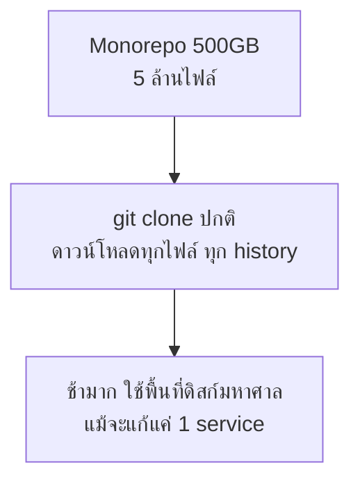

จากหัวข้อ Monorepo Fundamentals — เข้าใจแล้วว่า monorepo รวมทุกอย่างไว้ที่เดียวมีข้อดีเรื่อง atomic commit และ code sharing แต่ไม่ได้พูดถึงปัญหาที่โผล่มาตอน repo นั้นโตถึงระดับ**หลายสิบ GB หรือหลายล้านไฟล์** อย่างที่เกิดใน Google, Microsoft, Meta — `git clone` ธรรมดาที่เคยใช้เวลาไม่กี่วินาที จะกลายเป็นใช้เวลาเป็นชั่วโมง

## ปัญหาที่ Scale ใหญ่มากจริงๆ



<mark class="hl-warning">`git clone` แบบปกติดาวน์โหลด**ทั้ง history ของทุกไฟล์ในทุก branch** — เมื่อ repo โตถึงระดับที่บริษัทใหญ่เจอ (Windows OS monorepo ของ Microsoft มีขนาดหลาย TB) การ clone แบบเต็มรูปแบบกลายเป็นเรื่องที่ทำไม่ได้จริงในทางปฏิบัติ นักพัฒนาคนหนึ่งอาจไม่เคยแตะ 95% ของโค้ดใน repo เลยตลอดการทำงาน แต่ต้องดาวน์โหลดมันมาเก็บไว้ในเครื่องอยู่ดี</mark>

## Shallow Clone — ตัด History ที่ไม่จำเป็น

```bash
git clone --depth 1 https://github.com/org/huge-monorepo.git
```

<mark class="hl-term">**Shallow clone**</mark> ดึงมาแค่ commit ล่าสุด (หรือ N commit ล่าสุดตามที่กำหนด) ไม่ดึง history ทั้งหมดย้อนหลัง — เหมาะกับ CI pipeline ที่แค่ต้องการโค้ดปัจจุบันไปรัน build/test ไม่ได้ต้องการดู history ข้อเสียคือคำสั่งที่ต้องพึ่ง history เต็ม (เช่น `git blame` ย้อนไกลๆ, `git log` หา commit เก่า) จะใช้ไม่ได้หรือได้ผลไม่ครบ

## Partial Clone และ Sparse Checkout — ตัด "พื้นที่" ไม่ใช่แค่ "เวลา"

| เทคนิค | ตัดอะไรออก | เหมาะกับ |
|---|---|---|
| **Shallow clone** | ตัด commit history เก่า | CI ที่ต้องการแค่โค้ดปัจจุบัน |
| **Partial clone** (`--filter=blob:none`) | ไม่ดาวน์โหลดเนื้อไฟล์ (blob) จนกว่าจะถูกเปิดอ่านจริง | Repo ที่มีไฟล์ใหญ่จำนวนมากแต่ใช้จริงไม่กี่ไฟล์ |
| **Sparse checkout** | ทำงานบนดิสก์แค่บาง directory ที่เลือกไว้ | Monorepo ที่มีหลาย service แต่ทีมหนึ่งแตะแค่ 1-2 service |

```bash
git clone --filter=blob:none --sparse https://github.com/org/huge-monorepo.git
cd huge-monorepo
git sparse-checkout set services/payment services/shared
```

<mark class="hl-insight">Partial clone กับ sparse checkout ทำงานร่วมกันได้ — partial clone บอก git ว่า "อย่าเพิ่งดาวน์โหลดเนื้อไฟล์จนกว่าจะจำเป็น" ส่วน sparse checkout บอกว่า "ทำงานบนดิสก์แค่ directory เหล่านี้" ผลลัพธ์คือนักพัฒนาที่ทำงานแค่ทีม payment จะได้ checkout ที่เบามาก ทั้งที่ repo จริงมีขนาดหลาย TB เพราะไม่เคยต้องดาวน์โหลดหรือเก็บไฟล์ของทีมอื่นเลย</mark> — เชื่อมกับสิ่งที่เรียนในโมดูล Choosing Repo Strategy ว่า monorepo ขนาดใหญ่ต้องพึ่ง tooling ที่ฉลาดพอจะ "ย่อ" ประสบการณ์การทำงานให้เหมือนใช้ repo เล็ก แม้ repo จริงจะใหญ่มาก

## Git LFS — แยกไฟล์ไบนารีออกจาก History ปกติ

<mark class="hl-warning">ไฟล์ไบนารีขนาดใหญ่ (asset เกม, model ML, video) เป็นตัวการหลักที่ทำให้ repo บวมเร็วที่สุด เพราะ git เก็บทุกเวอร์ชันของไฟล์นั้นไว้ใน history ตลอดไป ต่างจากโค้ด text ที่ diff กันได้แบบมีประสิทธิภาพ ไฟล์ไบนารีทุกเวอร์ชันที่เคย commit จะถูกเก็บเต็มไฟล์ซ้ำๆ <mark class="hl-term">Git LFS (Large File Storage)</mark> แก้ปัญหานี้ด้วยการเก็บแค่ pointer เล็กๆ ไว้ใน git history ส่วนเนื้อไฟล์จริงเก็บแยกไว้ใน storage ต่างหาก ดาวน์โหลดเฉพาะตอนที่ checkout เวอร์ชันนั้นจริงๆ</mark>

## Monorepo Tooling ที่โตมาเพื่อรับมือ Scale นี้โดยเฉพาะ

จากหัวข้อ Choosing Repo Strategy — Nx, Turborepo, Bazel ที่เรียนไปแล้วไม่ได้มีไว้แค่จัดการ build/test แบบ incremental แต่ยังออกแบบมาให้ทำงานได้บน repo ขนาดที่ sparse checkout และ partial clone จำเป็นจริงๆ — เครื่องมือเหล่านี้รู้ dependency graph ของทั้ง repo ทำให้ CI รู้ได้ว่า commit หนึ่งกระทบ service ไหนบ้างโดยไม่ต้อง build ทุกอย่างใหม่ทั้งหมด ซึ่งเป็นสิ่งจำเป็นเมื่อ full build ใช้เวลาเป็นชั่วโมงถ้าไม่มี incremental strategy

> คำถามสัมภาษณ์: "ทีมย้ายจาก polyrepo มา monorepo แล้วนักพัฒนาบ่นว่า clone ครั้งแรกใช้เวลานานมาก ควรแก้ยังไงโดยไม่ย้ายกลับไป polyrepo" — คำตอบที่ดีคือชี้ว่าปัญหานี้ไม่จำเป็นต้องแก้ด้วยการย้ายกลับ polyrepo (ซึ่งเสียข้อดีของ monorepo ไปทั้งหมด) แต่แก้ด้วย tooling ระดับ git เอง — ใช้ partial clone (`--filter=blob:none`) ร่วมกับ sparse checkout ให้นักพัฒนาแต่ละคน checkout เฉพาะ directory ที่ทีมตัวเองทำงานจริง และถ้า repo มี asset ไบนารีใหญ่ปนอยู่ ควรย้ายเข้า Git LFS แยกออกจาก history หลัก วิธีนี้ทำให้ประสบการณ์การ clone เบาลงมากโดยยังคงข้อดีของ monorepo (atomic commit ข้าม service, dependency graph เดียว) ไว้ครบ
