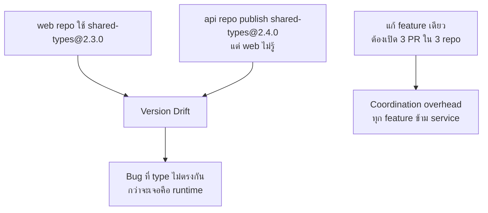

สตาร์ทอัพแห่งหนึ่งเริ่มจาก 3 repo แยกกัน (`web`, `api`, `shared-types`) ตามที่เรียนในโมดูล Polyrepo Fundamentals — ทำงานได้ดีตอนทีมมี 5 คน แต่พอทีมโตเป็น 40 คนใน 8 ทีมย่อย ปัญหาที่เคยเป็นแค่ "ความรำคาญเล็กๆ" กลายเป็นตัวถ่วงความเร็วทั้งองค์กร

## อาการที่ค่อยๆ สะสม

<mark class="hl-warning">ปัญหาหลักคือ **version drift** จากหัวข้อ Polyrepo Fundamentals กลายเป็นเรื่องประจำวัน — `shared-types` เปลี่ยน แต่ `web` team ไม่รู้ทันทีว่าต้อง bump dependency เพราะข้าม repo กัน กว่าจะรู้ตัวคือตอน production error type mismatch ที่ CI ของแต่ละ repo แยกกันจับไม่ได้เลย เพราะไม่มีที่ไหนรัน integration check ข้าม repo แบบ atomic</mark>

## ทำไมถึงตัดสินใจย้ายมา Monorepo

<mark class="hl-insight">ทีม platform ตัดสินใจย้ายมา monorepo ไม่ใช่เพราะ "monorepo คือของที่ดีกว่าเสมอ" (ซึ่งไม่จริงตามที่เรียนในหัวข้อ Choosing Repo Strategy) แต่เพราะ**อาการที่เจอตรงกับปัญหาที่ monorepo แก้ได้ตรงจุดพอดี** — atomic commit ข้าม package ทำให้ PR เดียวแก้ทั้ง `web`, `api`, `shared-types` พร้อมกันได้ และ CI รันบน commit เดียวเห็นทั้งระบบ ไม่มีทางที่ type จะไม่ตรงกันข้าม package หลุดผ่านไปได้อีก เพราะ compile fail ทันทีถ้าไม่ตรง</mark>

## สิ่งที่ต้องเตรียมก่อนย้ายจริง

| สิ่งที่ต้องมี | เหตุผล |
|---|---|
| Nx/Turborepo | จากหัวข้อ Choosing Repo Strategy — ไม่งั้น build ทุก package ใหม่ทุกครั้งจะช้าเกินรับได้เมื่อ repo โต |
| CODEOWNERS | จากหัวข้อ Git Workflow at Scale — 8 ทีมต้องมี ownership ชัดเจน ไม่งั้นทุกคนรีวิวทุกอย่างสับสนวุ่นวาย |
| Sparse checkout | จากหัวข้อ Large Repo Practices — ทีม `web` ไม่จำเป็นต้อง checkout โค้ดของทีม `payment` ทั้งหมด |
| Conventional Commits + scope | จากหัวข้อ Commit Convention at Scale — ต้องรู้ว่า commit กระทบ package ไหนเพื่อ release แยกกันได้ |

## ผลลัพธ์หลังย้าย 6 เดือน

<mark class="hl-insight">Feature ที่เคยต้องเปิด 3 PR ข้าม repo กลายเป็น 1 PR เดียว, CI จับ type mismatch ได้ตั้งแต่ก่อน merge แทนที่จะเจอตอน production, และ release automation (จากหัวข้อ Monorepo Versioning) คำนวณอัตโนมัติว่า package ไหนควรขึ้นเวอร์ชันจาก commit scope ที่เปลี่ยน แต่ต้นทุนที่จ่ายคือ build time ที่ยาวขึ้นถ้าไม่มี incremental build tooling ที่ดี และช่วงแรกทีมต้องปรับตัวกับ CODEOWNERS ที่เข้มงวดขึ้น</mark>

> คำถามสัมภาษณ์: "ทีมเสนอย้ายจาก polyrepo มา monorepo เพราะ 'ทุกคนบอกว่า monorepo ดีกว่า' ควรตอบยังไง" — คำตอบที่ดีคือชี้ว่าไม่มี strategy ไหนดีกว่าเสมอ ต้องดูอาการจริงก่อน — ถ้าปัญหาที่เจอคือ version drift ข้าม service ที่พึ่งพากันแน่น, ต้อง coordinate หลาย repo บ่อยสำหรับ 1 feature, หรือ CI แยกกันจับ integration bug ไม่ได้ นั่นคือสัญญาณที่ monorepo แก้ตรงจุด แต่ถ้าทีมเป็นอิสระต่อกันจริงๆ (คนละ consumer, คนละ release cycle) การย้ายมา monorepo อาจสร้างปัญหาใหม่ (ownership สับสน, build ช้า) มากกว่าที่แก้ได้
